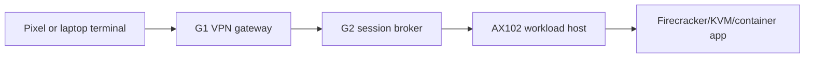

# ADR-g2-session-broker-001 - G2 Session Broker

Status: NEEDS ADR / implemented as guarded control-plane contract

Date: 2026-05-23

Related:

- Ksiegi 3.4 Thin Client invariant
- PHANTOM v3.0 boundary
- `ADR-terminal-modes-001.md`
- `docs/admin-panel-v2/99-step3-58-native-duckduckgo-gui-firecracker.md`
- `docs/admin-panel-v2/114-step3-78-zangi-android-novnc-bridge.md`

## Context

SYLION documentation describes a G2-brokered thin-client path, while the lab implementation used `noVNC/websockify` to prove early Firecracker GUI streams. This created architecture drift: a lab transport looked too close to a production session broker.

The terminal path must remain:

## Decision

The production component is named **G2 Session Broker**.

Approved production candidates:

- `guacamole` - Apache Guacamole PoC for VNC/RDP/SSH style brokering.
- `webrtc_selkies` - WebRTC/Selkies PoC for mobile latency, resizing, and touch input.

Lab-only adapter:

- `novnc_lab` - noVNC/websockify may remain for smoke tests, Firecracker GUI bring-up, screenshots, and diagnostics. It is not production-approved.

`noVNC` cannot unlock production readiness unless a future ADR explicitly changes this decision.

## Security Requirements

- G2 is the only browser-facing workload broker.
- No workload stream may bind to the public Internet.
- Terminal receives pixels, optional audio, and input events only.
- Clipboard is disabled by default.
- File transfer is disabled or CDR-gated.
- Session metadata may be audited; communication content is not stored in admin audit.
- Terminal-side operational storage remains forbidden.
- Broker choice is visible in admin and operator panels.
- Production approval remains `false` until Pixel and laptop human regression pass.

## Implementation Impact

Implemented in this sprint:

- Operator API exposes broker policy in streaming profile, streaming readiness, runtime manifest, and session response.
- `novnc_lab` readiness is blocked with `novnc_lab_only_not_approved_for_production_broker`.
- Admin production readiness now rolls up the selected G2 broker and blockers.
- Operator streaming UI can select Guacamole, Selkies/WebRTC, or noVNC lab and displays the broker result.
- `scripts/install-g2-guacamole-broker.mjs` renders/deploys a private Guacamole PoC on G2.

## Human Gate

Required before production baseline:

- Architect/CISO decision: Guacamole vs WebRTC/Selkies.
- Pixel ADB human regression for each app.
- Laptop browser human regression for each app.
- CDR and clipboard policy verification.
- Public exposure scan.
- Session timeout and re-auth test.

## Acceptance Tests

- `npm test` includes `step3-79-g2-session-broker-policy.test.js`.
- Guacamole nginx config must bind to `10.42.0.12:443`, not `0.0.0.0`.
- Guacamole compose must not contain passwords or default admin credentials.
- noVNC readiness must remain blocked as lab-only.
- Guacamole readiness may satisfy the candidate gate only when marked ready and private.
