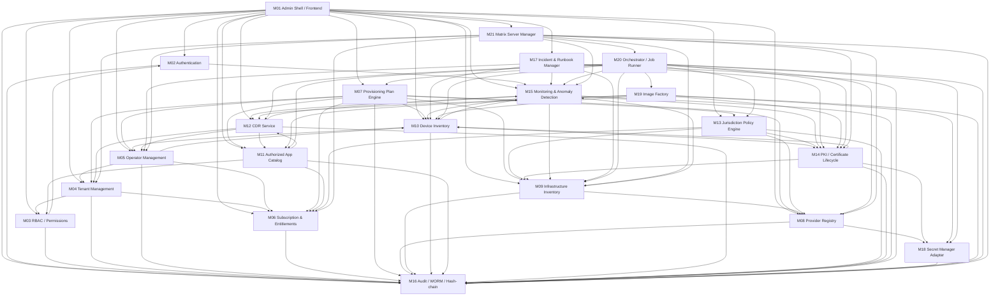
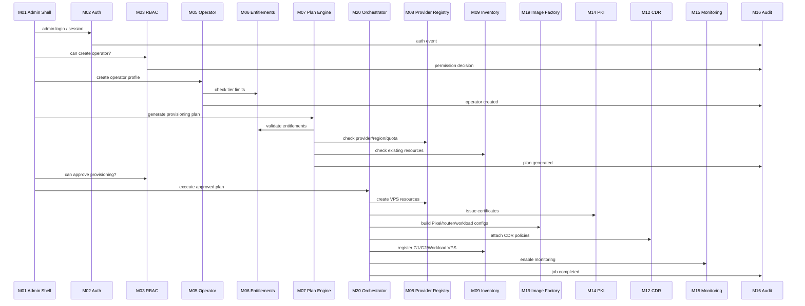
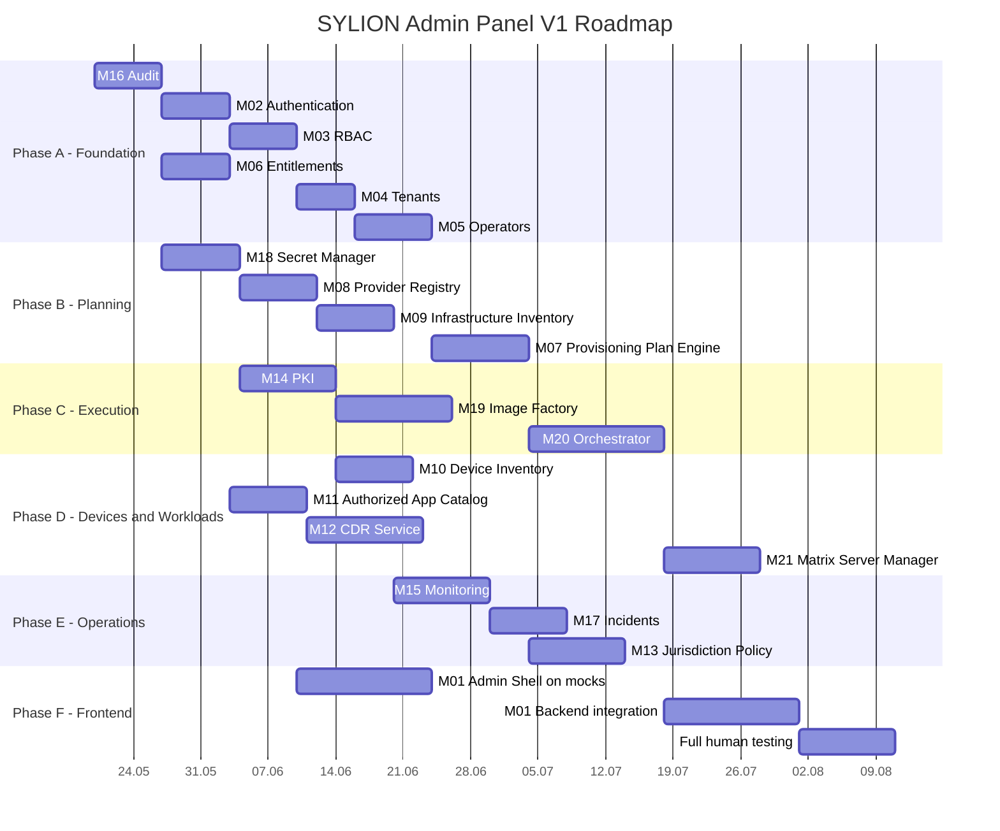

# SYLION Admin Panel V1 - Grafy I Roadmapa

## Graf Zależności Modułów



## Przepływ Integracyjny



## Roadmap



## Kolejność Integracji

```text
I01 Integration Spine
I02 Provisioning Planning
I03 Provisioning Execution
I04 Workload Integration
I05 Jurisdiction Rotation
I06 Matrix Add-on
I07 Admin Frontend Integration
Final Human E2E Test
```

## Milestone Definition Of Done

### M0 Freeze

```text
decyzje V1 zapisane
moduły rozpisane
prompty modułowe gotowe
grafy zależności gotowe
```

### M1 Spine

```text
admin login
RBAC
tenant create
operator create
tier assignment
audit events
```

### M2 Planning

```text
provider registry
inventory
provisioning plan
cost/risk/approval output
```

### M3 Execution

```text
3 VPS per operator
PKI references
image/config artifacts
orchestrator jobs
rollback/idempotency
```

### M4 Workloads

```text
authorized apps
microVM environment planning/execution
CDR policies
Matrix add-on
```

### M5 Operations

```text
monitoring
anomalies
incidents
jurisdiction rotations
audit evidence
```

### M6 Human Tested Panel

```text
frontend integrated
manual human flows tested
automated tests passing
security findings triaged
```
