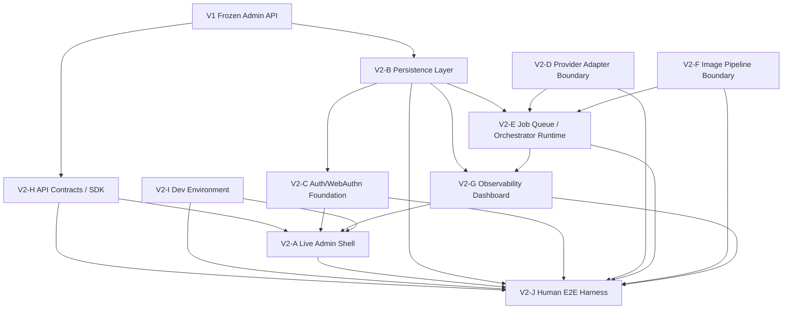
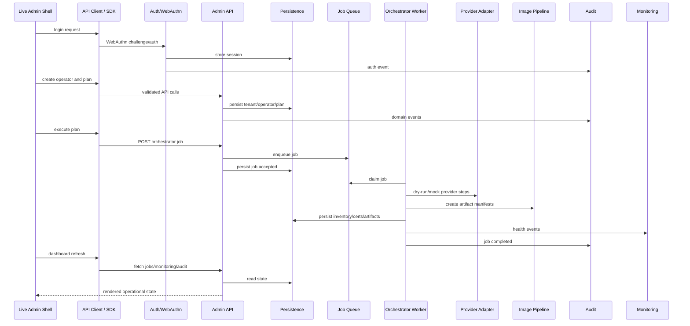
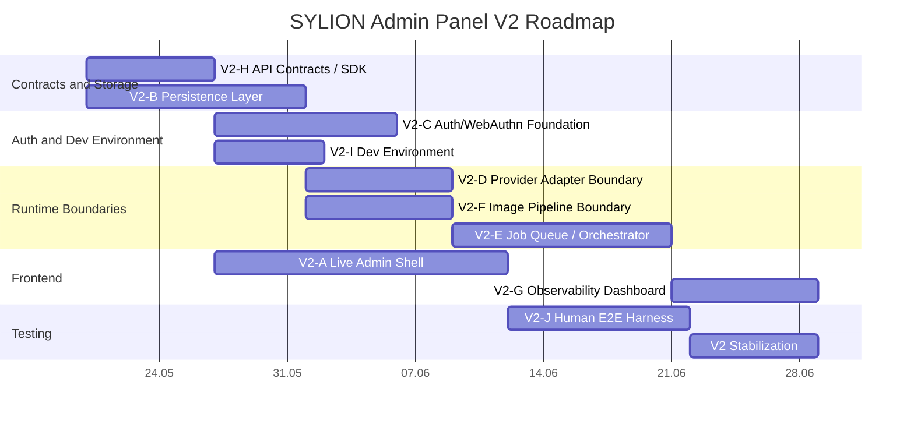

# SYLION Admin Panel V2 - Grafy I Roadmapa

## Graf Zależności V2



## V2 Runtime Flow



## Roadmap V2



## V2 Integration Order

```text
1. API Contracts / SDK
2. Persistence Layer
3. Auth/WebAuthn Foundation
4. Dev Environment
5. Provider Adapter Boundary
6. Image Pipeline Boundary
7. Job Queue / Orchestrator Runtime
8. Live Admin Shell
9. Observability Dashboard
10. Human E2E Harness
```

## V2 Milestones

| Milestone | Outcome |
|---|---|
| V2-M1 | API contract and SDK usable by frontend |
| V2-M2 | Data survives restart |
| V2-M3 | WebAuthn-compatible auth flow exists |
| V2-M4 | Orchestrator uses queue and adapters |
| V2-M5 | Frontend performs live admin workflows |
| V2-M6 | Human E2E test passes through UI/API/storage |

