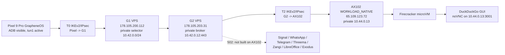
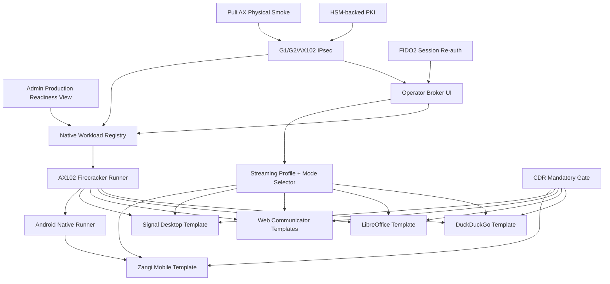

# STEP 3.59 - Deep State Audit

Date: 2026-05-22  
Scope: Admin panel, Operator panel, Pixel terminal path, G1/G2 VPN, AX102 WORKLOAD_NATIVE, Firecracker/noVNC streaming, CDR, PHANTOM/Ksiega 3.4 gates.

## Executive Status

The control plane is healthy, the panels load, the test suite is green, and the live private path now reaches the dedicated Hetzner AX102 workload host through G1/G2. The current proven live stream is DuckDuckGo GUI in a Firecracker microVM exposed only on the private workload address and proxied through G2.

This is not yet a production-ready multi-app environment. Signal, WhatsApp, Telegram, Threema, Zangi, LibreOffice, and Exodus are not currently running as real AX102 Firecracker or Android-native workloads. After the G2 broker was moved to the native AX102 host, those non-DuckDuckGo endpoints return 502 from G2 because their native workload processes are missing.

Physical Puli AX router testing is deferred until the router arrives. Physical FIDO2 and HSM tests are deferred, but both admin and operator configuration interfaces exist.

## Current Live Path

## Verified Working

1. Automated backend tests pass: `npm test` returned 159/159 passing tests.
2. Admin API health is live: `/health` returns `status=ok`, `service=admin-api`.
3. Admin WebAuthn simulator login works for Global Super Admin.
4. Admin panel static shell loads under `/admin`.
5. Operator panel static shell loads under `/operator`.
6. Pixel is visible over ADB: serial `46141FDAP009CZ`, model `Pixel 9 Pro`, Android/GrapheneOS base Android 16.
7. Pixel VPN interface is active: `tun1`, address `10.43.0.1/32`, MTU 1400.
8. Live verifier reports `readyForPrivateWorkloadStream=true` for Pixel -> G1 -> G2 -> AX102 -> Firecracker.
9. G1 Pixel VPN evidence is positive: Pixel SA established, Pixel pool present, private traffic selector present.
10. G2 to AX102 IPsec is positive: SA established, child installed, ping to `10.44.0.13` succeeds.
11. AX102 has native workload prerequisites: private loopback `10.44.0.13/32`, `/dev/kvm`, Firecracker, jailer.
12. AX102 has Firecracker boot smoke evidence and DuckDuckGo GUI evidence marked ready.
13. G2 resolves/proxies DuckDuckGo through private path: `https://duckduckgo.sylion.internal/vnc.html` returns HTTP 200 and noVNC markers.
14. CDR control-plane contracts and tests are green.
15. Blue Team metadata monitoring, anomaly/alert routes, incident routes and content-rejection tests are green.
16. Provider registry supports country/capability metadata including Firecracker/confidential capability filters.
17. Subscription/tier policy tests are green, including workload-count limits and jurisdiction limits.
18. PHANTOM remains governance/evidence-only and does not unlock execution.

## Admin Panel Audit

Admin navigation present:

- Overview
- Operators
- Provisioning
- Approvals
- Subscriptions
- Devices
- Providers
- Blue Team
- Security
- PHANTOM
- Release
- Audit

Admin configuration surface currently includes:

- Tenant creation and operator creation.
- Optional live Hetzner G1/G2/WORKLOAD baseline creation behind confirmation gates.
- Local provisioning pipeline drafts and local lab VPS metadata harness.
- Provider registry with secret references, country metadata, runtime capabilities, Firecracker and confidential compute markers.
- Authorized app catalog and CDR policy wiring.
- Subscription plan and tenant subscription controls.
- Workload quota, allocation quote, allocation and placement controls.
- Device registry for Pixel, Puli AX, laptop terminal and FIDO2 devices.
- Router package and router posture control-plane contracts.
- Blue Team signal recording, CDR status, alerts, metadata monitoring and incidents.
- Admin-layer FIDO2 policy and HSM profile.
- Operator-layer FIDO2/HSM policy editing from admin.
- Recovery and break-glass placeholders with PHANTOM separation.
- PHANTOM governance board, package, evidence, approval, exception, simulation and coverage forms.
- Release gates, human-test inventory, release problems, evidence artifacts, Ksiega 3.4 status and PHANTOM boundary proof.
- Full audit table.

Observed admin issues:

- Some audit script route assumptions were stale: `/subscription/catalog`, `/subscription/tiers`, `/phantom/status`, `/live-execution/foundation` returned 404 because the actual implemented route names differ or are surfaced through other modules. The UI still has subscription, PHANTOM and release views.
- Admin panel has many functional controls, but production gates still correctly block live execution unless environment and human gates are set.
- UI is broad and usable, but the production-readiness state is scattered. Next sprint should add one explicit "Production Readiness" page aggregating live AX102 workload status, Pixel CA trust, per-app 200/502 status, and blockers.

## Operator Panel Audit

Operator navigation present:

- Overview
- Apps
- Devices
- Workloads
- Workload Control
- Connection Path
- Live Access
- Signal Preview
- Runtime Gate
- VPN status
- Streaming
- My audit
- Security Unlock
- Backup & Panic
- Jurisdiction
- Matrix Server
- FIDO2 policy
- HSM refs
- Subscription

Operator configuration surface currently includes:

- Scoped local operator session for Pixel GrapheneOS or laptop terminal.
- App switcher with internal workload links.
- Workload broker preparation per app.
- Device list scoped to operator.
- Workload allocation metadata.
- Desired environment counts for WhatsApp, Signal, Telegram, Threema, Zangi, Matrix Client, Matrix Server, DuckDuckGo, LibreOffice, Exodus.
- Delete/recreate/rotate request planning.
- Live workload recreate form with exact confirmation phrase and four-eyes/wipe gates.
- Connection path visualization.
- Live access foundation checks.
- Signal preview and runtime gate checks.
- VPN evidence recording.
- Pixel CA provisioning package and manual GrapheneOS install steps.
- Streaming profile generation based on browser viewport.
- Streaming session request, readiness evidence and runtime manifest recording.
- Operator audit.
- G1/G2/WORKLOAD password policy, session duration and deferred FIDO2 re-auth policy.
- Backup, inactivity wipe and multi-level panic code policy.
- Jurisdiction rotation settings: mode, regions, countries, providers, frequency.
- Matrix server request.
- Operator FIDO2 policy and HSM references.
- Subscription renewal/upgrade request.

Observed operator issues:

- `operator-portal-smoke.mjs` currently fails on the Jurisdiction form because Playwright `getByPlaceholder('de,fi,nl')` matches both Regions and Countries. This is a test/UI locator bug; the UI needs unique labels/placeholders or the test must target named inputs.
- For a freshly created operator, the broker for `duckduckgo` returns `appName: Signal` and `duckduckgo_workload_slot_missing`. That means the control-plane broker is not yet bound to the live AX102 DuckDuckGo evidence and still falls back through Signal-oriented default logic.
- Operator quick link for DuckDuckGo points to `/`, while the proven noVNC path is `/vnc.html`. Root currently returns 200, but the panel should link to the actual broker/session URL or G2 should redirect root to noVNC.
- Streaming profile exists and adapts to Pixel viewport, but the actual runtime does not yet switch per app between desktop-mode and mobile-mode.
- Operator panel can queue workload control requests, but execution is not yet bound to the native AX102 Firecracker GUI runner for each app.

## Streaming And Workload Status

| Workload | Current live status via G2 -> AX102 | Notes |
| --- | --- | --- |
| DuckDuckGo | Working, HTTP 200 on `/vnc.html`, noVNC markers present | Runs as GUI workload in Firecracker on AX102; production flag remains false. |
| Signal | 502 from G2 | Native AX102 Firecracker GUI rootfs/session not built. Old Kasm/container path is not the current native path. |
| WhatsApp | 502 from G2 | Native AX102 workload missing. |
| Telegram | 502 from G2 | Native AX102 workload missing. |
| Threema | 502 from G2 | Native AX102 workload missing. |
| Zangi | 502 from G2 | Needs Android-native workload runner, approved Android image and approved Zangi APK reference. |
| LibreOffice | 502 from G2 | Native AX102 workload missing. |
| Exodus | 502 from G2 | Needs dedicated wallet workload and explicit operator risk acceptance. |

Pixel display adaptation:

- Pixel physical size from ADB: `960x2142`, density `360`.
- Operator API streaming profile for `960x2142`, DPR `2.625` returns target `861x1920`, max 30 FPS, max bitrate 6500 kbps, pointer scale `0.897`, policy `server_side_dynamic_resolution`.
- This proves the panel can calculate an adaptive stream profile.
- This does not yet prove per-app runtime dynamic resizing inside every microVM.
- Required product feature still missing: operator-selectable display mode per workload:
  - `desktop_fit`: desktop app scaled to Pixel.
  - `desktop_pan_zoom`: desktop resolution with pan/zoom.
  - `mobile_native`: Android-native workload resolution.
  - `pixel_native`: exact Pixel portrait profile when app supports it.

## Security State

Current positive security properties:

- Terminal remains thin client by policy: video pixels, optional audio and input events only.
- No operational data should be stored on Pixel.
- File transfer is CDR-required.
- G2 workload broker is private-bound on `10.42.0.12:443`.
- AX102 workload stream is private-bound on `10.44.0.13:3001`.
- G2 -> AX102 is under IPsec/IKEv2.
- Pixel -> G1 tunnel is active and evidenced.
- PHANTOM is separate and non-executable.

Current security gaps before production:

- SYLION Internal CA install on GrapheneOS is not completed automatically. Prior Pixel run hit GrapheneOS manual CA install flow and browser certificate warnings.
- Current CA/IPsec material is lab/bootstrap, not HSM-backed production PKI.
- Physical FIDO2 and HSM enforcement is deferred.
- Puli AX physical router package/posture smoke is deferred.
- Per-operator AX102 multi-tenant isolation needs hardening: cgroups, namespaces, taps, jailer policy, quotas, cleanup and panic wipe.
- Need explicit proof that every workload bind is private-only and never public.
- Need per-app human regression screenshots and click evidence through Pixel after each workload exists.

## What Is Mock, Stub, Or Lab-Only

- Local lab VPS harness is metadata-only by design.
- PHANTOM execution remains governance/evidence-only.
- FIDO2/HSM physical enforcement is deferred, though config surfaces exist.
- Puli AX package/posture is control-plane only until device arrives.
- Android-native workload support is a gate/contract, not an operating runner.
- Signal/WhatsApp/Telegram/Threema/Zangi/LibreOffice/Exodus native AX102 workloads are not running.
- Streaming sessions are control-plane objects unless a real noVNC/WebRTC source exists for the app.
- Production execution flags remain false.

## Bugs Found

1. Operator smoke test locator ambiguity: `getByPlaceholder('de,fi,nl')` matches two fields.
2. Operator broker maps `duckduckgo` to a broker object with `appName: Signal`.
3. Operator broker is not aware of live AX102 DuckDuckGo readiness evidence.
4. Operator app switcher links directly to host roots instead of broker-generated launch URLs.
5. Non-DuckDuckGo G2 app routes return 502 after migration to AX102.
6. Fresh operator path has no microVM slots until pipeline/allocation is created, so runtime views show slot missing.
7. ADB is installed but not in PATH; scripts should use configured platform-tools path or document it.

## Ordered Next Steps

1. Fix operator smoke test and jurisdiction field ambiguity.
2. Bind operator broker/control-plane to the native AX102 workload registry and evidence files.
3. Normalize DuckDuckGo launch URL to `/vnc.html` or add a G2 root redirect.
4. Add admin "Production Readiness" view showing per-app live status, Pixel CA state, G1/G2/AX102 tunnel status, CDR state and blockers.
5. Build native Firecracker GUI runner abstraction for AX102 with per-operator run directories, tap allocation, port allocation and cleanup.
6. Convert DuckDuckGo proof into a reusable workload template.
7. Implement LibreOffice Firecracker GUI workload.
8. Implement browser-based web communicator workloads: WhatsApp Web, Telegram Web, Threema Web.
9. Implement Signal Desktop Firecracker GUI workload with account enrollment handoff, private auth and CDR gates.
10. Decide and implement Android-native substrate for mobile workloads: Android-x86, Cuttlefish, AVD or Waydroid/binderfs on AX102. Zangi must use this path, not a public download page.
11. Add per-app desktop/mobile mode selector in admin/operator policies.
12. Add stream display modes: `desktop_fit`, `desktop_pan_zoom`, `mobile_native`, `pixel_native`.
13. Run fresh Pixel human regression through ADB for panel navigation, DuckDuckGo browsing, and every app as it becomes real.
14. Complete GrapheneOS CA provisioning ceremony and verify certificate trust from Vanadium.
15. Harden AX102 tenant isolation: cgroups, namespaces, jailer, per-operator bridges/taps, firewall, quotas, WORM evidence, panic wipe.
16. Add production PKI/HSM integration and physical FIDO2 unlock tests.
17. Perform Puli AX package/posture smoke when router arrives Monday.
18. Run full admin/operator human regression and record release evidence.

## Target Module Dependency Graph

## Release Decision

Current decision: not production-ready.

Reason: one real native Firecracker GUI workload is proven, but the product requirement is a full operator-selectable environment set across desktop and mobile modes. G1/G2/AX102 transport is now strong enough to continue implementation, but per-app workloads, Android-native runtime, Pixel human regression, production PKI/HSM/FIDO2, and Puli AX physical validation remain open.
