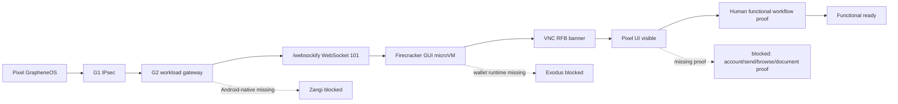

# Step 3.70 - Live Factual Pixel Audit Hardening

Date: 2026-05-22

This step fixes two false-positive / false-negative problems in the live workload audit path.

## Implemented

- `scripts/live-factual-workload-audit.mjs`
  - Checks the real noVNC target path instead of treating the root `302` redirect as a failed route.
  - Verifies WebSocket upgrade to `/websockify` for each noVNC workload.
  - Distinguishes:
    - `transportReadyApps`
    - `pixelUiVisibleApps`
    - `functionalReadyApps`
  - Adds screenshot-based visual classification for canvas-rendered noVNC sessions, because Android `uiautomator` cannot read application text inside the VNC canvas.
  - Keeps communicator PASS blocked until account bootstrap and send/receive are verified by a human or explicit test evidence.

- `scripts/launch-native-firecracker-gui-workload.mjs`
  - Requires a real VNC `RFB` banner before marking a GUI microVM ready.
  - Enlarges the Signal microVM profile to 4 vCPU / 6144 MiB.
  - Prevents stale or wedged VNC services from being reported as ready.

- `.gitignore`
  - Excludes live Pixel screenshots and UI dumps under `docs/admin-panel-v2/test-artifacts/` so QR codes, temporary session views, and other live evidence are not committed.

## Latest Live Result

Command:

```powershell
node scripts/live-factual-workload-audit.mjs --pixel
```

Observed through Pixel -> VPN -> G1 -> G2 -> AX102 WORKLOAD -> Firecracker/noVNC:

- Transport ready:
  - DuckDuckGo
  - LibreOffice
  - WhatsApp
  - Telegram
  - Threema
  - Signal
- Pixel UI visible:
  - DuckDuckGo
  - LibreOffice
  - WhatsApp
  - Telegram
  - Threema
  - Signal
- Functional workflow ready:
  - none yet, by design, because the audit now requires real user workflow proof.

## Remaining Blockers

1. Communicators still require account bootstrap plus send/receive proof.
2. DuckDuckGo still requires an explicit browsing workflow proof.
3. LibreOffice still requires a document create/open/save workflow proof.
4. Zangi remains blocked until the Android-native isolated runner exists.
5. Exodus remains blocked until an approved isolated wallet runtime and operator-risk workflow exist.
6. HSM/FIDO2 physical ceremony remains deferred.
7. Puli AX router package remains deferred until the physical router arrives.

## Security Invariants

- Terminal remains display/input only.
- Workload routes stay behind G2.
- G1/G2 bypass remains blocked.
- WebSocket/noVNC checks do not inspect communicator content.
- Screenshots and live UI dumps are local test artifacts and are not committed.
- PHANTOM remains governance-only and outside baseline execution.

## Mermaid


