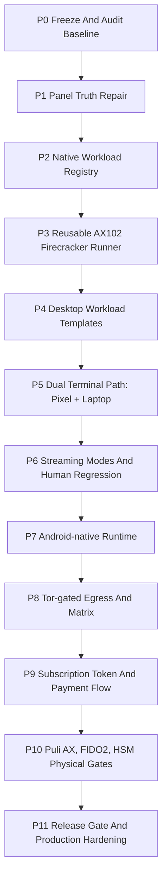
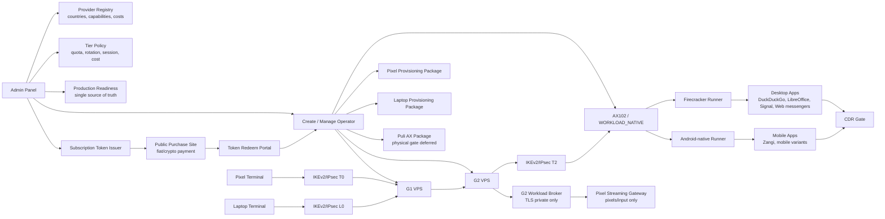
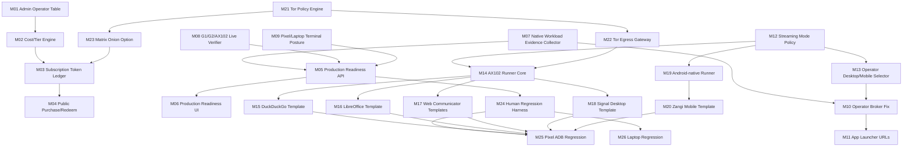
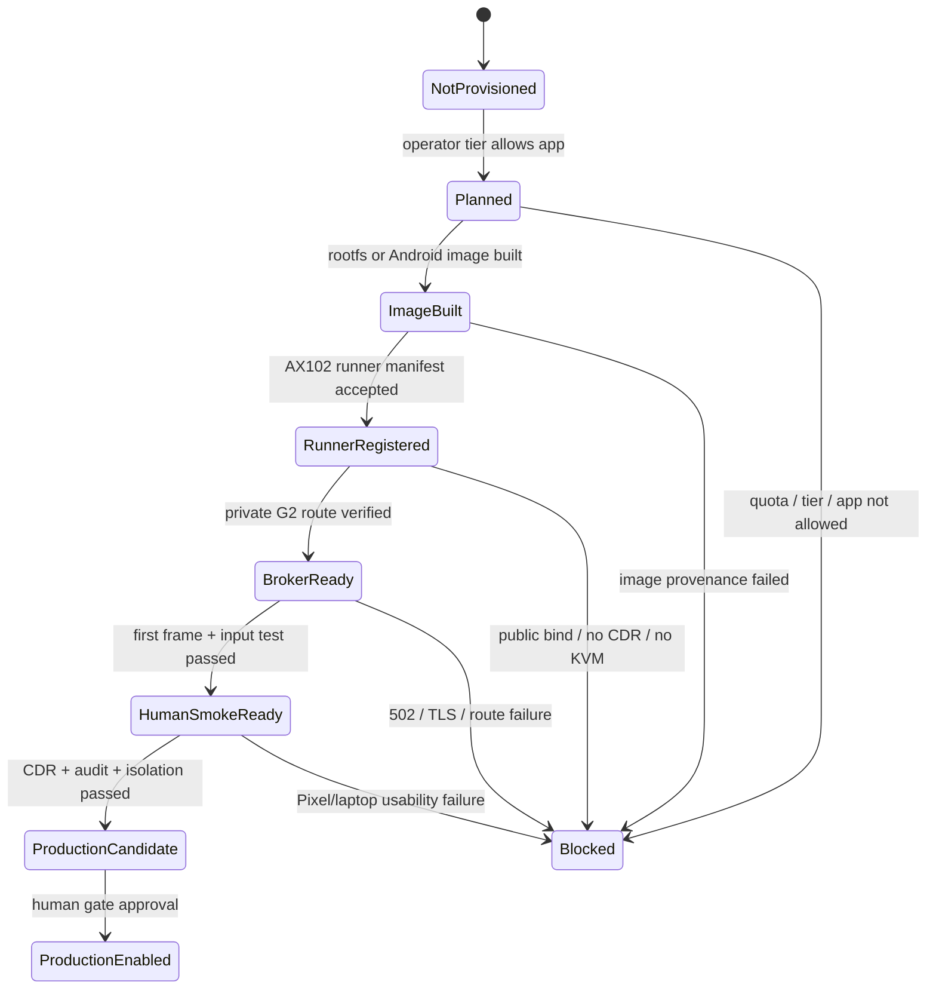
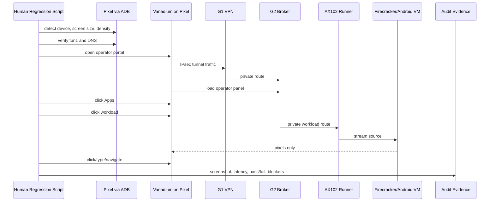

# STEP 3.60 - Repair, Implementation And Human Test Masterplan

Date: 2026-05-22  
Status: Planning freeze for implementation  
Scope: Admin panel, Operator panel, dual terminal path, AX102 Firecracker workloads, Android-native mode, streaming pixel tests, Tor-gated egress, Matrix, subscription token flow.

## Guiding Rules

1. No terminal bypass: Pixel and laptop must reach workloads only through G1 and G2.
2. No operational data on Pixel or laptop terminal.
3. IPsec/IKEv2 remains baseline transport.
4. CDR is mandatory for every file ingress/egress path.
5. PHANTOM remains governance/evidence-only and does not unlock baseline execution.
6. Tor/onion Matrix is a gated product capability requiring legal/compliance review before production.
7. FIDO2/HSM physical enforcement is deferred, but admin and operator interfaces must be complete now.
8. Puli AX physical tests are deferred until device arrival.
9. Every app must expose honest status: working, blocked, lab-only, or missing. No silent mock success.

## Phase Overview



## Target Architecture Graph



## Module Dependency Graph



## Workload State Graph



## Human Regression Flow



## Phase Details

### P1 - Panel Truth Repair

Goal: The panels must show true state, not optimistic placeholders.

Tasks:

1. Fix operator smoke locator ambiguity.
2. Fix `duckduckgo` broker mapping and app name.
3. Make workload broker read live AX102 evidence.
4. Add app route status: `200`, `502`, `blocked`, `not_built`, `human_test_pending`.
5. Update DuckDuckGo link to `/vnc.html` or add G2 root redirect.
6. Add admin filter/default view so current lab shows one real operator with G1/G2/AX102.
7. Add operator table columns: tier, subscription months, infra cost, customer price, gross margin, G1, G2, workload host, workload count, payment/token state.

Acceptance tests:

- Admin UI shows exactly one current live-lab operator when live-lab filter is active.
- Operator broker returns `DuckDuckGo`, not `Signal`.
- Non-running apps show `502/not_built`, not `ready`.
- `npm test` green.
- `operator-portal-smoke` green.

### P2 - Production Readiness Single Source Of Truth

Goal: One admin view shows current production readiness by operator and app.

Tasks:

1. Add `/production-readiness/operators`.
2. Add status collector for:
   - G1 Pixel SA.
   - G2->AX102 IPsec.
   - AX102 KVM/Firecracker/jailer.
   - app route HTTP status.
   - Firecracker evidence.
   - Pixel CA status.
   - CDR status.
   - router/FIDO2/HSM deferrals.
3. Add UI cards and table.
4. Add release blockers generated from readiness.

Acceptance tests:

- Readiness page never claims production when `productionExecutionAllowed=false`.
- Each app has explicit current blocker.
- Readiness status is auditable.

### P3 - AX102 Firecracker Runner Core

Goal: Convert DuckDuckGo proof into a reusable runner.

Tasks:

1. Create runner module for AX102:
   - per-operator run directory
   - per-app rootfs
   - tap allocation
   - private port allocation
   - cgroup/quota
   - jailer policy
   - cleanup
   - panic wipe hook
2. Write manifest format.
3. Add runner API control-plane endpoint.
4. Add evidence collector.
5. Add no public binds test.

Acceptance tests:

- Runner launches DuckDuckGo from template.
- Root binds redirect to `/vnc.html`.
- Evidence includes ready=true, privateBindOnly=true, terminalDataStored=false.
- Process cleanup removes stale microVMs.

### P4 - Desktop Workload Templates

Goal: Build real desktop workloads before Android-native.

Order:

1. DuckDuckGo production template.
2. LibreOffice.
3. Telegram Web.
4. WhatsApp Web.
5. Threema Web.
6. Signal Desktop.
7. Exodus only after wallet-risk acceptance gate.

Acceptance tests per app:

- G2 route returns 200.
- Pixel opens app.
- Laptop opens app.
- First frame under threshold.
- Basic click/type workflow passes.
- CDR blocks file movement unless clean verdict exists.

### P5 - Dual Terminal Path

Goal: Pixel and laptop are first-class terminal types.

Tasks:

1. Add laptop provisioning package:
   - IPsec profile.
   - CA package.
   - internal DNS instructions.
   - browser posture.
2. Add terminal registry and posture table.
3. Add operator selection between Pixel and laptop.
4. Add terminal-scoped session policy.
5. Add tests for no direct workload route from laptop.

Acceptance tests:

- Pixel path works through G1/G2.
- Laptop path works through G1/G2.
- Both terminal paths share the same broker and workload policy.
- No terminal stores operational data.

### P6 - Streaming Modes

Goal: Operator can choose display/runtime mode per app.

Modes:

- `desktop_fit`
- `desktop_pan_zoom`
- `mobile_native`
- `pixel_native`

Tasks:

1. Add app policy fields: allowed modes, default mode, current mode.
2. Add UI selector in operator Workload Control and App launcher.
3. Add admin tier policy for allowed modes.
4. Wire streaming profile to selected mode.
5. Add screenshot comparison tests.

Acceptance tests:

- Pixel portrait mode fits without unusable overflow.
- Laptop desktop mode keeps desktop UI usable.
- Mode changes are audited.
- Apps not supporting mobile mode cannot select it.

### P7 - Android-native Runtime

Goal: Support mobile app variants, starting with Zangi.

Decision candidates:

- Android-x86 under KVM.
- Cuttlefish.
- AVD under nested/host KVM.
- Waydroid/binderfs where feasible.

Tasks:

1. Probe AX102 kernel for binder/binderfs.
2. Decide runtime through ADR.
3. Build Android image provenance flow.
4. Add approved APK ref policy.
5. Launch first Android-native VM.
6. Stream mobile UI to Pixel and laptop.

Acceptance tests:

- Android VM boots.
- Zangi opens from approved APK/source ref.
- UI is visible and clickable.
- No APK from unapproved source.
- CDR and no-terminal-data invariants pass.

### P8 - Tor-gated Egress And Matrix

Goal: Add configurable Tor routing as a gated product capability.

Tasks:

1. Add admin Tor policy:
   - disabled
   - lab
   - production-approved
2. Add operator egress selector:
   - direct
   - jurisdiction route
   - tor_socks
   - tor_isolated_circuit
3. Add per-app egress policy.
4. Add latency and egress IP measurement.
5. Add Matrix server provisioning.
6. Add optional onion Matrix service gated by tier/legal policy.

Acceptance tests:

- Tor disabled by default.
- Enabling Tor requires tier and admin policy.
- DuckDuckGo egress IP changes when Tor lab mode is active.
- Matrix onion cannot be created unless policy permits it.
- Monitoring logs metadata only, never message content.

### P9 - Subscription Token And Payment Flow

Goal: Support paid subscription redemption and automatic operator provisioning.

Tasks:

1. Add public purchase site skeleton.
2. Add payment provider abstraction:
   - fiat provider
   - crypto provider
3. Add subscription token ledger:
   - single-use
   - expiry
   - tier
   - paid months
   - payment proof ref
4. Add token redeem flow.
5. Redeem token triggers operator creation and provisioning package generation.
6. Admin panel manages subscription duration, minimum 6 months.
7. Add cost model per operator.

Acceptance tests:

- Token cannot be reused.
- Token below 6 months is rejected.
- Token tier maps to workload quota.
- Redeem flow creates operator package and provisioning plan.
- Payment secrets are never stored in plaintext.

### P10 - Physical Gates

Deferred until hardware:

- Puli AX package installation.
- Puli AX kill switch and DNS leak tests.
- Physical FIDO2 enrollment and re-auth.
- HSM-backed CA/key custody.

Acceptance tests:

- Router package boots and enforces IPsec only.
- DNS leak test passes.
- FIDO2 re-auth is required after session expiry.
- HSM-backed cert issuance replaces lab CA.

## Implementation Backlog

| ID | Item | Owner Type | Depends On | Done When |
| --- | --- | --- | --- | --- |
| B01 | Fix operator smoke jurisdiction locator | frontend/test | none | Playwright smoke green |
| B02 | Fix DuckDuckGo broker mapping | backend | none | broker appName correct |
| B03 | Add live app route status collector | backend/ops | AX102 access | readiness shows 200/502 |
| B04 | Add Production Readiness admin view | frontend/backend | B03 | admin sees app blockers |
| B05 | Add operator cost/tier columns | frontend/backend | subscription service | table shows cost/subscription |
| B06 | Build Firecracker runner core | infra/backend | AX102 | reusable runner works |
| B07 | Convert DuckDuckGo to template | infra | B06 | noVNC works through G2 |
| B08 | Add LibreOffice template | infra | B06 | UI opens through G2 |
| B09 | Add web messenger templates | infra | B06 | web UIs open |
| B10 | Add Signal Desktop template | infra | B06 | Signal session opens |
| B11 | Add laptop terminal package | backend/docs | G1/G2 | laptop path tested |
| B12 | Add streaming mode selector | frontend/backend | B03 | desktop/mobile modes shown |
| B13 | Add Pixel ADB human runner v2 | test/ops | B04/B07 | screenshots + latency |
| B14 | Add laptop human runner | test/ops | B11 | screenshots + latency |
| B15 | Android runtime ADR/probe | infra/architecture | AX102 | runtime chosen |
| B16 | Zangi Android-native | infra | B15 | Zangi opens |
| B17 | Tor policy lab mode | backend/ops/legal | B04 | disabled by default |
| B18 | Matrix server + onion gate | backend/infra | B17 | gated provisioning |
| B19 | Subscription token ledger | backend | subscription service | token redeem works |
| B20 | Public payment site skeleton | frontend/backend | B19 | payment proof creates token |

## Prompt Pack

### Prompt 01 - Panel Truth Repair

```text
You are implementing SYLION STEP 3.60 Panel Truth Repair.

Goal:
Fix admin/operator panels so they show real live state, not optimistic placeholders.

Requirements:
- Preserve G1/G2 path invariants.
- Do not store operational data on terminal.
- CDR remains mandatory.
- PHANTOM remains governance-only.
- Fix operator smoke jurisdiction locator ambiguity.
- Fix DuckDuckGo broker mapping so it never returns appName=Signal.
- Make broker read native AX102 evidence and route status.
- Show non-running apps as 502/not_built/blocked.
- Add tests for negative cases.

Deliverables:
- Code changes.
- Tests.
- Short doc update.
- List of files changed.
```

### Prompt 02 - Production Readiness View

```text
Build the SYLION Admin Production Readiness view.

Create backend API and frontend panel that show per-operator and per-app readiness:
- G1 Pixel SA
- G2->AX102 IPsec
- AX102 KVM/Firecracker/jailer
- app route HTTP status
- Firecracker evidence
- Pixel CA trust
- CDR coverage
- router/FIDO2/HSM deferrals
- productionExecutionAllowed=false unless all human gates pass

Add tests proving the view never claims production readiness for blocked apps.
```

### Prompt 03 - AX102 Firecracker Runner Core

```text
Implement a reusable AX102 Firecracker GUI runner for SYLION workloads.

Required:
- per-operator run directories
- per-app rootfs refs
- tap allocation
- private bind only
- cgroup/quota placeholders or implementation
- jailer policy
- cleanup/recreate
- panic wipe hook
- evidence JSON
- G2 noVNC route compatibility

Use DuckDuckGo as first template and keep productionExecutionAllowed=false.
```

### Prompt 04 - Desktop App Templates

```text
Add SYLION desktop workload templates using the AX102 Firecracker runner.

Implement in order:
1. LibreOffice
2. Telegram Web
3. WhatsApp Web
4. Threema Web
5. Signal Desktop

Each template must:
- run in isolated Firecracker workload
- bind private-only
- expose noVNC/WebRTC stream through G2
- require CDR for file transfer
- produce evidence
- have Pixel and laptop smoke tests
```

### Prompt 05 - Dual Terminal Path

```text
Implement laptop terminal support parallel to Pixel terminal support.

Requirements:
- terminal types: pixel_grapheneos, laptop_web_terminal
- laptop provisioning package
- IPsec/IKEv2 profile
- CA trust package
- terminal posture
- no direct workload route
- same G1/G2 broker path
- separate session policy and audit trail

Add tests proving both terminals can open the same workload through G1/G2.
```

### Prompt 06 - Streaming Modes

```text
Implement app-level streaming display modes:
- desktop_fit
- desktop_pan_zoom
- mobile_native
- pixel_native

Add admin tier policy and operator selector.
Wire selected mode to streaming profile and workload launch request.
Add tests for Pixel 960x2142 and laptop desktop viewport.
Reject mobile_native for apps without Android-native support.
```

### Prompt 07 - Pixel Human Regression

```text
Build and run SYLION Pixel ADB human regression v2.

The script must:
- find adb or use configured platform-tools path
- verify Pixel model, screen, density
- verify VPN tun1 and DNS
- open operator panel in Vanadium
- click through all operator sections
- open each workload
- screenshot each workload
- type/click/navigate like a human
- measure first frame and rough input latency
- record failures and screenshots
- never inspect message content or secrets
```

### Prompt 08 - Laptop Human Regression

```text
Build and run SYLION laptop human regression.

Use Playwright/browser automation to:
- open operator panel through laptop terminal path
- verify VPN/profile assumptions
- open DuckDuckGo/LibreOffice/messengers
- compare rendering with Pixel results
- measure first frame and click latency
- verify no terminal-side operational storage
- record screenshots and evidence JSON
```

### Prompt 09 - Android-native Runtime ADR And Probe

```text
Create an ADR and probe for SYLION Android-native runtime on AX102.

Compare:
- Android-x86
- Cuttlefish
- AVD
- Waydroid/binderfs

Evaluate:
- KVM
- binder/binderfs
- networking through G2
- streaming to Pixel/laptop
- image provenance
- APK approval refs
- per-operator isolation

Do not implement production Zangi until ADR selects runtime and tests pass.
```

### Prompt 10 - Zangi Android-native

```text
Implement Zangi as Android-native SYLION workload after ADR approval.

Requirements:
- approved Android image ref
- approved Zangi APK/source ref
- isolated runtime per operator/app slot
- private-only streaming through G2
- Pixel and laptop tests
- CDR policy
- no terminal data storage
- productionExecutionAllowed=false until human gate
```

### Prompt 11 - Tor Policy Lab Mode

```text
Implement SYLION Tor egress lab-mode controls.

Requirements:
- disabled by default
- admin global policy
- operator per-app egress selector
- tier gates
- audit metadata-only
- latency and egress IP measurement
- no claims of anonymity
- legal/compliance gate before production

Add DuckDuckGo lab test showing direct vs Tor-lab egress behavior.
```

### Prompt 12 - Matrix Server And Onion Gate

```text
Implement Matrix server provisioning controls.

Requirements:
- operator can request own Matrix server
- admin can approve/provision
- optional onion service only when Tor policy allows
- tier/add-on gated
- no message content in monitoring
- audit all changes
- production gates explicit
```

### Prompt 13 - Subscription Token Flow

```text
Implement subscription token flow.

Requirements:
- minimum duration 6 months
- token single-use
- token expiry
- tier and paid months encoded server-side
- payment proof ref
- public redeem page
- redeem triggers operator creation/provisioning package generation
- admin can manage subscription duration and cost
- crypto/fiat payment provider abstraction without plaintext secrets
```

### Prompt 14 - Final Human Release Test

```text
Run full SYLION human release regression.

Must cover:
- admin login and all admin tabs
- provider/tier/subscription management
- one real operator with G1/G2/AX102
- Pixel terminal path
- laptop terminal path
- every workload app
- desktop/mobile mode selector
- streaming rendering and latency
- DuckDuckGo browsing
- Tor lab mode if enabled
- Matrix request
- backup/panic controls
- FIDO2/HSM config interfaces
- CDR file transfer gate
- Blue Team alert/metadata views

Output:
- pass/fail matrix
- screenshots
- evidence JSON
- list of release blockers
```

## Test Matrix

| Area | Automated | Human Pixel | Human Laptop | Pass Criteria |
| --- | --- | --- | --- | --- |
| Admin login | yes | optional | yes | Global Super Admin session, no token leakage |
| Admin operator table | yes | no | yes | one live-lab operator visible with tier/cost |
| Operator panel nav | yes | yes | yes | all sections clickable |
| DuckDuckGo | yes | yes | yes | 200, first frame, browsing works |
| LibreOffice | yes | yes | yes | document UI opens |
| WhatsApp Web | yes | yes | yes | QR/login UI opens |
| Telegram Web | yes | yes | yes | web UI opens |
| Threema Web | yes | yes | yes | web UI opens |
| Signal Desktop | yes | yes | yes | app UI opens, account gate clear |
| Zangi Android | yes | yes | yes | Android-native app opens |
| Streaming modes | yes | yes | yes | desktop/mobile mode behaves correctly |
| CDR | yes | yes | yes | file transfer blocked without clean verdict |
| Tor lab egress | yes | yes | yes | disabled by default, gated when enabled |
| Matrix | yes | yes | yes | request/provision gates work |
| Backup/Panic | yes | yes | yes | policies save, destructive execution gated |
| FIDO2/HSM config | yes | yes | yes | interface ready, physical gate deferred |
| Puli AX | later | later | later | wait for hardware |

## Release Gate

Production release remains blocked until:

1. All planned apps have real workload status, not 502.
2. Pixel and laptop human regression pass.
3. CDR is proven in live file transfer path.
4. HSM-backed PKI replaces lab CA.
5. FIDO2 physical re-auth is tested.
6. Puli AX physical posture passes.
7. Tor and onion Matrix have legal/compliance gate approval if included.
8. Admin Production Readiness page shows no critical blocker.
