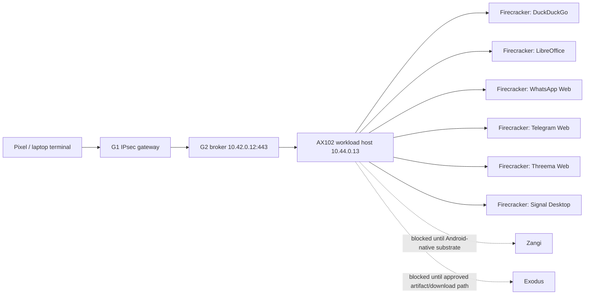

# Step 3.63 - Real Firecracker MicroVM Workloads

Date: 2026-05-22

## Freeze

This step replaces the earlier container/Kasm-style communicator fallback for the main desktop workloads with real Firecracker GUI microVM execution on the AX102 workload host.

The production factual gate is now:

- Firecracker microVM booted on AX102.
- App exposed only through noVNC/websockify bound to the private workload IP.
- G2 proxies the private workload endpoint over the private path.
- The app process is running.
- The app did not crash.
- A real X11 window for that app is visible inside the microVM.
- Terminal data is not stored.
- CDR remains mandatory for file transfer.

## Live Evidence

Workload host: `AX102 / 65.109.123.72 / 10.44.0.13`

G2 broker: `178.105.203.31 / 10.42.0.12:443`

| App | Runtime | Port | Firecracker evidence | G2 route | State |
| --- | --- | ---: | --- | --- | --- |
| DuckDuckGo | Firefox in Firecracker microVM | 3001 | `ready=true`, `visibleWindow=true` | `200`, noVNC marker | ready |
| LibreOffice | LibreOffice Writer in Firecracker microVM | 3002 | `ready=true`, `visibleWindow=true` | `200`, noVNC marker | ready |
| WhatsApp | WhatsApp Web in Firefox Firecracker microVM | 3010 | `ready=true`, `visibleWindow=true` | `200`, noVNC marker | ready |
| Telegram | Telegram Web in Firefox Firecracker microVM | 3011 | `ready=true`, `visibleWindow=true` | `200`, noVNC marker | ready |
| Threema | Threema Web in Firefox Firecracker microVM | 3012 | `ready=true`, `visibleWindow=true` | `200`, noVNC marker | ready |
| Signal | Signal Desktop in Firecracker microVM | 3013 | `ready=true`, `visibleWindow=true` | `200`, noVNC marker | ready |
| Zangi | Android-native workload required | 3014 | not built | G2 gate remains | blocked |
| Exodus | Dedicated wallet workload | 3015 | official `.deb` download blocked by Cloudflare challenge | `200`, noVNC marker | blocked |

## Important Fix

The black-screen problem was not a G2/noVNC routing issue. The microVMs had too little guest entropy for Firefox/LibreOffice/Electron startup. Processes existed, but no visible windows were created.

The runner now installs and starts `haveged` inside the guest before launching X11 apps, and readiness fails unless `sylion-visible-window=true`.

## Architecture

## Remaining Blockers

- Zangi requires the Android-native workload substrate with KVM/binder/binderfs and an approved APK/package reference.
- Exodus cannot be fetched by unattended `curl` from the official download host because Cloudflare returns a challenge. Production path needs an approved artifact mirror, manual artifact upload with hash verification, or vendor-supported unattended download.
- HSM/FIDO2 remain intentionally deferred but must stay visible in admin/operator UI.
- Puli AX router provisioning remains deferred until the physical router is available.

