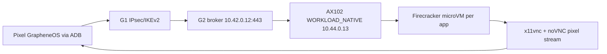

# Step 3.65 Pixel Firecracker Human Rerun

Status: factual rerun completed on 2026-05-22.

## Scope

This test verifies the real terminal path:

## Fixes Applied

1. Firefox launch no longer passes `--width 1080 --height 2200`.
   Firefox treated bare numeric values as navigable addresses, producing `0.0.4.56` instead of the target app.
2. Firecracker guest rootfs no longer inherits host `127.0.0.53` DNS.
   The guest now gets explicit lab DNS resolvers so web workloads can resolve the real external service.
3. Browser workloads now write target-content evidence:
   `targetHttpCode`, `targetContentRequired`, and `targetContentVerified`.
4. Firefox browser workloads use a dedicated profile with persistent storage allowed.
   This removed the blocking WhatsApp persistent-storage prompt.

## Live Evidence

| App | Runtime | G2/noVNC | Target evidence | Pixel screenshot result |
|---|---|---:|---:|---|
| DuckDuckGo | Firefox in Firecracker | pass | HTTP 200, `DuckDuckGo` marker | real DuckDuckGo page visible |
| LibreOffice | LibreOffice Writer in Firecracker | pass | native app | Writer canvas visible |
| WhatsApp | Firefox in Firecracker | pass | HTTP 200, `WhatsApp` marker | WhatsApp QR/login page visible |
| Telegram | Firefox in Firecracker | pass | HTTP 200, `Telegram` marker | Telegram QR/login page visible |
| Threema | Firefox in Firecracker | pass | HTTP 200, `Threema` marker | Threema QR/login page visible |
| Signal | Signal Desktop in Firecracker | pass | native app | Signal QR/link page visible |

Evidence directories:

- `docs/admin-panel-v2/test-artifacts/step3-65-pixel-firecracker-human-rerun/`
- `docs/admin-panel-v2/test-artifacts/step3-65-pixel-firecracker-human-rerun-2/`
- `docs/admin-panel-v2/test-artifacts/step3-65-pixel-firecracker-human-interaction/`

## Remaining Findings

1. Pixel visual scaling is usable but not polished. Desktop browser apps are still horizontally cropped in portrait mode.
2. ADB text injection did not type into the remote noVNC app, even after opening the noVNC keyboard panel.
   This is recorded as an input-method finding, not a workload-launch failure.
3. Zangi is still pending an Android-native workload runner.
4. Exodus is still blocked by official download artifact availability.
5. HSM/FIDO2 and router validation remain intentionally postponed.

## Acceptance State

The path `Pixel -> VPN -> G1 -> VPN -> G2 -> VPN/private workload -> Firecracker microVM -> noVNC pixel stream` is operational for the verified apps above.

The next implementation step is a Pixel terminal UX pass:

- mobile streaming profile with portrait fit,
- noVNC input method hardening,
- operator app switcher from Pixel,
- repeat ADB human regression with typing, tapping, app switching, and screenshots.
