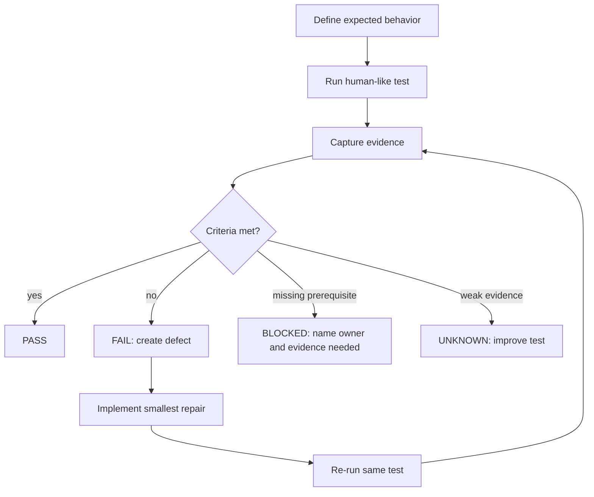

# Step 3.66 Human Regression And Security Masterplan

Status: planning freeze for factual, non-hallucinated testing.

Date: 2026-05-22.

## Purpose

This document defines the rule for moving SYLION from "it seems visible" to "a human can use it and evidence proves it".

Every feature must be tested by the same loop:

1. Define the expected behavior before testing.
2. Execute a human-like test through the real terminal path.
3. Capture evidence: screenshot, command output, audit record, and exact URL or host.
4. Mark the result as `PASS`, `FAIL`, `BLOCKED`, or `UNKNOWN`.
5. If `FAIL`, implement the smallest repair.
6. Re-run the exact same test.
7. Pass only when the pre-declared criteria are satisfied.

No feature can pass because a process exists, a port is open, or a page has a generic noVNC canvas. Those are transport checks only.

## Source Boundaries

Księga 3.4 baseline requirements used here:

- thin client: no operational data on terminal,
- split gateway: Pixel or laptop -> G1 -> G2 -> workload,
- baseline transport: IPsec/IKEv2,
- Firecracker microVM isolation per operator/workload,
- CDR for file ingress and egress,
- HSM-backed PKI planned as production requirement,
- auditability, monitoring, and incident response,
- admin and operator panels as control planes.

PHANTOM v3.0 boundary:

- PHANTOM is `[A]`, outside certifiable baseline.
- PHANTOM may appear in admin governance, risk, evidence, and approval views.
- PHANTOM must not enable baseline execution.
- Any PHANTOM operational activation requires `HUMAN GATE REQUIRED`: Legal, CISO, Architect, Compliance/Product.

Router boundary:

- GL-XE3000 Puli AX testing is postponed until hardware arrives.
- Router tests remain planned but blocked by physical hardware availability.

FIDO2/HSM boundary:

- UI and configuration flows may be tested now.
- Real cryptographic enrollment and HSM-backed CA cannot pass until physical devices/backend are present.

## Evidence Rule

Every test record must contain:

- test id,
- tester: `Codex` or human name,
- date/time,
- environment: local, admin VPS, G1, G2, AX102 workload,
- terminal: Pixel, laptop, admin browser, operator browser,
- exact path tested,
- expected behavior,
- evidence files or logs,
- result,
- defect id if failed,
- repair commit,
- retest evidence.

Allowed result meanings:

- `PASS`: all pre-written pass criteria satisfied.
- `FAIL`: attempted test disproved the expected behavior.
- `BLOCKED`: external prerequisite missing, for example router/FIDO2/HSM/test account.
- `UNKNOWN`: not tested or evidence insufficient.

## Test Flow Graph

## Priority Order

1. Pixel terminal usability and stream input.
2. Laptop terminal path.
3. Operator panel app switching and workload lifecycle.
4. Admin panel operator/provider/subscription controls.
5. Security transmission path and isolation.
6. CDR file flow.
7. Monitoring, anomaly, alert, and audit.
8. Backup, panic code, inactivity wipe.
9. Matrix server creation.
10. Tier/subscription/billing token flow.
11. PHANTOM governance-only checks.
12. Deferred: Puli AX router, FIDO2, HSM.

## Functional Human Regression Matrix

| ID | What Must Work | How It Should Work | How To Check Like A Human | Pass Criteria | If It Fails, Repair Then Retest |
|---|---|---|---|---|---|
| HR-001 | Pixel VPN to G1 | Pixel has active IPsec/IKEv2 session to G1 and private selectors to G2. | On Pixel: verify VPN key icon. From ADB: collect `dumpsys connectivity`, `ip route`, pings to `10.42.0.12` and internal hosts. On G1: verify SA for Pixel identity. | Pixel VPN present, `tun*` route exists, G1 SA established, ping to G2 succeeds, DNS internal names resolve. | Fix Pixel VPN profile, cert, DNS, strongSwan config, traffic selectors. Re-run same ADB and G1 checks. |
| HR-002 | G1 to G2 tunnel | G1 routes only allowed private traffic to G2 through IPsec. | From G1: check `swanctl/ipsec status`, ping G2 private IP, inspect firewall routes. | SA established, child SA installed, no public bypass for internal hosts. | Fix G1/G2 IPsec config, firewall, route tables. Retest. |
| HR-003 | G2 to workload tunnel | G2 reaches AX102 workload private IP through secure path. | From G2: `ipsec status`, ping `10.44.0.13`, curl workload noVNC private endpoints. | SA established or approved private secure route, G2 broker targets private workload address, no public workload bind. | Fix workload private bind, G2 proxy, tunnel config. Retest. |
| HR-004 | Firecracker boot | Each workload app runs in separate Firecracker microVM. | On AX102: list Firecracker PIDs, run dirs, tap devices, evidence JSON per app. | Each app has distinct run dir, tap, guest IP, host port, evidence `ready=true`; no shared app process outside expected host services. | Fix launcher, tap cleanup, rootfs build, per-app config. Retest. |
| HR-005 | Pixel sees real DuckDuckGo | Pixel displays actual DuckDuckGo app page from microVM. | On Pixel: open `duckduckgo.sylion.internal/vnc.html`, screenshot. Try search field by physical touch. | Screenshot shows `duckduckgo.com` page inside remote Firefox, not browser error, not generic noVNC only. For full pass, input/search works. | Fix browser profile, DNS, scaling, noVNC input. Retest screenshot and input. |
| HR-006 | Pixel sees real Signal | Pixel displays Signal Desktop from microVM. | Open Signal workload on Pixel, screenshot. Human scans QR/link flow if test Signal account exists. | Basic pass: Signal QR/link page visible. Full pass: test account links and sends/receives message. | Fix Signal package, GPU/sandbox flags, persistent profile, noVNC. Retest. |
| HR-007 | Pixel sees real WhatsApp | Pixel displays WhatsApp Web from microVM. | Open WhatsApp workload on Pixel, screenshot. Human scans QR with test WhatsApp account if available. | Basic pass: WhatsApp QR/login page visible. Full pass: paired session sends/receives test message. | Fix Firefox persistent storage, user agent/profile, network/DNS. Retest. |
| HR-008 | Pixel sees real Telegram | Pixel displays Telegram Web from microVM. | Open Telegram workload on Pixel, screenshot. Log in with test Telegram account if available. | Basic pass: Telegram login/QR page visible. Full pass: account login and test message works. | Fix URL/profile/DNS/scaling. Retest. |
| HR-009 | Pixel sees real Threema | Pixel displays Threema Web from microVM. | Open Threema workload on Pixel, screenshot. Pair with test Threema if available. | Basic pass: Threema QR/login page visible. Full pass: paired message test works. | Fix URL/profile/DNS/scaling. Retest. |
| HR-010 | Zangi workload | Zangi must be available as approved runtime, likely Android-native. | Open Zangi from operator panel and direct workload host. | `BLOCKED` until Android-native runner exists. Pass only when real Zangi app UI launches and account flow works. | Implement Android-native workload runner or supported desktop/web alternative. Retest. |
| HR-011 | LibreOffice workload | Pixel displays LibreOffice and can edit a document in workload. | Open LibreOffice on Pixel, tap document, type using physical Pixel keyboard/noVNC keyboard, screenshot. | Writer visible and text appears in document. File save/export must route through CDR when enabled. | Fix noVNC input, focus, keyboard mapping, scaling, CDR handoff. Retest typing and CDR. |
| HR-012 | DuckDuckGo browsing | Operator can browse web from workload, not terminal. | Open DuckDuckGo, search, click result, verify remote page loads. Check terminal has no downloaded content. | Search and click work; page is rendered in workload; no user data stored on Pixel. | Fix input, DNS, browser profile, egress policy. Retest. |
| HR-013 | Operator app switching on Pixel | Operator can move between panel, Signal, WhatsApp, Telegram, Threema, DuckDuckGo, LibreOffice. | On Pixel, open operator panel, use app switcher buttons, return to panel. Capture screenshots after each step. | Each app opens through G2 broker; no 127.0.0.1; app state visible; panel remains reachable. | Fix operator UI, deep links, broker URLs, Pixel viewport. Retest sequence. |
| HR-014 | Operator workload lifecycle | Operator can request delete/recreate for allowed app environments within tier limits. | In operator panel, use lifecycle controls for one test workload. Confirm destructive warning. | UI shows tier quota, requires explicit confirmation, creates audit event, new workload evidence appears. | Fix lifecycle API, RBAC, quota, audit, runner integration. Retest. |
| HR-015 | Operator session timer | Operator sees session time remaining and re-auth boundary. | Open operator panel, inspect session timer. Simulate or shorten session expiry. | Timer visible; after expiry, sensitive actions require re-auth; no silent extension. | Fix session policy, UI timer, step-up gate. Retest. |
| HR-016 | Operator security settings | Operator can configure password refs, FIDO2/HSM placeholders, panic policy, backup, inactivity wipe. | Open settings tabs and submit safe metadata-only configs. | Settings persist as metadata/refs only; secrets not echoed; unavailable HSM/FIDO2 marked deferred. | Fix forms, validation, audit, redaction. Retest. |
| HR-017 | Admin creates operator | Admin creates one operator and system generates G1/G2/workload package plan. | In admin panel, create operator with tier. Inspect operator table, cost, tier, resources, evidence. | Operator appears once with tier, cost, G1/G2/workload status, package refs. | Fix provisioning pipeline, live resource mapping, cost ledger. Retest. |
| HR-018 | Admin provider registry | Admin can add VPS/dedicated providers with countries and capabilities. | Add/edit provider with country/capabilities: Firecracker/KVM, AMD SEV-SNP, Intel TDX, Android-native. | Provider saved with secret refs only, countries searchable, capability filters work. | Fix provider schema/UI/filtering/secret storage. Retest. |
| HR-019 | Subscription tiers | Admin can define tier limits for apps, environments, rotation, session length, dedicated/shared pool. | Edit tier policies and create operator under each tier. | Limits enforced in admin and operator panels; over-limit requests fail clearly. | Fix entitlement policy and UI constraints. Retest. |
| HR-020 | Billing token flow | Public payment/token flow can provision operator package after payment token. | Use test token only. Submit token. Inspect generated package refs. | Token creates allowed operator flow, not plaintext secrets; min subscription 6 months enforced. | Implement/repair billing token service, validation, package generation. Retest. |
| HR-021 | Matrix own server | Operator/admin can request own Matrix server as paid add-on. | Enable add-on, request Matrix server, inspect plan/evidence. | Add-on required; plan creates refs and CDR/E2EE/audit policy; no unapproved live side effects. | Fix add-on gate, Matrix provisioner, audit. Retest. |
| HR-022 | Backup | Operator can request backup according to tier and policy. | Use operator backup UI. Inspect job/evidence and restore plan. | Backup metadata exists, encrypted target/ref exists, no terminal storage, restore test defined. | Fix backup worker, policy, encryption refs. Retest backup and restore drill. |
| HR-023 | Panic code | Operator can configure panic levels without exposing code. | Configure levels: data wipe, workload wipe, account disable. Do not execute destructive action without human gate. | Code stored write-only; simulation shows correct scope; real destructive execution requires approved procedure. | Fix secret handling, simulations, approval gates. Retest metadata flow. |
| HR-024 | Inactivity wipe | Operator can set inactivity policy. | Set short lab timeout, simulate inactivity, inspect planned action. | Planned action matches tier/policy; audit record created; destructive path gated. | Fix scheduler/policy/audit. Retest. |

## Security Test Matrix

| ID | Security Property | How It Should Work | Verification | Pass Criteria | Repair Loop |
|---|---|---|---|---|---|
| SEC-001 | No terminal operational data | Pixel/laptop only receive pixels/input; no chat history, workload files, app secrets stored locally. | Inspect Pixel downloads/app storage where feasible; verify no workload downloads. Check app URLs and noVNC cache behavior. | No message/file content intentionally written to terminal. Screenshots are test artifacts only. | Fix download blocking, browser cache policy, noVNC clipboard policy. Retest. |
| SEC-002 | IPsec/IKEv2 baseline | Pixel->G1 and G1/G2/workload path use approved secure tunnels or explicit approved private segment. | `swanctl/ipsec status`, route tables, packet capture metadata, firewall rules. | SAs established, internal names unreachable without VPN, no public workload service exposure. | Fix strongSwan, firewall, broker binds. Retest. |
| SEC-003 | G1/G2 boundary | Terminal cannot bypass G1/G2 to workload. | From Pixel/laptop attempt direct workload public IP/port. From internet scan selected ports. | Direct workload access blocked; only broker path works. | Fix firewall/security groups/nginx binds. Retest. |
| SEC-004 | Workload isolation | App microVMs do not share process namespace, tap, rootfs runtime state, or operator data. | Compare PIDs/run dirs/taps/rootfs copies. Try network reachability between guest IPs. | Separate Firecracker instances; no guest-to-guest connectivity unless explicitly allowed. | Fix launcher namespace, iptables, per-app rootfs. Retest. |
| SEC-005 | CDR mandatory file flow | Any file import/export goes through CDR. | Upload/download file via app where possible. Inspect CDR verdict and audit. | Unknown/malicious blocked; clean reconstructed file only exits. | Fix file gateway, MIME detection, app integration. Retest. |
| SEC-006 | Secrets redaction | Provider tokens, panic codes, HSM refs, app secrets never appear in UI/logs/evidence. | Grep logs/evidence/test artifacts for secret-like values. Inspect API responses. | Only secret refs shown; no plaintext. | Fix serializer, logging, UI redaction. Retest grep and API. |
| SEC-007 | Audit hash chain | Sensitive operations produce immutable audit refs without content leakage. | Create provider/operator/workload action; inspect audit chain. | Event exists, correlation id exists, hash chain verifies, no content payload. | Fix audit writer/schema. Retest. |
| SEC-008 | Monitoring and anomaly | Admin sees metadata-only anomalies: failed login, key change, tunnel down, workload crash, provider drift. | Inject safe lab events and inspect Blue Team dashboard/alerts. | Alert appears with severity, owner, runbook, no message content. | Fix detectors, alert routing, UI. Retest. |
| SEC-009 | RBAC and step-up | Admin/operator actions require correct role and fresh step-up for sensitive changes. | Attempt with readonly/support/operator tokens. Attempt after session expiry. | Unauthorized denied; sensitive action requires step-up. | Fix auth middleware and policy. Retest. |
| SEC-010 | HSM/FIDO2 deferred UI | UI supports configuration but does not claim physical enrollment. | Open admin/operator HSM/FIDO2 tabs. Submit metadata-only config. | Marked deferred/blocked until physical test; no fake pass. | Fix labels, gates, state model. Retest. |
| SEC-011 | PHANTOM separation | PHANTOM stays governance-only and cannot unlock execution. | Try PHANTOM execution request; inspect response/audit. | `executionAllowed=false`, `sideEffectAllowed=false`, human gate required. | Fix PHANTOM boundary checks. Retest. |
| SEC-012 | Legal product claims | UI/docs do not claim invisibility, anonymity, or impossible security. | Search UI/docs for risky claims. | Claims describe controls/residual risk only. | Rewrite wording, add residual risks. Retest search. |

## Pixel Test Script Plan

The Pixel human regression must run in these exact phases:

1. Preconditions:
   - ADB device authorized.
   - Pixel VPN active.
   - internal CA installed or trust state documented.
   - G1/G2/workload evidence fresh.

2. Connectivity:
   - open admin panel,
   - open operator panel,
   - ping internal hosts,
   - verify DNS through tunnel.

3. App visibility:
   - open DuckDuckGo,
   - open Signal,
   - open WhatsApp,
   - open Telegram,
   - open Threema,
   - open LibreOffice,
   - open Zangi only when runner exists.

4. App interaction:
   - tap search/input field,
   - open noVNC keyboard,
   - type text,
   - click a button/link,
   - capture before/after screenshot.

5. App switching:
   - start from operator panel,
   - open app,
   - return to operator panel,
   - open next app,
   - verify session timer remains accurate.

6. Negative checks:
   - open workload without VPN,
   - open direct public workload endpoint,
   - use wrong role,
   - exceed tier limits,
   - try file transfer bypassing CDR.

7. Evidence packaging:
   - save screenshots,
   - save sanitized XML,
   - save evidence JSON,
   - save test summary with PASS/FAIL/BLOCKED/UNKNOWN.

## Laptop Test Script Plan

The laptop path must be tested separately from Pixel:

Laptop checks:

| ID | What Must Work | How To Check | Pass Criteria |
|---|---|---|---|
| LT-001 | Laptop VPN profile | Connect laptop VPN to G1 and verify internal DNS. | G1 SA established, internal hosts reachable, no direct workload public access. |
| LT-002 | Admin panel | Open admin panel from laptop through intended URL. | Admin login works, no localhost URL required. |
| LT-003 | Operator panel | Open operator panel from laptop terminal session. | App switcher, settings, session timer visible. |
| LT-004 | Workload streams | Open each communicator and LibreOffice. | Same app evidence as Pixel, but viewport fits laptop. |
| LT-005 | Input | Type and click inside remote apps. | Text entry and button clicks reach microVM. |

## Repair Discipline

One repair per defect:

1. Write defect title.
2. Capture failing evidence.
3. Identify one probable layer:
   - terminal,
   - CA/VPN/DNS,
   - G1,
   - G2 broker,
   - workload host,
   - Firecracker guest,
   - app runtime,
   - UI/control plane.
4. Patch only that layer.
5. Run narrow retest.
6. Run affected regression subset.
7. Commit only after evidence passes.

Do not mark a defect fixed because another test passed.

## Current Known Defects And Blocks

| ID | Status | Finding | Needed Next Action |
|---|---|---|---|
| DEF-001 | FAIL | Pixel portrait stream is horizontally cropped for desktop apps. | Implement mobile viewport/scaling mode and retest screenshots. |
| DEF-002 | FAIL | ADB text injection does not reliably type into noVNC remote apps. | Harden noVNC keyboard/input mode or provide mobile thin-client input bridge. |
| DEF-003 | BLOCKED | Zangi runner not built. | Decide Android-native runner approach, then implement and test. |
| DEF-004 | BLOCKED | Exodus official artifact unavailable. | Exodus remains in scope. Add an approved-artifact path with checksum/signature evidence instead of dropping the app. |
| DEF-005 | BLOCKED | Router Puli AX physical validation postponed. | Test when router arrives. |
| DEF-006 | BLOCKED | HSM/FIDO2 physical enrollment postponed. | Test UI now, physical crypto later. |
| DEF-007 | FAIL | Full communicator account creation/linking and send/receive are not proven. Web-only versions are insufficient for account bootstrap. | Add Account Bootstrap module with legal test-number provider support and Android-native/mobile bootstrap where required. |
| DEF-008 | PLANNED | Destructive wipe/panic/inactivity tests need a sacrificial operator. | Create one explicitly labeled disposable operator, then test wipe levels only against that operator. |

## Human Gate Required

HUMAN GATE REQUIRED for these decisions:

1. Which phone-number/SMS provider is approved for lawful test account bootstrap.
2. Whether Zangi must be Android-native only or an approved desktop/web alternative is acceptable.
3. Any production claim about anonymity, jurisdictional guarantees, lawful-access exposure, or PHANTOM behavior.
4. Any real panic wipe execution beyond the single disposable operator scope.

Recommended owners:

- Architect: baseline path and tier architecture.
- CISO: security acceptance and residual risk.
- Product: acceptance depth for communicator workflows.
- Legal/Compliance: PHANTOM and jurisdictional claims.
- Infra: VPN, G1/G2/workload, Firecracker.

## Immediate Next Sprint

Smallest next sprint:

1. Create a machine-readable test matrix file matching this document.
2. Implement Pixel human regression runner that records `PASS/FAIL/BLOCKED/UNKNOWN` per test id.
3. Add Account Bootstrap test plan and UI requirements.
4. Add Disposable Operator destructive lab plan and guardrails.
5. Fix DEF-001: mobile viewport/scaling.
6. Fix DEF-002: noVNC input.
7. Re-run HR-005, HR-011, HR-013.
8. Only after input works, test communicator account bootstrap, pairing, and message send/receive.

## Open Questions

1. Which legal SMS/phone-number provider should be used for disposable communicator test accounts?
2. Can you provide or approve disposable test numbers/accounts for Signal, WhatsApp, Telegram, Threema, and Zangi?
3. For Exodus, do we use an admin-uploaded approved artifact with checksum/signature if direct vendor download is blocked?
4. Confirm the disposable operator label before real destructive tests: proposed `OP-DESTRUCTIVE-001`.
