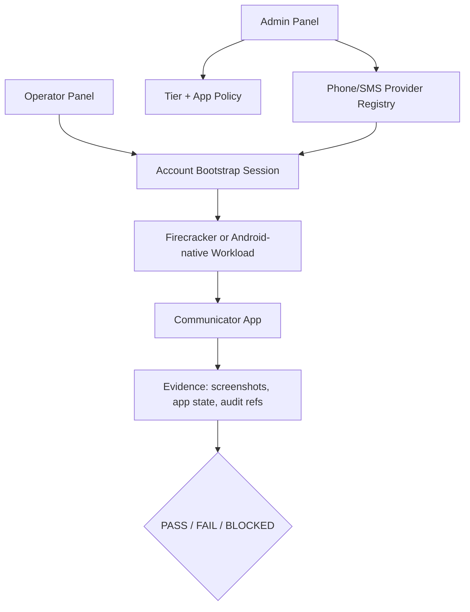
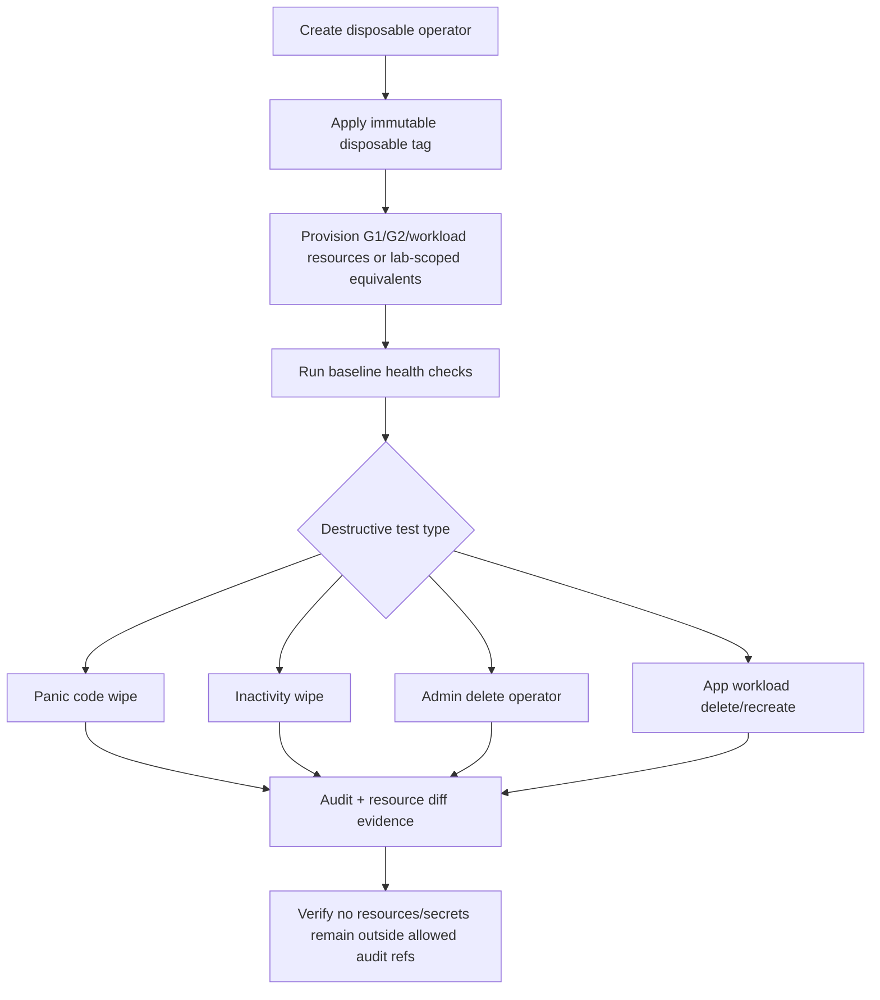

# Step 3.67 Account Bootstrap And Disposable Operator Plan

Status: planning freeze after user decisions.

Date: 2026-05-22.

## Decisions Captured

1. Communicator web versions are not enough.
   They may show login/QR screens, but they do not prove that SYLION can create or bootstrap an account from the operator workflow.
2. SYLION needs a lawful test-number/SMS provider integration for disposable account registration tests.
3. Exodus remains in the current product scope and must not be dropped.
4. Real destructive tests will use one explicitly disposable operator that can be deleted.

## Boundary

Phone-number providers may only be used for lawful test numbers, account QA, and provider-compliant verification flows.
The system must not implement bypasses, ban evasion, mass registration, or hidden identity manipulation.

PHANTOM v3.0 remains `[A]` governance-only. Account bootstrap, test numbers, wipe tests, and Exodus are baseline/product QA topics unless explicitly moved into PHANTOM governance by human approval.

## New Module: Account Bootstrap

Purpose: let the admin/operator workflow create or link real test accounts where each communicator permits it, using approved provider integrations and clear pass/fail evidence.

### Required Admin Panel Controls

| Control | Requirement | Acceptance |
|---|---|---|
| Phone/SMS providers | Add provider name, countries, supported apps, pricing, API secret ref, compliance notes. | Secret is stored only as ref; provider appears in policy selector. |
| App bootstrap policy | For each communicator define `web_link_only`, `android_native_required`, `desktop_supported`, `sms_required`, `manual_human_step_required`. | Operator UI shows only allowed options for tier/app. |
| Test number allocation | Allocate number for a disposable operator/app. | Number allocation has cost, country, TTL, app binding, and audit event. |
| OTP capture | Fetch OTP through provider API or mark manual code entry. | OTP value is never stored in audit; only result metadata and provider ref are stored. |
| Account evidence | Store screenshots and app-state markers. | Evidence proves account screen, pairing, and message test state without leaking message contents. |

### Required Operator Panel Controls

| Control | Requirement | Acceptance |
|---|---|---|
| Bootstrap app account | Operator chooses app and approved bootstrap mode. | UI explains whether web, desktop, or Android-native is required. |
| Disposable test account | Operator can request disposable test account only if tier/policy allows. | Shows cost and TTL; no hidden provider call. |
| Manual step capture | Human can enter OTP/scan QR when provider/app requires it. | OTP not logged; audit says only `otp_submitted=true`. |
| Account status | App shows `not_started`, `number_allocated`, `otp_pending`, `linked`, `message_test_passed`, `failed`. | Status updates are tied to evidence refs. |

## Communicator Bootstrap Matrix

| App | Current Web/Desktop Reality | Required SYLION Bootstrap Path | Basic PASS | Full PASS |
|---|---|---|---|---|
| Signal | Signal Desktop must be linked to a Signal mobile account. | Android-native or physical/mobile bootstrap with phone number, then link Signal Desktop workload. | Signal QR/link screen visible in microVM. | Disposable account created/linked and test message sent/received. |
| WhatsApp | WhatsApp Web is linked-device flow, not standalone account creation. | Mobile/Android-native bootstrap with test number, then link WhatsApp Web workload. | WhatsApp QR/login page visible. | Disposable account linked and test message sent/received. |
| Telegram | Telegram can start with phone number/code, but verification may depend on app/provider policy. | Web/Desktop or Android-native with lawful test number and OTP handling. | Telegram login/QR page visible. | Disposable account logs in and test message sent/received. |
| Threema | Threema Web/Desktop depends on an existing Threema app/account/license flow. | Valid test Threema account/license, likely mobile/native bootstrap, then web pairing. | Threema QR/login page visible. | Test account paired and test message sent/received. |
| Zangi | Runner not built; account path unproven. | Android-native workload runner is likely required. | Zangi app starts in isolated workload. | Disposable account registers/logs in and message test passes. |

## New Module: Disposable Operator Destructive Lab

Purpose: allow real wipe, panic-code, inactivity deletion, and teardown tests without risking the main operator.

Proposed label: `OP-DESTRUCTIVE-001`.

### Destructive Test Guardrails

| Guardrail | Requirement |
|---|---|
| Unique label | Operator name/id must include `DESTRUCTIVE` and `DISPOSABLE`. |
| Resource tag | Every VPS, microVM, cert, DNS record, package, and audit event must carry disposable operator id. |
| Four-eyes gate | Real account deletion or provider deletion requires explicit test approval record. |
| Scope lock | Destructive jobs must reject any operator not tagged disposable. |
| Dry run first | Every destructive action runs `plan_only` and stores expected resource diff. |
| Evidence after | After deletion, system checks provider resources, database state, cert revocation, DNS, workload ports, and audit chain. |
| Audit retention | Operational resources are deleted, but audit refs remain metadata-only and hash-chain verifiable. |

## Disposable Operator Test Matrix

| ID | What Must Work | How To Check | PASS Criteria | Repair If FAIL |
|---|---|---|---|---|
| DO-001 | Create disposable operator | Admin creates `OP-DESTRUCTIVE-001` with explicit tag. | Operator exists, isolated tenant/resources, clear disposable banner. | Fix admin create flow, tagging, tenant isolation. |
| DO-002 | Provision baseline | Generate G1/G2/workload/resources for disposable operator. | Resources tagged, visible in admin, reachable only through intended path. | Fix provisioning/tag propagation. |
| DO-003 | App workload recreate | Operator deletes and recreates one app environment. | Old microVM gone, new microVM evidence exists, audit records both. | Fix lifecycle runner and audit. |
| DO-004 | Panic level 1 | Simulate then execute app-data wipe only. | App data destroyed for disposable operator, account remains, audit retained. | Fix wipe scope and resource filter. |
| DO-005 | Panic level 2 | Simulate then execute workload wipe. | Disposable workloads removed/recreated as policy defines, no other operator affected. | Fix workload selector and provider tags. |
| DO-006 | Panic level 3 | Simulate then execute full disposable operator deletion. | Operator disabled/deleted, resources removed, certs revoked, DNS removed, audit remains. | Fix teardown order and post-checks. |
| DO-007 | Inactivity wipe | Set short lab inactivity policy and trigger scheduler. | Same result as configured level, only disposable operator affected. | Fix scheduler and policy engine. |
| DO-008 | Negative safety | Attempt destructive action against non-disposable operator. | Request is denied before side effects. | Fix guard policy immediately. |

## Exodus Scope

Exodus remains required.

Current blocker: direct download was unavailable/blocked during the previous runner attempt.

Required product path:

1. Add approved artifact registry for desktop workloads.
2. Admin uploads or references an Exodus installer artifact.
3. Store checksum/signature/provenance metadata.
4. Build Firecracker image from approved artifact.
5. Pixel/laptop human test opens real Exodus UI.
6. No wallet seed creation or real funds in automated tests.

Exodus PASS levels:

| Level | Criteria |
|---|---|
| Basic PASS | Real Exodus app opens in microVM and screenshot proves UI. |
| Functional PASS | Disposable empty test wallet can be created/imported using test-only seed controlled by human, no funds. |
| Security PASS | No seed/private material appears in logs, screenshots intended for repo, API output, or terminal storage. |

## Updated Acceptance Policy

Communicator acceptance now has two levels:

| Level | Meaning | When Used |
|---|---|---|
| Basic stream PASS | Real app login/QR screen visible through Pixel/laptop path. | Transport and UI rendering tests. |
| Full account PASS | Disposable account is created/linked and sends/receives a test message. | Product-readiness claim for communicator support. |

The product must not claim "communicator works" unless Full account PASS is complete for that app.

## Immediate Implementation Queue

1. Add machine-readable test matrix entries for `Account Bootstrap` and `Disposable Operator`.
2. Add admin data model for phone/SMS provider metadata with secret refs only.
3. Add app bootstrap policy matrix.
4. Add disposable operator tag and destructive guard policy.
5. Add plan-only destructive diff endpoint.
6. Add tests that destructive actions reject non-disposable operators.
7. Implement Android-native bootstrap runner decision record for apps that cannot create accounts in web/desktop.
8. Add Exodus approved artifact registry path.

## Human Gate Required

HUMAN GATE REQUIRED before:

- connecting a real SMS/phone-number provider,
- storing or displaying any OTP beyond immediate human entry,
- executing full operator deletion,
- testing panic wipe beyond the disposable operator,
- making customer-facing claims that a communicator is fully supported,
- using any PHANTOM-adjacent identity, jurisdictional, or evasion language.

Owners:

- Product: app acceptance level.
- CISO: destructive test approval.
- Legal/Compliance: SMS provider and account terms.
- Infra: disposable resource tagging and teardown.
- Architect: Android-native runner and baseline alignment.
