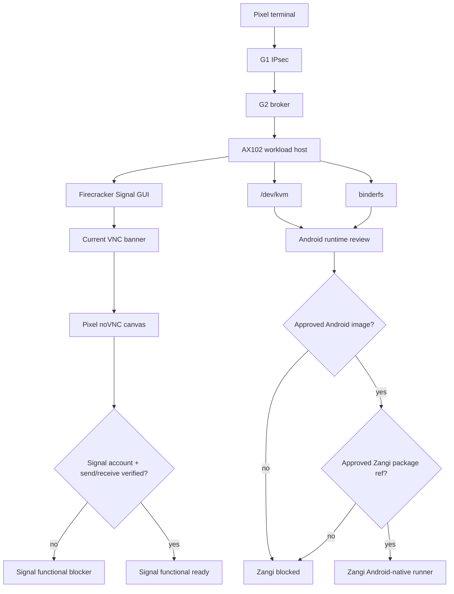

# Step 3.71 - Android-Native Host Gate And Signal Stability

Date: 2026-05-22

Status: implemented as a live host gate and factual audit hardening. This is not a production readiness approval.

## What Changed

1. The live factual workload audit now requires a current VNC banner from the workload host for noVNC-backed apps.
2. Signal was relaunched on AX102 with hardened x11vnc flags.
3. Signal was re-tested from Pixel through the full path after the relaunch.
4. AX102 was qualified for Android-native host review by enabling and persisting binderfs.
5. Android-native probe now separates host readiness from approved image/APK provenance.
6. The repository test command now runs deterministically with `--test-concurrency=1`.

## Live Facts

| Area | Result |
| --- | --- |
| Workload host | AX102 `65.109.123.72` |
| Host virtualization | bare metal, `/dev/kvm` present |
| Firecracker GUI | Signal launches with visible window and `RFB 003.008` |
| Pixel path | Pixel can see Signal noVNC canvas through G1/G2/workload |
| Signal functional state | blocked until account bootstrap and send/receive are verified |
| Android host gate | KVM plus binderfs ready |
| Zangi production state | blocked until approved Android workload image and Zangi APK/package reference exist |
| Exodus production state | blocked until official wallet artifact and operator risk workflow are approved |

## Commands Added Or Hardened

```bash
npm run live:android-binderfs-gate -- --target=root@65.109.123.72
npm run live:android-binderfs-gate -- --target=root@65.109.123.72 --apply
npm run live:android-native-probe -- --target=root@65.109.123.72
node scripts/live-factual-workload-audit.mjs --pixel --apps=signal
```

## Current Android-Native Gate

The AX102 host now passes the kernel/runtime substrate gate:

- `/dev/kvm`: present
- `binder_linux`: loaded
- `/dev/binderfs`: mounted
- binder nodes: `binder`, `hwbinder`, `vndbinder`, `binder-control`
- systemd mount: `dev-binderfs.mount` enabled

The host is therefore ready for Android runtime review. It is not yet ready to run production Zangi because the approved Android workload image and approved Zangi package reference are still missing.

## Current Signal Verdict

Signal is no longer accepted on transport-only evidence. It must pass all three layers:

1. G2 route and WebSocket upgrade are ready.
2. Workload host can connect to the current Firecracker guest VNC banner.
3. Pixel renders a non-blank, non-loading noVNC canvas.

The current result passes these three layers. It remains functionally blocked until disposable account bootstrap and send/receive testing are performed.

## Dependency Graph



## Remaining Blockers

| Blocker | Why it matters | Next implementation step |
| --- | --- | --- |
| `functional_workflow_not_verified` for communicators | Visible login/QR screens are not enough. | Build account-bootstrap evidence flow with human-entered OTP/phone data redacted from logs. |
| Zangi approved image/APK refs missing | Zangi cannot be treated as a browser/download-page workload. | Choose Android runtime, pin Android image, add approved package provenance gate. |
| Exodus artifact/risk path missing | Wallet tooling is sensitive and cannot be auto-promoted from a download page. | Add approved artifact ref and explicit operator risk acceptance workflow. |
| Physical HSM/FIDO2 | Hardware is deferred. | Keep admin/operator UI gates, run physical tests later. |
| Puli AX router | Hardware delivery is deferred. | Keep router package plan, run physical OpenWrt/IPsec tests later. |

## Test Evidence

```text
npm test
182 passing

node scripts/live-factual-workload-audit.mjs --pixel --apps=signal
transportReadyApps: ["signal"]
pixelUiVisibleApps: ["signal"]
functionalReadyApps: []
blockedApps: ["signal"]
```

## Compliance Notes

- No terminal-side operational data storage is introduced.
- PHANTOM remains governance-only and is not connected to baseline execution.
- Android/Zangi is not claimed production-ready until image and package provenance are approved.
- Signal is not claimed functional until account bootstrap and send/receive evidence are recorded.
