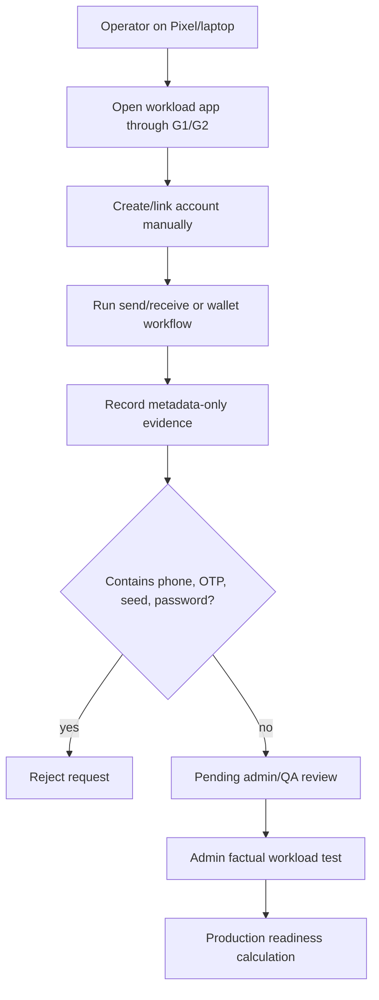

# Step 3.72 - Operator Account Bootstrap Evidence

Date: 2026-05-22

Status: implemented as operator-side evidence collection. It does not approve production readiness by itself.

## Purpose

Communicator workloads cannot be marked functional just because the login screen, QR code or noVNC canvas is visible. A factual pass requires:

1. UI visible on Pixel or laptop terminal.
2. Account created or linked inside the isolated workload.
3. Send/receive test completed.

For Exodus, the required checks are UI visibility, wallet workflow and operator risk acceptance.

## Implemented Surface

- Operator portal tab: `Account Bootstrap`
- API:
  - `GET /operator-api/account-bootstrap`
  - `POST /operator-api/account-bootstrap/sessions`
  - `POST /operator-api/account-bootstrap/sessions/:id/evidence`
- Smoke test now starts its own fresh Admin API server and clicks through Account Bootstrap.

## Guardrails

- No phone numbers are stored.
- No OTP/SMS verification codes are stored.
- No passwords, panic codes, wallet seeds, mnemonics or private keys are accepted.
- Evidence is metadata only: artifact refs, pass/fail checks, optional latency and safe notes.
- Operator evidence becomes `evidence_passed_pending_admin_qa_review`, not production-ready.
- Admin/QA must still record or approve the final factual workload test.

## Flow



## Verification

```text
npm test
184 passing

npm run test:operator-portal
Operator portal smoke completed against a fresh local test server
```

## Remaining Work

1. Add admin-side review queue for operator bootstrap evidence.
2. Run real disposable account bootstrap on Pixel for Signal/Telegram/WhatsApp/Threema.
3. Implement Android-native runner and approved Zangi image/package refs before Zangi can pass.
4. Add Exodus approved artifact and explicit wallet-risk workflow before Exodus can pass.
