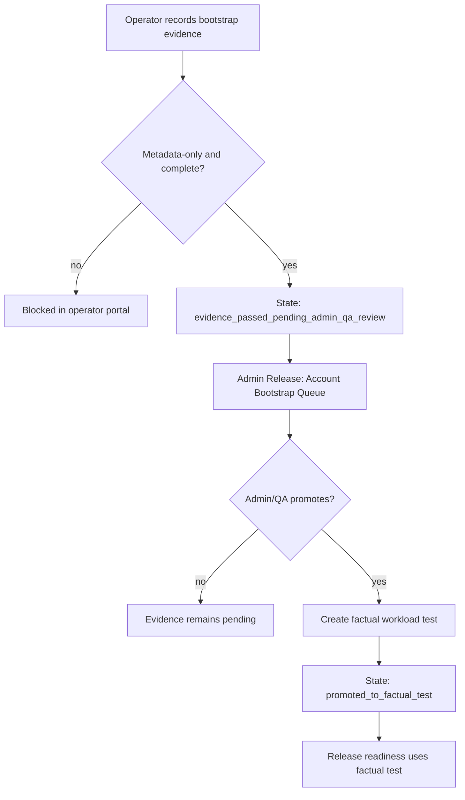

# Step 3.73 - Admin Bootstrap Evidence Review

Date: 2026-05-22

Status: implemented as an admin QA review bridge. It does not approve production readiness by itself.

## Purpose

Step 3.72 lets an operator record metadata-only account bootstrap evidence from the Pixel or laptop terminal. Step 3.73 adds the admin-side queue that can promote complete evidence into a factual workload test after QA review.

This closes the gap where a communicator could look visible through noVNC but still be unusable. A Signal, Telegram, WhatsApp, Threema or Zangi workload must not become functional-ready from transport or UI visibility alone.

## Implemented Surface

- Admin Release view:
  - `Account Bootstrap Queue`
  - Promote button for complete evidence only.
- API:
  - `GET /release/account-bootstrap-evidence`
  - `POST /release/account-bootstrap-evidence/:id/promote`
- Operator service:
  - admin list/get review methods
  - promoted session state: `promoted_to_factual_test`
  - `promotedFactualTestId`, `reviewedBy`, `reviewedAt`
- Audit:
  - `operator_portal.account_bootstrap_promoted_to_factual_test`

## Promotion Rules

- Evidence must already be a factual candidate.
- Secrets remain rejected: no phone numbers, OTPs, passwords, panic codes, wallet seeds, private keys or tokens.
- Promotion creates a release factual workload test with `factualStateVerified=true`.
- Promotion is still evidence for release gates, not a blanket production-ready claim.
- PHANTOM remains governance-only and is not part of the baseline promotion path.

## Flow



## Verification

```text
node --test services/admin-api/test/step3-72-account-bootstrap-evidence.test.js
node --test services/admin-api/test/admin-web-static.test.js
npm test
npm run test:operator-portal
```

Observed on 2026-05-22:

```text
npm test: 184 passing
operator portal smoke: passed
```

## Remaining Work

1. Run one disposable real account bootstrap on Pixel for each messenger.
2. Add a real Android-native workload runner and approved Zangi package/image refs.
3. Add Exodus approved artifact, wallet workflow and risk acceptance evidence.
4. Keep live factual audits failing until account bootstrap and send/receive tests are proven.
