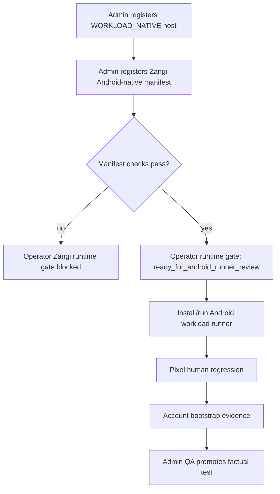

# Step 3.74 - Zangi Android-Native Manifest Gate

Date: 2026-05-22

Status: implemented as a manifest-driven runtime gate. It does not launch Zangi yet.

## Purpose

Zangi must not be represented as functional by opening a Chromium download page. It requires an Android-native workload path with:

- KVM-capable WORKLOAD host.
- binder/binderfs evidence.
- approved Android workload image reference.
- approved Zangi APK/package reference.
- CDR policy.
- private stream through G2.
- Pixel viewport declaration.

## Implemented Surface

- Admin `Workload Image` manifests can register `runtimeKind=android_native_workload`.
- Operator runtime gate consumes the latest ready Zangi Android-native manifest.
- `android-native-workload-probe.mjs` accepts explicit `--android-image-ref` and `--zangi-apk-ref` arguments, while still rejecting secret-bearing material.
- Operator portal shows manifest-derived Android gate readiness separately from production execution.

## Current Live AX102 Result

```text
hostReady: true
provenanceReady: false
ready: false
blockers:
- approved_zangi_apk_ref_missing
- approved_android_workload_image_missing
```

The AX102 host currently has KVM and binderfs available, but no approved Android workload image or Zangi APK reference has been supplied.

## Flow



## Verification

```text
node --test services/admin-api/test/step3-32-operator-workload-security-control.test.js
node --test services/admin-api/test/step3-53-workload-image-manifests.test.js
node --test services/admin-api/test/step3-71-android-native-probe-script.test.js
npm test
node scripts/android-native-workload-probe.mjs --host=65.109.123.72 --user=root --key=.deploy\sylion_hetzner_admin_ed25519
```

Observed on 2026-05-22:

```text
npm test: 185 passing
AX102 Android-native probe: hostReady=true, provenanceReady=false
```

## Remaining Work

1. Build or import an approved Android workload image artifact.
2. Add an approved Zangi APK/package reference with provenance evidence.
3. Install an Android-native runner on AX102.
4. Run Pixel -> VPN -> G1 -> VPN -> G2 -> VPN -> AX102 -> Android workload human regression.
5. Bootstrap a disposable Zangi account without storing phone, OTP, password or token material.
