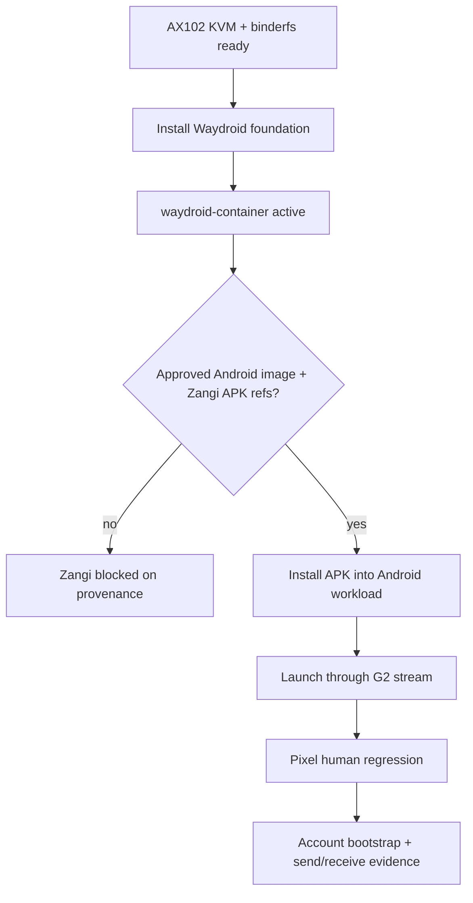

# Step 3.75 - Android-Native Runner Foundation

Date: 2026-05-22

Status: implemented and applied to AX102 as runner foundation. It does not install Zangi APK or approve production readiness.

## Purpose

This step installs a controlled Android-native runtime foundation on the WORKLOAD bare-metal host so Zangi can move away from the Chromium download-page placeholder.

The implementation follows the official Waydroid Ubuntu/Debian installation flow from `https://docs.waydro.id/usage/install-on-desktops` and keeps APK installation separate, matching `https://docs.waydro.id/usage/install-and-run-android-applications`.

## Implemented Surface

- New script: `scripts/install-android-native-runner.mjs`
- New npm command: `npm run live:android-native-runner-install`
- Default mode: `plan_only`
- Apply mode requires:
  - `--apply`
  - `--confirm=INSTALL_ANDROID_NATIVE_RUNNER`
  - `SYLION_ANDROID_RUNNER_INSTALL_ALLOWED=true`

## AX102 Result

Applied on 2026-05-22:

```text
targetHost: root@65.109.123.72
waydroid: true
weston: true
waydroid_container: active
kvm: true
binderfs_mounts: 2
```

Follow-up Android native probe:

```text
hostReady: true
provenanceReady: false
ready: false
blockers:
- approved_zangi_apk_ref_missing
- approved_android_workload_image_missing
```

## Guardrails

- No terminal-side operational data.
- No APK install without approved package reference.
- No phone number, OTP, password, token or seed storage.
- CDR remains mandatory for file ingress/egress.
- Production execution remains false.
- PHANTOM remains outside the baseline path.

## Flow



## Verification

```text
node --test services/admin-api/test/step3-75-android-native-runner-installer.test.js
npm test
npm run live:android-native-runner-install -- --host=65.109.123.72 --user=root --key=.deploy\sylion_hetzner_admin_ed25519
node scripts/android-native-workload-probe.mjs --host=65.109.123.72 --user=root --key=.deploy\sylion_hetzner_admin_ed25519
```

Observed on 2026-05-22:

```text
npm test: 187 passing
AX102 runner plan: Waydroid installed, container active
AX102 Android-native probe: hostReady=true, provenanceReady=false
```

## Remaining Work

1. Add approved Android workload image reference.
2. Add approved Zangi APK/package reference.
3. Install the approved APK into Waydroid.
4. Expose the Android app through the private G2 thin stream.
5. Run Pixel human regression and account bootstrap evidence.
