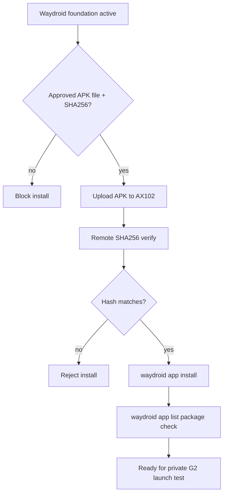

# Step 3.76 - Android APK Provenance Installer

Date: 2026-05-22

Status: implemented as an approved-APK install gate. No Zangi APK has been installed yet.

## Purpose

The Android-native runner is present on AX102, but installing a messenger APK must be provenance-gated. The system must not download arbitrary APKs from third-party mirrors and call the app production-ready.

## Implemented Surface

- New script: `scripts/install-android-apk-workload.mjs`
- New npm command: `npm run live:android-apk-install`
- Default mode: `plan_only`
- Apply mode requires:
  - `--apk=<local approved apk file>`
  - `--sha256=<expected apk sha256>`
  - `--apply`
  - `--confirm=INSTALL_ANDROID_APK`
  - `SYLION_ANDROID_APK_INSTALL_ALLOWED=true`

## Current AX102 Result

```text
waydroid: true
waydroid_container: active
package_installed: false
readyForApply: false
blockers:
- approved_apk_file_missing
- approved_apk_sha256_missing
```

## Android Image Evidence

Current Waydroid images on AX102:

```text
system.img sha256: d2809f66124f5d99e1165466ebd8aa1dacfb82829937942d81134a0862117103
vendor.img sha256: 5edafb92678c5abec7c8403c6873ce1de583009a57a6cb6de44d99f9b3f5c070
```

These hashes can be converted into an admin workload manifest image reference, but APK provenance is still missing.

## Flow



## Verification

```text
node --test services/admin-api/test/step3-76-android-apk-workload-installer.test.js
npm test
npm run live:android-apk-install -- --host=65.109.123.72 --user=root --key=.deploy\sylion_hetzner_admin_ed25519 --app=zangi --package=com.beint.zangi
```

Observed on 2026-05-22:

```text
npm test: 189 passing
AX102 APK installer plan: blocked only by missing approved APK file and SHA256
```

## Remaining Work

1. Obtain an approved Zangi APK/package source.
2. Record SHA256 and source provenance.
3. Run `live:android-apk-install` with apply gates.
4. Launch Zangi through Waydroid and expose only via G2 thin stream.
5. Run Pixel human regression and account bootstrap evidence.
