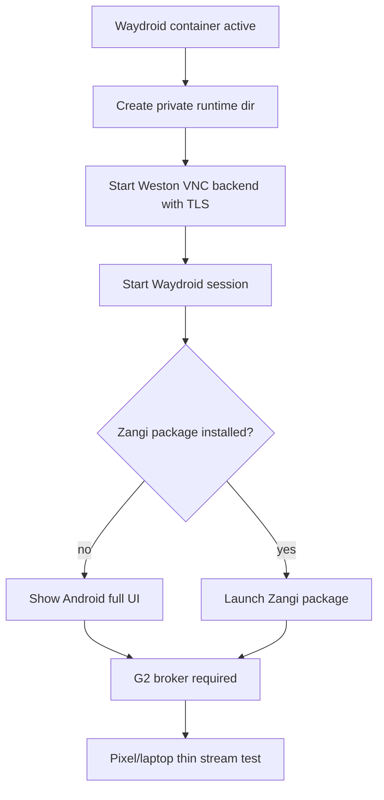

# Step 3.77 - Android-Native Private Stream

Date: 2026-05-22

Status: implemented and applied to AX102 for Android full UI. Zangi app itself is still blocked until approved APK install.

## Purpose

This step proves the Android-native workload can expose a thin-client stream without placing app data on the Pixel or laptop terminal.

## Implemented Surface

- New script: `scripts/launch-android-native-workload.mjs`
- New npm command: `npm run live:android-native-launch`
- Default mode: `plan_only`
- Apply mode requires:
  - `--apply`
  - `--confirm=LAUNCH_ANDROID_UI`
  - `SYLION_ANDROID_UI_LAUNCH_ALLOWED=true`

## AX102 Result

Applied on 2026-05-22:

```text
session: RUNNING
container: RUNNING
wayland_display: sylion-zangi-wayland
vnc_listener: true
public_drop_rule: true
streamReady: true
appLaunchMode: android_full_ui_no_app_installed
```

Public IPv4 port check:

```text
65.109.123.72:5914 -> blocked
```

The stream is TLS VNC on port `5914` with a firewall drop rule for public `eno1`. It is intended to be consumed only through the private G2 broker path.

## Guardrails

- No terminal-side operational data.
- TLS certificate generated on AX102 for the Android stream.
- Public interface blocked with `nft`.
- Zangi package launch is attempted only if the approved package is installed.
- Without Zangi APK, the launcher exposes Android full UI only.
- Production execution remains false.

## Flow



## Verification

```text
node --test services/admin-api/test/step3-77-android-native-launcher.test.js
npm test
npm run live:android-native-launch -- --host=65.109.123.72 --user=root --key=.deploy\sylion_hetzner_admin_ed25519 --app=zangi --package=com.beint.zangi --port=5914 --width=412 --height=915 --apply --confirm=LAUNCH_ANDROID_UI
Test-NetConnection -ComputerName 65.109.123.72 -Port 5914 -InformationLevel Quiet
```

Observed on 2026-05-22:

```text
npm test: 191 passing
AX102 Android stream: streamReady=true
Public port check: False
```

## Remaining Work

1. Install approved Zangi APK.
2. Bind the Android VNC/TLS stream through G2/noVNC.
3. Open it from Pixel over the existing Pixel -> G1 -> G2 -> WORKLOAD path.
4. Run human regression with touch/clicks and account bootstrap evidence.
