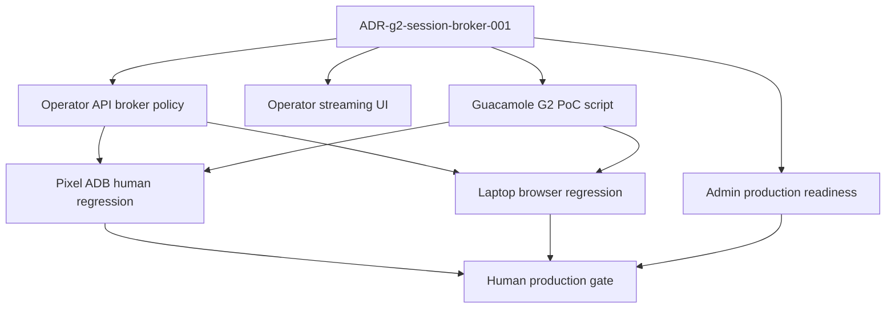
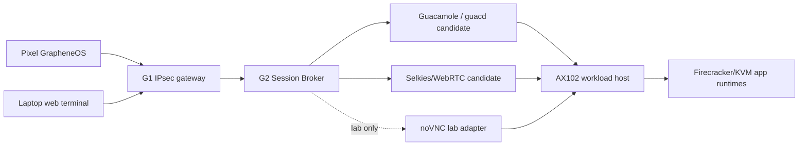

# Step 3.79 - G2 Session Broker and Guacamole PoC

Status: implemented as guarded control-plane + deploy script

## Why This Step Exists

The lab used `noVNC/websockify` to move quickly from Firecracker GUI workloads to a Pixel-visible stream. That was useful evidence, but it is not enough for production. This step freezes the correction:

- `G2 Session Broker` is the architecture component.
- Guacamole and Selkies/WebRTC are production candidates.
- noVNC is lab-only unless a future ADR promotes it.

## Dependency Graph



## Runtime Model



## Implemented Files

- `adr/ADR-g2-session-broker-001.md`
- `scripts/install-g2-guacamole-broker.mjs`
- `services/admin-api/src/modules/operatorPortal/operatorPortalService.js`
- `services/admin-api/src/app.js`
- `apps/operator-web/index.html`
- `apps/operator-web/app.js`
- `apps/admin-web/app.js`
- `services/admin-api/test/step3-79-g2-session-broker-policy.test.js`

## Production Gates

| Gate | Required outcome |
|---|---|
| Broker selection | `guacamole` or `webrtc_selkies` selected, not `novnc_lab` |
| Private bind | G2 listener only on private address |
| Public exposure | no public session broker stream |
| Terminal storage | false |
| Clipboard | disabled by default |
| File transfer | disabled or CDR-gated |
| Pixel test | app UI visible and interactive through G1/G2 |
| Laptop test | app UI visible and interactive through G1/G2 |
| Content audit | no message/file/wallet content in audit |

## Guacamole PoC Command

Plan only:

```powershell
node scripts/install-g2-guacamole-broker.mjs --print-plan
node scripts/install-g2-guacamole-broker.mjs --render-nginx
node scripts/install-g2-guacamole-broker.mjs --render-compose
```

Deploy to G2:

```powershell
npm run live:g2-guacamole-broker
```

Expected evidence:

- `session.sylion.internal` terminates on G2 private TLS.
- `10.42.0.12` is accepted as a temporary G2 broker host alias/default on the private listener for Pixel testing before internal DNS is fully provisioned.
- `/guacamole/` loads through internal route only.
- generated database password is stored on G2 in `/etc/sylion/guacamole.env` and is not printed.
- no workload password or account secret appears in generated config.

## Test Plan

1. Run unit/contract tests.
2. Deploy Guacamole PoC to G2.
3. Create Guacamole connection to one workload source.
4. Open from Pixel through VPN -> G1 -> G2 -> Guacamole.
5. Verify screen is app UI, not browser shell, not noVNC loading screen.
6. Repeat on laptop.
7. Record factual workload tests for each app.
8. Keep production blocked until all human checks pass.

## Current Non-Goals

- HSM/FIDO2 physical ceremony.
- Puli AX physical router package.
- PHANTOM execution.
- Declaring noVNC production-ready.
