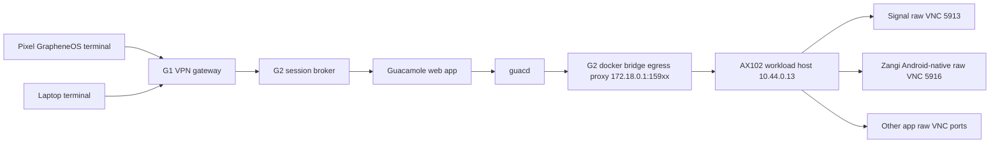
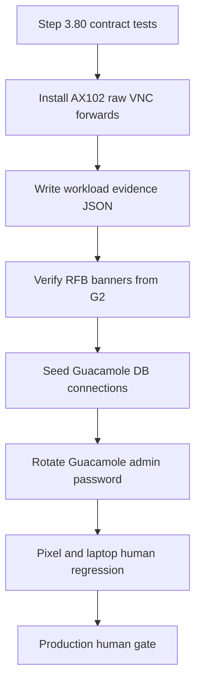

# Step 3.80 - Guacamole Raw VNC Workload Connections

Status: implemented as guarded live deployment automation

## Freeze

Step 3.80 moves the session broker path from lab noVNC sources toward the production broker shape:

- Guacamole remains on G2 as the session broker candidate.
- Workload AX102 exposes private raw VNC forwards only on `10.44.0.13`.
- Guacamole connects through G2 Docker-bridge egress proxies (`172.18.0.1:159xx -> 10.44.0.13:59xx`) because `guacd` runs inside Docker and cannot directly use the host IPsec policy route.
- The G2 egress proxies connect to raw VNC ports, not to noVNC/websockify HTTP pages.
- Zangi Android-native uses a Weston VNC TLS/VeNCrypt adapter with local PAM authentication on the workload host before exposing a private raw VNC stream to Guacamole.
- Guacamole connection concurrency is seeded as `10` per user for the current operator test tier so the operator can switch between apps without being blocked by stale single-session limits.
- noVNC remains lab evidence only.
- Clipboard and file transfer stay disabled until CDR gates are implemented for transfer.
- HSM/FIDO2 hardware ceremony and Puli AX router package remain deferred.

## Runtime Graph



## Connection Map

| App | Mode | Raw VNC on AX102 | Source target | Lab noVNC port | Status |
|---|---:|---:|---:|---:|---|
| DuckDuckGo Browser | desktop | `172.18.0.1:15901 -> 10.44.0.13:5901` | `172.16.58.2:5900` | `3001` | required |
| LibreOffice | desktop | `172.18.0.1:15902 -> 10.44.0.13:5902` | `172.16.58.6:5900` | `3002` | required |
| WhatsApp | desktop web | `172.18.0.1:15910 -> 10.44.0.13:5910` | `172.16.58.10:5900` | `3010` | required |
| Telegram | desktop web | `172.18.0.1:15911 -> 10.44.0.13:5911` | `172.16.58.14:5900` | `3011` | required |
| Threema | desktop web | `172.18.0.1:15912 -> 10.44.0.13:5912` | `172.16.58.18:5900` | `3012` | required |
| Signal | desktop | `172.18.0.1:15913 -> 10.44.0.13:5913` | `172.16.58.22:5900` | `3013` | required |
| Zangi | android-native lab | `172.18.0.1:15916 -> 10.44.0.13:5916` | `127.0.0.1:5916` | `3014` | required |
| Exodus | desktop | `10.44.0.13:5915` | `172.16.58.30:5900` | `3015` | blocked until target live |

## Live Result On 2026-05-23

Server-side checks:

- `npm run live:android-native-launch -- --apply --confirm=LAUNCH_ANDROID_UI` returned `streamReady: true` for Zangi.
- `npm run live:workload-guacamole-vnc-forwards` verified `RFB 003.008` from G2 for DuckDuckGo, LibreOffice, WhatsApp, Telegram, Threema, Signal, and Zangi.
- Guacamole DB contains seven `SYLION ...` VNC connections with `max_connections_per_user = 10`.
- Clipboard copy/paste and SFTP remain disabled in Guacamole parameters.

Pixel ADB human-regression evidence:

- Pixel reaches Guacamole at `https://10.42.0.12/guacamole/`.
- Signal opens as actual Signal Desktop UI through Guacamole.
- DuckDuckGo opens as a real browser workload and reaches `duckduckgo.com`.
- Zangi no longer hangs on Guacamole connection; it opens the Android-native Waydroid UI stream.

Current factual blockers:

- Zangi APK is not installed yet because no approved APK artifact and checksum are present in the workspace.
- Exodus remains blocked because the Exodus GUI/VNC target is not live.
- Guacamole/VNC visual switching works, but the operator UX still needs a first-class app switcher/disconnect control rather than relying on browser lifecycle behavior.
- Pixel DNS for `session.sylion.internal` is not complete yet; `10.42.0.12` is the current tested private endpoint until CA/DNS provisioning is finalized.

## Deployment Graph



## Commands

Plan:

```powershell
node scripts/install-workload-guacamole-vnc-forwards.mjs --print-plan
node scripts/seed-g2-guacamole-workload-connections.mjs --print-plan
```

Deploy:

```powershell
npm run live:workload-guacamole-vnc-forwards
npm run live:g2-guacamole-connections
```

## Evidence

Expected live evidence:

- Workload evidence file: `/opt/sylion-workloads/evidence/guacamole-vnc-forwards.json`
- G2 verification checks raw `RFB` banners from `10.44.0.13:59xx`.
- Guacamole DB contains `SYLION ...` VNC connections.
- Guacamole admin secret is rotated and stored on G2 in `/etc/sylion/guacamole-admin.env`.
- The secret is not printed in logs or chat.

## Human Regression Criteria

Pixel and laptop tests pass only if:

1. Operator reaches G2 Guacamole through the VPN path.
2. The selected app opens as an actual app screen, not a noVNC loading shell.
3. Pixel scaling fits the screen and remains usable in portrait and landscape.
4. Laptop scaling remains readable and interactive.
5. Signal, Zangi, WhatsApp, Telegram, Threema, DuckDuckGo, and LibreOffice each show factual UI.
6. DuckDuckGo can browse a public page from inside the workload.
7. File transfer is unavailable unless CDR is explicitly enabled.
8. Clipboard is disabled by default.
9. No message content, wallet content, or files are written to terminal storage.
10. Audit records contain metadata only.

## Known Blocker

Exodus remains blocked until the Exodus Firecracker GUI target exposes a live VNC server. The Guacamole connection is intentionally not seeded until that target is factual-live.

Zangi is now stream-capable through the Android-native workload runner, but production app execution remains blocked until an approved Zangi APK artifact and checksum are provided and installed through the gated Android APK installer.
