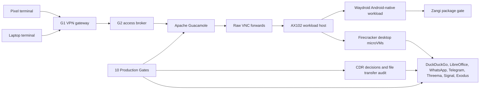

# Step 3.82 - 10 Gate Repair And Live Status

Date: 2026-05-23

Status: implemented, pushed and partially applied live.

## Scope

This step turns the current "10 things that do not work" list into hard production gates in the Admin API and admin panel. It also repairs the G2 Guacamole broker path and tightens factual testing so transport-only or nonblank-screen evidence cannot be treated as a working communicator.

## Implemented

- Admin panel now has a `10 Production Gates` section under Production Readiness.
- Admin API exposes `productionGates` with acceptance criteria, verification method, repair action, blockers, human gate and `productionExecutionAllowed=false`.
- Communicators and Exodus no longer accept env-only factual PASS. WhatsApp, Telegram, Threema, Signal, Zangi and Exodus require a recorded factual test/workflow.
- CDR production gate now reads real CDR evidence from decisions and monitoring events, not only an env flag.
- Zangi Pixel/live factual audit now requires `com.beint.zangi` to be installed before Android-native UI can count.
- Exodus launcher uses software-rendering environment variables, but Pixel still shows a blank app canvas. This remains blocked.
- G2 Guacamole was deployed as a real Docker-backed broker:
  - Guacamole HTTP: `200`
  - Guacamole connections: `8`
  - max connections per user: `10`
  - raw VNC reachability from G2 to AX102: all 8 app routes have `RFB 003.008`

## Live State

| Gate | State | Current evidence | Next action |
| --- | --- | --- | --- |
| 1. Zangi Android-native functional | blocked | Pixel stream renders Android/Waydroid, but `androidPackageInstalled=false`. | Provide approved Zangi APK provenance and checksum, install package, relaunch, then record account bootstrap evidence. |
| 2. Exodus Pixel visual and workflow | blocked | Firecracker/G2/VNC are ready, but Pixel screenshot is still blank/white. | Continue Electron rendering fix or replace runtime profile; then run wallet workflow evidence without secrets. |
| 3. G2 Guacamole broker | partially repaired | Broker is live, connections seeded, raw VNC reachable. | Keep production execution blocked until human approval and broker audit policy are reviewed. |
| 4. Communicator functional tests | blocked | Transport exists for several apps, but account bootstrap/send-receive evidence is not recorded. | Test one app at a time with safe metadata-only workflow records. |
| 5. Native Android workload mode | blocked | Waydroid stream exists; app install/provenance is missing. | Finish approved APK install flow and operator panel app-mode lifecycle. |
| 6. CDR ingress/egress | control-plane present | CDR decisions/transfers are implemented and tested in API. | Run live operator file ingress/egress regression with deny and allow evidence. |
| 7. Tor/jurisdiction routing | blocked | Policy model exists; end-to-end route evidence is not present. | Add route probes and tier-gated evidence without anonymity claims. |
| 8. Self-service recreate/rotate | partial | Operator panel can queue requests and native runner is gated. | Complete execution/rollback states for allowed actions; keep destructive operations human-gated. |
| 9. Confidential compute | blocked | AX102 KVM/Firecracker is not SEV-SNP/TDX attested. | Add provider capability and attestation records before tier claims. |
| 10. Payment token provisioning | blocked | Admin subscription model exists; public payment/token redemption is not live. | Implement payment sandbox, token issue/redeem, and provisioning handoff. |

## Mermaid



## Verification

```text
node --test services/admin-api/test/step3-60-production-readiness.test.js
node --test services/admin-api/test/step3-61-native-firecracker-runner.test.js
node --test services/admin-api/test/step3-70-live-factual-audit-helpers.test.js
node --test services/admin-api/test/step3-80-guacamole-workload-connections.test.js
node --test services/admin-api/test/admin-web-static.test.js services/admin-api/test/apps-cdr.contract.test.js
node scripts/live-factual-workload-audit.mjs --apps=zangi,exodus --pixel
node scripts/install-g2-guacamole-broker.mjs --deploy
node scripts/install-workload-guacamole-vnc-forwards.mjs --apply
node scripts/seed-g2-guacamole-workload-connections.mjs --apply
```

The live Pixel factual audit intentionally exits non-zero because Zangi and Exodus are still blocked. That is expected and correct.

