# Step 3.86 - Human Test, Simulation And Repair Masterplan

Date: 2026-05-23

Status: planning freeze before next implementation pass.

Scope: admin panel, operator panel, Pixel ADB human regression, laptop terminal path, Pixel/router/G1/G2/workload metadata monitoring, VPS rotation, workload Firecracker/container rotation, panic code, backup, CDR, PHANTOM v3.0 boundary, Ksiegi 3.4 baseline alignment.

## Ground Rules

1. Every test starts with a written expected behavior.
2. Every test ends as `PASS`, `FAIL`, `BLOCKED`, or `UNKNOWN`.
3. `PASS` requires factual evidence, not only a running process, HTTP 200, or a nonblank canvas.
4. Pixel and laptop are thin terminals: they receive pixels/audio/input only.
5. Baseline path remains: terminal -> Puli AX -> G1 -> G2 -> WORKLOAD -> app microVM/container.
6. Puli AX physical tests are `BLOCKED` until router hardware arrives.
7. HSM/FIDO2 physical enrollment is `BLOCKED` until devices/backends are present, but admin/operator configuration UI must be testable now.
8. Monitoring is metadata-only. It cannot store messages, payloads, packet captures, files, wallet data, secrets, API keys, OTP, phone numbers, seeds, or private keys.
9. CDR is mandatory for file ingress/egress.
10. PHANTOM v3.0 remains `[A]` governance/legal-risk track and cannot unlock baseline execution.
11. No production claim can pass until Ksiegi 3.4 baseline controls and human regression evidence are satisfied.

## Strict Anti-Hallucination Test Protocol

This protocol is mandatory. If a result is not proven by evidence, it is not working. The system must prefer a harsh `FAIL`, `BLOCKED`, or `UNKNOWN` over a comfortable but false `PASS`.

### Non-Negotiable Rules

1. No assumption can become a result.
2. No UI label can prove backend behavior by itself.
3. No backend status can prove human usability by itself.
4. No screenshot can prove security by itself.
5. No port, HTTP 200, process, Docker container, Firecracker PID, VNC banner or Guacamole connection can prove an application works.
6. No single evidence type can pass a critical feature; critical features require at least two independent evidence types.
7. If the exact path is not the required path, the result is `FAIL`, even when the app appears to load.
8. If a test uses localhost, `127.0.0.1`, direct public workload IP, or any shortcut not allowed by the planned test, the result is `FAIL`.
9. If a test captures or stores content that is forbidden, the result is `FAIL_CRITICAL` and evidence must be redacted before retest.
10. If a required physical prerequisite is missing, the result is `BLOCKED`, not `PASS` and not "probably OK".
11. If evidence is stale, ambiguous, incomplete, or cannot be traced to a timestamp and operator, the result is `UNKNOWN`.
12. If a repair changes behavior, the exact failed test must be re-run. Nearby tests are not enough.
13. If a test passes once but cannot be reproduced, it is `FLAKY` and cannot unlock production readiness.
14. If a feature is simulated, it must be labelled `SIMULATION_PASS`; it cannot satisfy live production evidence unless the gate explicitly accepts simulation.
15. If a feature is lab-only, it must be labelled `LAB_PASS`; it cannot become `PRODUCTION_PASS`.
16. If PHANTOM is involved, it can only produce governance evidence unless separately approved by Legal, CISO, Architect and Compliance/Product.
17. If Ksiegi 3.4 has a normative baseline control, the implementation must show direct evidence or remain blocked.
18. If Codex cannot verify a claim with tools, the answer must say "not verified" and name the missing test.
19. If a test finds a blocker, implementation pauses for the smallest repair, then retests that exact blocker.
20. If two consecutive repairs fail the same feature, escalate to root-cause analysis before more coding.

### Evidence Hierarchy

Evidence is ranked. Higher levels can support lower levels, but lower levels cannot replace higher levels.

| Level | Evidence type | Can prove | Cannot prove |
| --- | --- | --- | --- |
| E0 | Written requirement and expected behavior | Test intent | Any behavior |
| E1 | Static code/config review | Intended contract, routes, guards | Runtime behavior |
| E2 | Unit/contract tests | API invariants and negative cases | Real infrastructure usability |
| E3 | Integration tests on local harness | Multi-module behavior | Provider/VPS/Pixel reality |
| E4 | Live metadata probes | Real path state, reachability, latency, segment health | App content usability |
| E5 | Human-like browser/ADB interaction | Actual UI usability | Security or isolation by itself |
| E6 | Security probes and negative tests | Boundary enforcement, no bypass, no leaks | Business workflow success |
| E7 | Reproducible full regression | Release candidate confidence | Final production approval |
| E8 | Human gate approval | Approved release state | New evidence after changes |

Critical baseline features need at least:

- control-plane evidence: E2 or E3,
- live path evidence: E4,
- human usability evidence: E5,
- negative/security evidence: E6.

### Result Semantics

| Result | Meaning | Allowed next action |
| --- | --- | --- |
| `PASS` | All pre-written criteria satisfied with required evidence level. | Freeze evidence and move to next test. |
| `SIMULATION_PASS` | Simulation behaved correctly, no live claim. | Use to prepare live drill only. |
| `LAB_PASS` | Lab path works, production controls incomplete. | Keep production gate blocked. |
| `FAIL` | Test disproved expected behavior. | Create defect, repair smallest scope, retest. |
| `FAIL_CRITICAL` | Security, privacy, secret, bypass, content leak or destructive-risk failure. | Stop related work, redact evidence, security review, then repair. |
| `BLOCKED` | External prerequisite missing. | Name owner/prereq; do not code around it as if passed. |
| `UNKNOWN` | Evidence weak, stale, ambiguous or missing. | Improve test/evidence first. |
| `FLAKY` | Passed and failed or cannot reproduce. | Stabilize root cause; cannot release. |

### Minimum Evidence Bundle

Every human or live test must write a small evidence bundle:

```text
evidence/
  summary.json
  screenshots/
  ui-dumps/
  metadata/
  logs-sanitized/
  defects/
```

`summary.json` must include:

- test id,
- test version,
- git commit,
- tester,
- timestamp start/end,
- environment: local/admin VPS/G1/G2/AX102,
- terminal: Pixel/laptop/admin browser/operator browser,
- exact URL/host/path tested,
- expected behavior,
- preconditions,
- actions performed,
- evidence refs,
- result,
- blockers,
- repair commit if retested,
- residual risk.

Forbidden in evidence:

- chat/message content,
- contact lists,
- phone numbers,
- OTP/SMS codes,
- passwords,
- panic codes,
- provider API keys,
- wallet seeds/private keys,
- packet captures,
- file contents,
- raw browser cookies,
- private key material.

### No-Shortcut Checklist

Before any `PASS`, the tester must answer all applicable questions:

| Question | If answer is no |
| --- | --- |
| Did we test the exact required path? | `FAIL` |
| Did we avoid localhost/direct public shortcuts? | `FAIL` |
| Did we click/type/scroll like a human where usability matters? | `UNKNOWN` or `FAIL` |
| Did we capture timestamped evidence? | `UNKNOWN` |
| Did we prove no terminal operational data was stored? | `FAIL` for thin-client gate |
| Did we prove CDR behavior for file movement? | `FAIL` for file-capable app |
| Did we prove G1/G2 were not bypassed? | `FAIL` |
| Did we avoid forbidden content/secrets? | `FAIL_CRITICAL` |
| Did we re-run after repair? | `UNKNOWN` |
| Did the same test pass twice for flaky areas? | `FLAKY` |

### Repair Discipline

The repair loop is strict:

1. Reproduce the failure.
2. Write the failure as a defect record.
3. Identify the smallest responsible module.
4. Patch only that module unless root cause proves wider scope.
5. Run unit/contract tests for the patched module.
6. Re-run the original failing human/live test unchanged.
7. Run adjacent regression tests.
8. Update evidence and status.
9. If the second repair fails, stop feature coding and perform root-cause analysis.

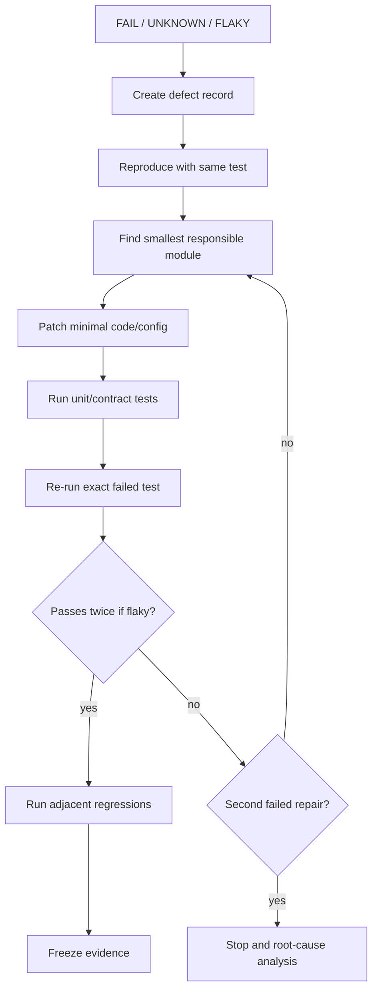

### Claim Control

Allowed wording:

- "verified by test X at commit Y",
- "observed in lab only",
- "blocked on prerequisite Z",
- "simulation passed, live not verified",
- "metadata-only evidence shows segment healthy",
- "human usability not yet proven".

Forbidden wording unless fully proven:

- "production ready",
- "secure end-to-end",
- "anonymous",
- "undetectable",
- "fully isolated",
- "works",
- "safe",
- "no leak possible",
- "guaranteed",
- "operator can use it" without human usability proof.

## Production Gate Math

A module is not complete until all required test categories pass:

```text
module_ready =
  contract_tests_pass
  AND ui_human_test_pass_if_ui_exists
  AND live_path_test_pass_if_live_feature
  AND negative_security_tests_pass
  AND evidence_bundle_complete
  AND no_critical_open_defects
```

For SYLION production readiness:

```text
production_candidate =
  all_required_modules_ready
  AND Ksiegi_3_4_baseline_report_has_no_false_green
  AND PHANTOM_boundary_report_passes
  AND router/HSM/FIDO2 either PASS or explicitly BLOCKED with no production claim
  AND human_gate_approval_present
```

## Current Truth Snapshot

| Area | Current state | What this plan does next |
| --- | --- | --- |
| Admin panel | Exists; provider, operator, blue team, PHANTOM, readiness and production gates exist. | Test every admin workflow by Playwright and API, then repair gaps. |
| Operator panel | Exists; settings, workload control, app switching, streaming and traffic monitor exist. | Drive it from Pixel ADB and laptop browser like a real operator. |
| Traffic Monitor | Implemented as metadata-only operator view. | Add live probe ingestion and verify segments against actual path metadata. |
| Pixel path | Pixel ADB and VPN evidence exist; CA install was user-present. | Run full ADB human regression: panel, app switcher, apps, stream, keyboard, return path. |
| Laptop path | Mode exists in control-plane and package view. | Add laptop human regression: same G1/G2/workload path, no local data. |
| Firecracker/workloads | Native Firecracker runner exists for selected GUI workloads; Guacamole routes exist. | Prove per-app factual usability and per-app isolation. |
| Communicators | QR/login surfaces observed for several apps; account bootstrap/send-receive not complete. | Test registration/linking with safe test accounts; no secrets in evidence. |
| Zangi | Blocked on approved Android-native APK/runtime evidence. | Keep blocked until provenance/install/launch/send-receive pass. |
| Exodus | Blocked on real wallet UI/workflow and explicit operator risk evidence. | Keep blocked; test without wallet seeds or private data. |
| VPS rotation | Control-plane exists; live provider and dedicated host exist. | Add safe simulation first, then gated live rotate drill. |
| Workload rotation | Operator recreate/rotate path exists. | Test UI + live runner + evidence + rollback with one disposable operator. |
| Panic code | UI/config metadata exists. | Test write-only storage and simulation; destructive live execution stays human-gated. |
| PHANTOM | Governance-only code/tests exist. | Re-test boundary: PHANTOM cannot trigger baseline execution. |

## Master Validation Graph

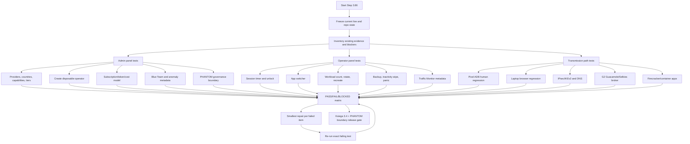

## Zone And Data Flow

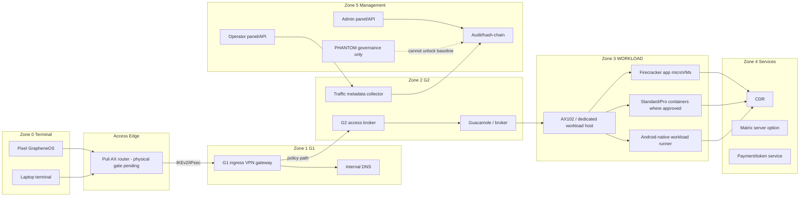

## Test Result State Machine

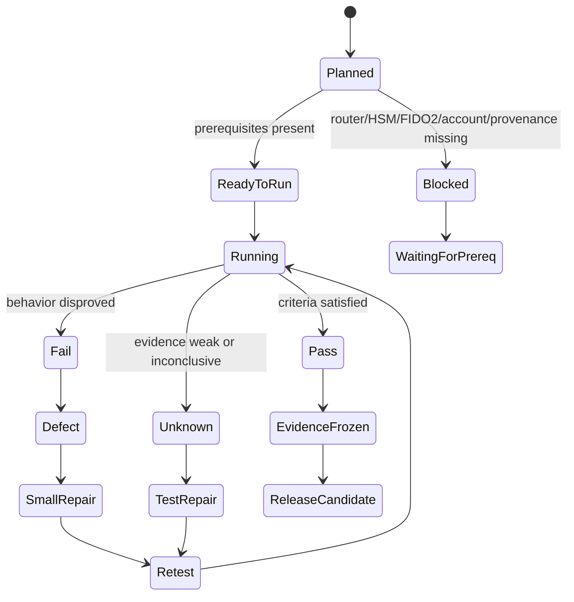

## Admin Functionality Test Plan

| ID | Function | Expected behavior | Human/API test | PASS criteria | Repair if FAIL |
| --- | --- | --- | --- | --- | --- |
| ADM-01 | Admin login and step-up | Admin logs in with WebAuthn/FIDO2 simulator now, physical later. Sensitive actions require fresh step-up. | Playwright: login, attempt provider secret rotation, verify step-up gate. | Unauthorized denied; fresh step-up allows only scoped action; audit event exists. | Fix auth policy matrix, RBAC, step-up freshness. |
| ADM-02 | Operator table | Admin sees only current live/test operator when filtered; columns show tier, cost, sub length, G1/G2/workload, app counts, status. | Playwright: open Operators and Production Readiness. | Table is accurate, no duplicate ghost operators, costs and tier visible. | Fix operator query, cost model, UI columns. |
| ADM-03 | Create disposable operator | Admin creates disposable operator with tier and package plan. | UI + API: create test tenant/operator; inspect generated G1/G2/workload plan. | Operator has baseline 3 layers, package refs, no plaintext secrets. | Fix provisioning pipeline, package generator, redaction. |
| ADM-04 | Provider registry | Admin adds providers with country and capabilities. | Add Hetzner/OVH-style provider entry with KVM, Firecracker, TDX/SEV-SNP flags. | Countries/capabilities searchable; secret refs only; no plaintext token echoed. | Fix schema, filters, serializer. |
| ADM-05 | Tier policy | Admin configures Standard/Pro/Phantom/Sovereign limits. | Set app count quotas, session hours, rotation capability, dedicated/shared host policy. | Operator UI enforces same limits; over-limit fails clearly. | Fix entitlement engine and UI constraints. |
| ADM-06 | Dedicated host allocation | Admin can register/use AX102 and future dedicated hosts. | API/UI: list host, KVM/firecracker status, attestation status. | KVM evidence present; SEV-SNP/TDX only true with attestation. | Fix host registry and confidential compute evidence. |
| ADM-07 | Live VPS rotate simulation | Admin simulates G1/G2/workload rotation without mutation. | Run dry-run; inspect plan, costs, rollback, audit. | Plan includes new VPS, route update, DNS, certs, rollback; no mutation. | Fix planner before live test. |
| ADM-08 | Live VPS rotate gated drill | Admin performs live rotate only for disposable operator. | Require fresh step-up, approval, confirmation, provider allowlist. | New VPS created, health passes, old route drains, rollback available. | Fix orchestrator/idempotency/firewall/provider cleanup. |
| ADM-09 | Blue Team dashboard | Admin sees metadata-only alerts: tunnel down, key change, login failures, workload crash, CDR events. | Inject safe events; inspect dashboard. | Alerts have severity, owner, runbook, no content. | Fix detector, incident mapping, UI. |
| ADM-10 | CDR admin | Admin can see decisions and monitoring events. | Create clean/quarantine transfer evidence. | Ingress/egress both represented; no file content in logs. | Fix CDR gateway/audit. |
| ADM-11 | Payment/token | Admin manages subscription tokens and minimum 6 months. | Use sandbox token; redeem; create package. | Token material redacted; min 6 months enforced; package generated. | Fix token ledger/redeem flow. |
| ADM-12 | PHANTOM view | Admin can review PHANTOM governance records only. | Create PHANTOM review/simulation record. | `sideEffectAllowed=false`; cannot unlock baseline. | Fix PHANTOM service boundary. |
| ADM-13 | Ksiegi 3.4 status | Admin readiness maps controls to evidence. | Open readiness; compare gate states. | Each baseline control has PASS/FAIL/BLOCKED evidence and owner. | Fix readiness collector and docs traceability. |

## Operator Functionality Test Plan

| ID | Function | Expected behavior | Human/API test | PASS criteria | Repair if FAIL |
| --- | --- | --- | --- | --- | --- |
| OP-01 | Operator login/session | Operator opens panel from Pixel or laptop through internal host. | Pixel ADB opens `operator.sylion.internal/operator`; laptop opens equivalent internal URL. | No `127.0.0.1`; session bound; timer visible. | Fix DNS, CA, session cookie, URLs. |
| OP-02 | Session timer | Operator sees remaining time and expiry behavior. | Set short session in lab; wait/force expiry; retry sensitive action. | Expired session requires re-auth; no silent extension. | Fix session policy and UI timer. |
| OP-03 | App switcher | Operator switches between panel and app workloads. | Pixel: tap Apps, open Signal/DuckDuckGo/LibreOffice, return to panel. | Every app route opens via G2; back/reopen works. | Fix deep links, broker routing, Pixel viewport. |
| OP-04 | Traffic Monitor | Operator sees segment status and alerts. | Open Traffic Monitor; record safe metadata for G1/G2 and G2/workload. | Segments update; alerts change; no content fields accepted. | Fix endpoint, evidence model, UI render. |
| OP-05 | Workload counts | Operator requests app environment counts within tier. | Set e.g. WhatsApp x2, Signal x1; exceed limit intentionally. | Valid request accepted; over-limit denied; audit exists. | Fix quota enforcement/UI. |
| OP-06 | Workload rotate | Operator rotates one app environment. | Disposable operator only; rotate DuckDuckGo or Signal via UI. | Confirmation required; runner evidence sanitized; route reappears. | Fix live runner, cleanup, broker refresh. |
| OP-07 | Recreate all | Operator recreates all allowed environments only after confirmation. | Simulation first, then gated disposable live test. | No accidental wipe; CDR/audit present; rollback/backup refs exist. | Fix destructive guardrails. |
| OP-08 | G1/G2/workload passphrase refs | Operator configures layer passwords/refs. | Submit write-only values; reload panel. | Passwords not echoed; only metadata refs shown. | Fix serializer/storage redaction. |
| OP-09 | FIDO2/HSM config | Operator configures placeholders. | Submit refs/transport policy. | UI says deferred; no fake physical pass. | Fix copy/state/gates. |
| OP-10 | Backup | Operator enables backup policy. | Set cadence/scope; request backup simulation. | Metadata and encrypted target refs only; restore plan exists. | Fix backup planner and evidence. |
| OP-11 | Inactivity wipe | Operator sets inactivity cleanup. | Set short lab policy; simulate no session. | Planned action matches policy; live destructive action gated. | Fix scheduler/policy/audit. |
| OP-12 | Panic code | Operator configures panic levels. | Submit write-only codes; run simulation for each level. | Codes never displayed; simulation scope correct; live action gated. | Fix write-only secret handling and approval gates. |
| OP-13 | Matrix server | Operator requests own Matrix server add-on. | Enable add-on, submit hostname/federation. | Plan created; add-on required; no unapproved live side effect. | Fix entitlement/provisioner. |
| OP-14 | Jurisdiction policy | Operator configures rotation allowed by tier. | Try manual/scheduled/full_policy by tier. | Tier limits enforced; route evidence metadata only. | Fix policy engine and UI. |

## Pixel ADB Human Regression Plan

### Preconditions

| Check | Command/evidence | PASS |
| --- | --- | --- |
| ADB authorized | `adb devices` | Pixel serial is `device`. |
| Screen awake | `adb shell dumpsys power` + screenshot | Display is on and unlocked by user when needed. |
| VPN active | `adb shell dumpsys connectivity` | Validated VPN network; `tun1` or expected tunnel present. |
| Internal DNS | `adb shell getprop net.dns1` or connectivity dump | Internal DNS visible where Android exposes it. |
| CA state | Vanadium lock icon or controlled browser result | Internal TLS trusted or blocker documented. |
| No local shortcut | URL bar/screenshots | No workload test uses `127.0.0.1` or localhost. |

### ADB Click Flow

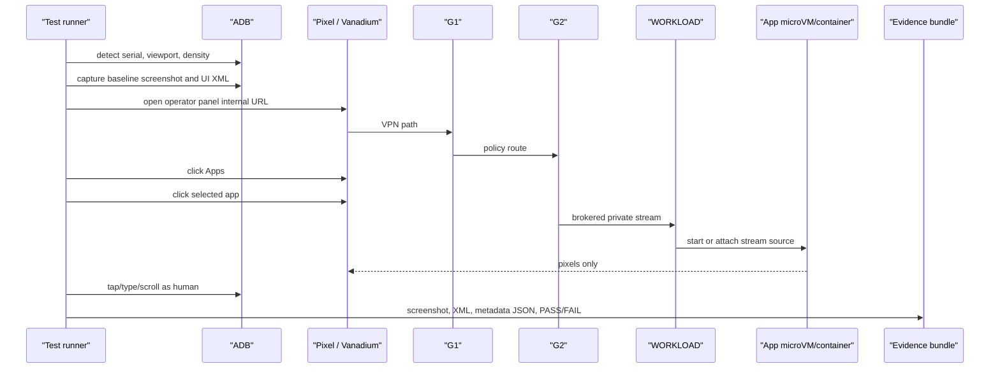

### Pixel App Matrix

| ID | App | Basic PASS | Full PASS | Current expected state |
| --- | --- | --- | --- | --- |
| PX-01 | Operator panel | Panel loads, nav usable, session timer visible. | App switcher -> app -> back to panel works. | Should pass after current UI. |
| PX-02 | Traffic Monitor | Segment list and alerts visible. | Recording safe metadata updates segment. | Should pass; no content evidence allowed. |
| PX-03 | DuckDuckGo | Real browser/search surface visible. | Type query, open result, no terminal download. | Candidate for PASS. |
| PX-04 | LibreOffice | Real LibreOffice UI visible. | Type in Writer/Calc; save/export requires CDR. | Candidate but needs interaction proof. |
| PX-05 | Signal | Signal Desktop QR/link UI visible. | Test account links and send/receive recorded. | Basic candidate, full blocked on account. |
| PX-06 | WhatsApp | QR/login visible. | Test account pair/send/receive recorded. | Basic candidate, full blocked on account. |
| PX-07 | Telegram | Login/QR visible. | Test account login/send/receive recorded. | Basic candidate, full blocked on account. |
| PX-08 | Threema | Login/QR visible. | Test account pair/send/receive recorded. | Basic candidate, full blocked on account. |
| PX-09 | Zangi | Real Android-native app UI visible. | Account bootstrap and send/receive. | Blocked on APK provenance/runtime. |
| PX-10 | Exodus | Real wallet UI visible. | Safe workflow without seed/private data; risk accepted. | Blocked. |

## Laptop Human Regression Plan

The laptop must not be treated as a local admin shortcut. It is a second terminal mode.

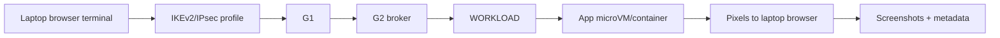

Laptop tests mirror Pixel tests:

1. VPN active and internal DNS only.
2. Admin panel reachable through internal hostname.
3. Operator panel reachable through internal hostname.
4. App switcher works.
5. DuckDuckGo, LibreOffice, Signal, WhatsApp, Telegram, Threema render.
6. Direct workload public address is blocked.
7. Clipboard and downloads remain disabled or CDR-gated.
8. Pixel and laptop sessions are separately auditable.

## Transmission And Metadata Verification

| Segment | What to observe | Metadata only evidence | PASS |
| --- | --- | --- | --- |
| Pixel/laptop -> Puli AX | Deferred until router arrives. | `router_physical_gate_pending`. | BLOCKED until device test. |
| Terminal -> G1 | VPN session, tunnel interface, DNS through tunnel. | SA id, interface, internal hosts reachable, no payload. | VPN up, internal names resolve, direct bypass blocked. |
| G1 -> G2 | Policy route and firewall. | SA/route ids, ping/HTTP status, drop policy metadata. | G2 reachable only via allowed path. |
| G2 -> WORKLOAD | Broker reaches private workload bind. | broker connection count, HTTP/RFB reachability, private bind. | No public workload bind; broker path works. |
| WORKLOAD -> microVM/container | Per-app runtime state. | PID/run dir/tap/guest IP/evidence id. | Separate app environment; CDR required. |
| App -> internet | Egress policy. | destination category, route policy, no content. | Egress follows configured policy; Tor only when tier/policy allows and legal gate permits. |

### Traffic Monitor Repair Loop

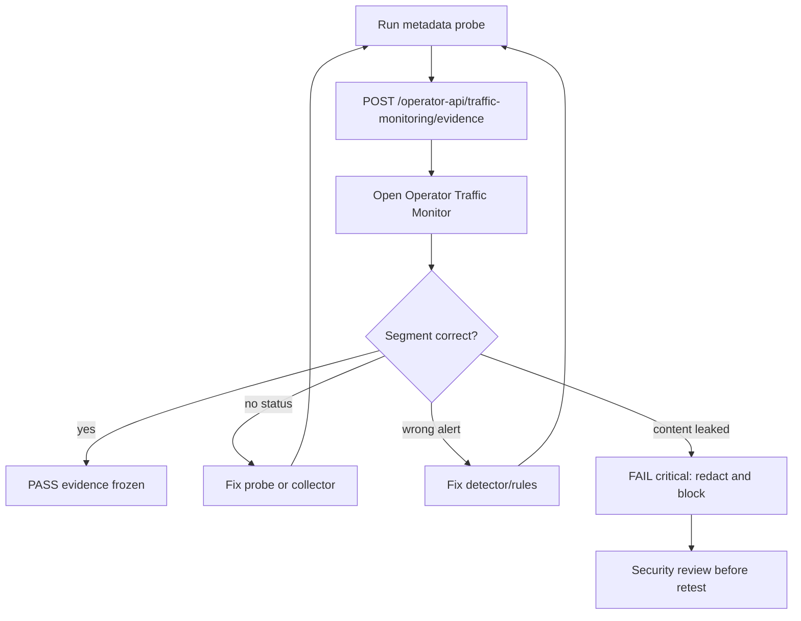

## VPS Rotation Plan

VPS rotation has two categories: simulation and gated live drill.

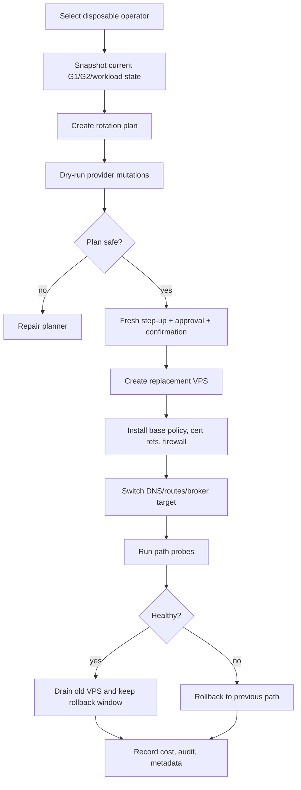

| ID | Rotation test | PASS criteria |
| --- | --- | --- |
| ROT-01 | Plan only | New resources, route changes, cert refs, costs, rollback listed; no mutation. |
| ROT-02 | G1 live rotate | Pixel/laptop reconnects; G2 reachable; no direct workload bypass. |
| ROT-03 | G2 live rotate | Broker moves; sessions drain; app endpoints recover. |
| ROT-04 | Workload VPS/dedicated host rotate | App stream sources rebuild; CDR/audit persists; old host isolated. |
| ROT-05 | Jurisdiction policy rotate | Only allowed tier can schedule; metadata evidence does not claim anonymity. |

## Workload Rotation And Firecracker/Container Plan

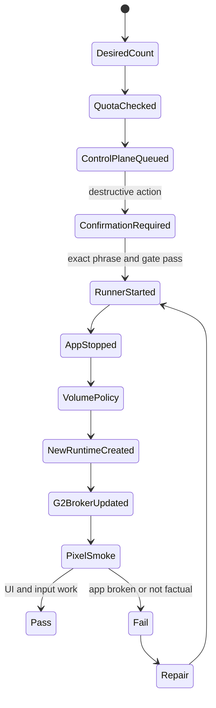

| ID | App/runtime | Standard/Pro candidate | Phantom/Sovereign candidate | Required evidence |
| --- | --- | --- | --- | --- |
| WR-01 | DuckDuckGo | Container or Firecracker | Dedicated Firecracker | search interaction, G2 private route, no terminal data |
| WR-02 | LibreOffice | Container or Firecracker | Dedicated Firecracker | document typing, CDR on file export |
| WR-03 | Signal | Firecracker desktop | Dedicated Firecracker | QR/link visible, test account evidence |
| WR-04 | WhatsApp | Container/browser or Firecracker | Dedicated Firecracker | QR/login visible, account evidence |
| WR-05 | Telegram | Container/browser or Firecracker | Dedicated Firecracker | login visible, account evidence |
| WR-06 | Threema | Container/browser or Firecracker | Dedicated Firecracker | QR/login visible, account evidence |
| WR-07 | Zangi | Blocked until Android-native | Dedicated Android-native/firecracker-like isolation | approved APK, app UI, account evidence |
| WR-08 | Exodus | Dedicated workload only | Dedicated workload only | wallet UI, no seed/private data, risk acceptance |

## Panic, Backup And Inactivity Plan

Panic testing must start in simulation only.

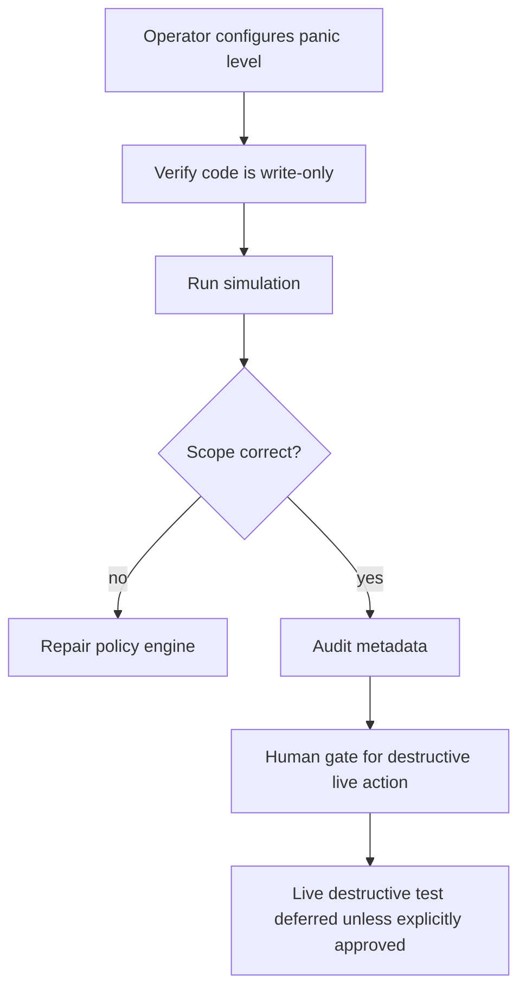

| ID | Function | Simulation PASS | Live PASS |
| --- | --- | --- | --- |
| PAN-01 | Level 1 data wipe | Scope shows workload data only; no account revoke. | Requires explicit human gate and disposable operator. |
| PAN-02 | Level 2 environment destroy | Scope shows app environments/G1/G2/workload cleanup. | Requires four-eyes approval and rollback record. |
| PAN-03 | Level 3 account revoke | Scope shows account disable, package revoke, session revoke. | Requires legal/CISO-approved drill. |
| BAK-01 | Backup | Encrypted backup target/ref and restore plan exist. | Restore drill on disposable operator succeeds. |
| INA-01 | Inactivity wipe | Policy triggers planned action after timeout. | Live action remains gated unless approved. |

## Security And Abuse Case Matrix

| ID | Abuse case | Expected defense | Test |
| --- | --- | --- | --- |
| SEC-01 | Terminal stores workload files | Download disabled or CDR-gated. | Attempt file download from app; inspect Pixel/laptop storage. |
| SEC-02 | Direct workload bypass | Public workload ports unavailable. | Probe workload public IP/ports; try direct URL from Pixel/laptop. |
| SEC-03 | G1/G2 bypass | Terminal cannot route directly to workload. | Route and firewall probes. |
| SEC-04 | Payload logged in monitoring | API rejects content-bearing keys. | Submit `messageContent`, `packetCapture`, `fileContent`; expect 422. |
| SEC-05 | Secret leak | UI/logs never echo provider tokens, panic codes, seeds, OTP. | Grep logs/evidence/UI payloads for injected sentinel secret. |
| SEC-06 | Over-tier resource use | Operator cannot exceed subscription quota. | Request counts above tier. |
| SEC-07 | Destructive action without approval | Rotate/wipe requires gate/confirmation. | Try missing phrase and stale step-up. |
| SEC-08 | PHANTOM unlock baseline | PHANTOM approval cannot run baseline job. | Attempt PHANTOM-linked execution. |
| SEC-09 | False production claim | Production gate remains blocked without factual evidence. | Remove factual records; readiness must degrade. |
| SEC-10 | Public broker exposure | G2 broker cannot bind public for workload sessions. | Runtime manifest with `0.0.0.0` fails. |

## PHANTOM And Ksiegi 3.4 Release Gate

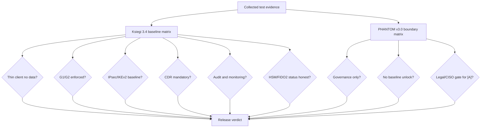

| Gate | PASS requires |
| --- | --- |
| K34-01 Thin client | Pixel/laptop evidence proves no operational data storage beyond pixels/input and allowed screenshots. |
| K34-02 G1/G2 | Probes show no G1/G2 bypass and no public workload exposure. |
| K34-03 Transport | IPsec/IKEv2 or documented private segment evidence exists; deviations require ADR. |
| K34-04 Firecracker isolation | Per-app runtime isolation evidence exists; container mode is tier-limited and explicit. |
| K34-05 CDR | File ingress/egress tests produce allow/block/quarantine/reconstruct decisions. |
| K34-06 HSM/FIDO2 | UI is ready, but physical enforcement remains `BLOCKED` until hardware/backend test. |
| K34-07 Audit/WORM | Sensitive operations have correlation ids and hash-chain/audit evidence without secrets. |
| PH-01 Separation | PHANTOM records are non-executable governance artifacts. |
| PH-02 Legal gate | Any PHANTOM-adjacent operational claim requires Legal, CISO, Architect and Compliance/Product sign-off. |
| PH-03 Claims | Docs/UI do not claim anonymity, invisibility, or impossible security guarantees. |

## Implementation Phases

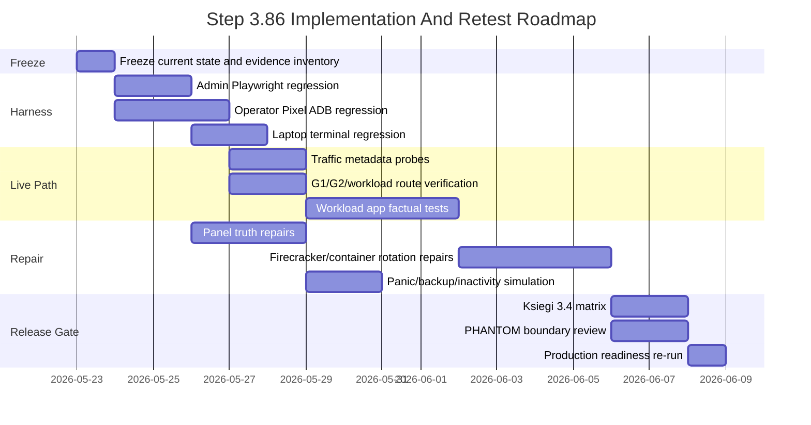

## Concrete Next Implementation Queue

1. `T86-01`: Create a single evidence schema for human regression runs.
2. `T86-02`: Extend Pixel ADB regression to click Traffic Monitor, Apps, Workload Control, Backup/Panic, Jurisdiction.
3. `T86-03`: Add traffic probe scripts that record metadata into `/operator-api/traffic-monitoring/evidence`.
4. `T86-04`: Add laptop terminal regression harness with the same evidence schema.
5. `T86-05`: Add admin Playwright regression for provider/tier/operator/cost/blue-team/PHANTOM/readiness views.
6. `T86-06`: Add disposable operator lifecycle test: create -> provision -> rotate one workload -> recreate all simulation -> delete/disable.
7. `T86-07`: Add VPS rotation dry-run and gated disposable live drill.
8. `T86-08`: Add workload rotation UI test and route refresh verification.
9. `T86-09`: Add panic/backup/inactivity simulation endpoints if missing, then UI tests.
10. `T86-10`: Add Ksiegi 3.4/PHANTOM compliance report generator that reads evidence and outputs PASS/FAIL/BLOCKED.

## Prompt Pack For Repair Agents

### Prompt A - Pixel ADB Human Regression

```text
Implement Step 3.86 Pixel ADB human regression. Use existing scripts/pixel-live-human-regression.mjs and current operator UI. Add clicks for Traffic Monitor, App Switcher, Workload Control, Backup & Panic, Jurisdiction, Streaming and each workload app. Capture sanitized screenshots, UI XML, route metadata and PASS/FAIL/BLOCKED JSON. Do not store message content, secrets, OTP, phone numbers, wallet data, payloads or packet captures. Preserve thin-client invariant and update tests.
```

### Prompt B - Admin Full Regression

```text
Implement Step 3.86 admin Playwright regression. Cover login/step-up, operator table, provider registry with countries/capabilities, tier policy, production readiness, blue team alerts, CDR, payment token sandbox, PHANTOM governance and Ksiegi 3.4 status. Assertions must fail on optimistic or env-only readiness. No secrets in artifacts.
```

### Prompt C - Traffic Metadata Probes

```text
Implement metadata-only probes for Pixel/laptop -> router/G1/G2/workload/app path. Record only segment id, status, encrypted/control evidence, latency, packet loss, byte counters, policy decision and evidence refs through /operator-api/traffic-monitoring/evidence. Reject or redact payloads, packet captures, message content, file content and secrets. Add tests for negative submissions.
```

### Prompt D - Workload Rotate And Firecracker Factual Tests

```text
Implement disposable-operator workload rotate tests for DuckDuckGo, LibreOffice and one communicator. Verify quota, confirmation, runner execution, CDR guardrails, private G2 broker route, per-app Firecracker/container isolation, Pixel visual usability and rollback evidence. Keep Zangi and Exodus blocked unless factual app-specific gates pass.
```

### Prompt E - Panic/Backup/Inactivity

```text
Implement simulation-first tests for panic levels, backup and inactivity wipe. Verify write-only code storage, scoped actions, audit records, four-eyes/human gates for destructive live execution and no plaintext secret echo. Do not perform destructive live actions except on explicitly disposable operator with approved gate.
```

### Prompt F - Ksiegi 3.4 And PHANTOM Report

```text
Implement a report generator that maps current evidence to Ksiegi 3.4 baseline controls and PHANTOM v3.0 separation controls. Output PASS/FAIL/BLOCKED/UNKNOWN with linked evidence refs, residual risks and owner. PHANTOM must remain non-executable and cannot unlock baseline production readiness.
```

## Final Exit Criteria

The next stage can be called production-candidate only when:

1. Admin and operator full regressions pass.
2. Pixel and laptop human regressions pass for panel, app switching, DuckDuckGo, LibreOffice and at least one communicator basic login surface.
3. Full communicator pass requires safe test account bootstrap/send-receive evidence.
4. Zangi remains blocked until Android-native provenance/install/launch works.
5. Exodus remains blocked until real wallet UI/workflow works without secret capture.
6. Traffic Monitor shows factual metadata for all non-router segments and router is explicitly blocked until Puli AX.
7. VPS rotation dry-run passes; live drill passes only for disposable operator.
8. Workload rotate/recreate passes for at least one low-risk app and does not store terminal data.
9. Panic/backup/inactivity simulation passes and destructive live execution remains gated.
10. Ksiegi 3.4 report has no false green controls.
11. PHANTOM report proves governance-only separation.
12. `productionExecutionAllowed=false` stays false until final human gate approval.
