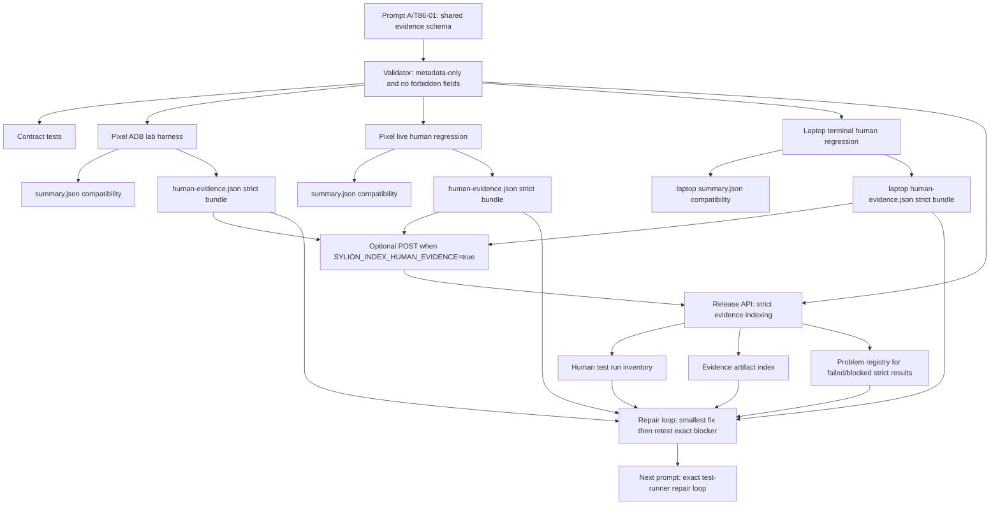

# Step 3.86 Implementation Freeze - Human Evidence Contract

Date: 2026-05-23

Status: Prompt A/T86-01 through Prompt A/T86-05 implemented.

## Implemented

1. Shared human evidence contract:
   - `scripts/lib/human-evidence.mjs`
   - `services/admin-api/src/lib/humanEvidence.js`
   - strict result states: `PASS`, `SIMULATION_PASS`, `LAB_PASS`, `FAIL`, `FAIL_CRITICAL`, `BLOCKED`, `UNKNOWN`, `FLAKY`
   - metadata-only validator
   - forbidden evidence key/value detector
   - production-readiness helper: only `PASS` can satisfy production readiness

2. Contract tests:
   - `services/admin-api/test/step3-86-human-evidence-schema.test.js`
   - validates PASS requirements
   - rejects operational content keys and secret-like values
   - rejects PASS with blockers or without evidence references
   - preserves `FAIL_CRITICAL` priority over softer states

3. Pixel ADB lab harness integration:
   - `scripts/pixel-adb-operator-lab.mjs`
   - writes compatible `summary.json`
   - additionally writes strict `human-evidence.json`
   - labels local Pixel lab evidence as `LAB_PASS`, never production PASS

4. Pixel live human regression integration:
   - `scripts/pixel-live-human-regression.mjs`
   - writes compatible `summary.json`
   - additionally writes strict `human-evidence.json`
   - maps live findings to strict semantics:
     - issues -> `FAIL`
     - known physical/product gates -> `BLOCKED`
     - clean full evidence -> `PASS`

5. Release inventory integration:
   - `POST /release/human-evidence-runs`
   - SDK helper: `recordHumanEvidenceRun`
   - strict evidence summary is indexed as:
     - release human test run,
     - `human_evidence_summary` artifact,
     - release problem when strict result maps to failed or blocked,
     - build-assessment latest run metadata.
   - admin Release view now shows strict result, blockers and next required action for strict evidence runs.

6. Optional harness upload:
   - `scripts/pixel-adb-operator-lab.mjs`
   - `scripts/pixel-live-human-regression.mjs`
   - both always write local `human-evidence.json`
   - both POST to `/release/human-evidence-runs` only when:
     - `SYLION_INDEX_HUMAN_EVIDENCE=true`
   - default mode is no API mutation, so dry-runs stay safe.

7. Laptop terminal parity harness:
   - `scripts/laptop-terminal-human-regression.mjs`
   - npm script: `test:laptop-terminal-human-regression`
   - opens admin panel and operator workload controls through Playwright
   - writes strict `human-evidence.json`
   - supports the same optional Release API indexing flag:
     - `SYLION_INDEX_HUMAN_EVIDENCE=true`

## No-Shortcut Rules Now Enforced In Code

- A passing test must have evidence references.
- `PASS` cannot contain blockers.
- `SIMULATION_PASS` and `LAB_PASS` cannot unlock production readiness.
- Forbidden evidence keys include secrets, tokens, API keys, OTP/SMS, phone numbers, wallet seeds, message content, packet captures, file contents and raw cookies.
- Secret-like values are rejected even if they are nested.
- Required guardrail fields must state:
  - `metadataOnly: true`
  - `terminalDataStored: false`
  - `contentInspected: false`
  - `packetCaptureStored: false`

## Evidence Flow



## Verification

Executed without live infrastructure mutation:

```text
node --check scripts/lib/human-evidence.mjs
node --check scripts/pixel-adb-operator-lab.mjs
node --check scripts/pixel-live-human-regression.mjs
node --check scripts/laptop-terminal-human-regression.mjs
node --check services/admin-api/src/lib/humanEvidence.js
node --check services/admin-api/src/modules/release/releaseControlService.js
node --check services/admin-api/src/app.js
node --test services/admin-api/test/step3-86-human-evidence-schema.test.js
node --test services/admin-api/test/step3-86-human-evidence-release-index.test.js
node --test services/admin-api/test/step3-21-human-test-inventory.test.js services/admin-api/test/step3-11-release-control.test.js
node --test services/admin-api/test/admin-web-static.test.js
```

Result: all checks passed.

## Next Prompt

Prompt A/T86-06:

Add the exact failed-test repair loop runner:

- reads a strict `human-evidence.json`,
- opens/updates a release problem for each blocker,
- records the repair commit after a fix,
- forces retest of the exact failed test id,
- refuses production readiness when the latest result is `LAB_PASS`, `SIMULATION_PASS`, `BLOCKED`, `UNKNOWN`, `FLAKY`, `FAIL`, or `FAIL_CRITICAL`.

No live production claim can advance until the evidence index shows a reproducible `PASS` for the exact required path.
