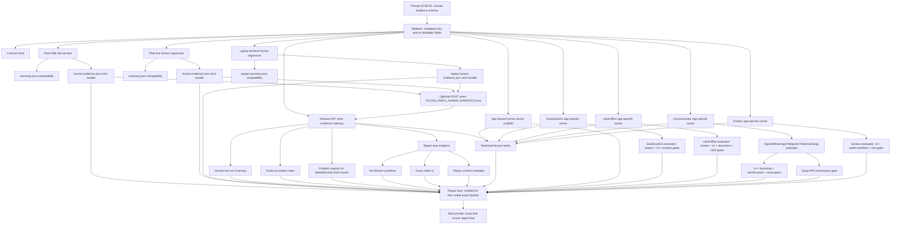

# Step 3.86 Implementation Freeze - Human Evidence Contract

Date: 2026-05-23

Status: Prompt A/T86-01 through Prompt A/T86-12 implemented.

## Implemented

1. Shared human evidence contract:
   - `scripts/lib/human-evidence.mjs`
   - `services/admin-api/src/lib/humanEvidence.js`
   - strict result states: `PASS`, `SIMULATION_PASS`, `LAB_PASS`, `FAIL`, `FAIL_CRITICAL`, `BLOCKED`, `UNKNOWN`, `FLAKY`
   - metadata-only validator
   - forbidden evidence key/value detector
   - production-readiness helper: only `PASS` can satisfy production readiness

2. Contract tests:
   - `services/admin-api/test/step3-86-human-evidence-schema.test.js`
   - validates PASS requirements
   - rejects operational content keys and secret-like values
   - rejects PASS with blockers or without evidence references
   - preserves `FAIL_CRITICAL` priority over softer states

3. Pixel ADB lab harness integration:
   - `scripts/pixel-adb-operator-lab.mjs`
   - writes compatible `summary.json`
   - additionally writes strict `human-evidence.json`
   - labels local Pixel lab evidence as `LAB_PASS`, never production PASS

4. Pixel live human regression integration:
   - `scripts/pixel-live-human-regression.mjs`
   - writes compatible `summary.json`
   - additionally writes strict `human-evidence.json`
   - maps live findings to strict semantics:
     - issues -> `FAIL`
     - known physical/product gates -> `BLOCKED`
     - clean full evidence -> `PASS`

5. Release inventory integration:
   - `POST /release/human-evidence-runs`
   - SDK helper: `recordHumanEvidenceRun`
   - strict evidence summary is indexed as:
     - release human test run,
     - `human_evidence_summary` artifact,
     - release problem when strict result maps to failed or blocked,
     - build-assessment latest run metadata.
   - admin Release view now shows strict result, blockers and next required action for strict evidence runs.

6. Optional harness upload:
   - `scripts/pixel-adb-operator-lab.mjs`
   - `scripts/pixel-live-human-regression.mjs`
   - both always write local `human-evidence.json`
   - both POST to `/release/human-evidence-runs` only when:
     - `SYLION_INDEX_HUMAN_EVIDENCE=true`
   - default mode is no API mutation, so dry-runs stay safe.

7. Laptop terminal parity harness:
   - `scripts/laptop-terminal-human-regression.mjs`
   - npm script: `test:laptop-terminal-human-regression`
   - opens admin panel and operator workload controls through Playwright
   - writes strict `human-evidence.json`
   - supports the same optional Release API indexing flag:
     - `SYLION_INDEX_HUMAN_EVIDENCE=true`

8. Exact repair loop:
   - `POST /release/human-evidence-repair-loop`
   - SDK helper: `recordHumanEvidenceRepairLoop`
   - creates one release problem per strict blocker
   - stores optional repair commit and previous run id
   - records the exact `testId` that must be rerun
   - refuses production readiness for every result except strict `PASS`

9. Workload factual-state matrix:
   - `GET /release/workload-factual-matrix`
   - SDK helper: `listWorkloadFactualMatrix`
   - admin Release view renders factual criteria cards before factual test results
   - covers Signal, WhatsApp, Telegram, Threema, Zangi, DuckDuckGo, LibreOffice and Exodus
   - defines expected behavior, human steps, pass criteria, fail criteria and repair prompt per app

10. Workload factual human runner scaffold:
   - `scripts/workload-factual-human-runner.mjs`
   - npm script: `test:workload-factual-human-runner`
   - consumes `/release/workload-factual-matrix`
   - writes one strict `human-evidence.json` per app
   - labels unexecuted app tests as `UNKNOWN`, never PASS
   - optional `SYLION_INDEX_HUMAN_EVIDENCE=true` sends each app result to `/release/human-evidence-repair-loop`

11. DuckDuckGo app-specific factual runner:
   - `scripts/lib/duckduckgo-factual-evaluator.mjs`
   - `scripts/workload-duckduckgo-human-runner.mjs`
   - npm script: `test:duckduckgo-human-runner`
   - reads `/release/workload-factual-matrix?appKey=duckduckgo_browser`
   - requests a DuckDuckGo streaming session through the operator API
   - opens the operator panel in a Pixel-sized Playwright viewport
   - can optionally open the internal stream URL only when `SYLION_DUCKDUCKGO_OPEN_STREAM=true`
   - refuses factual PASS unless all of these are true:
     - stream session is ready,
     - launch URL is internal `*.sylion.internal`,
     - broker is G2,
     - DuckDuckGo UI marker has safe evidence reference,
     - browsing metadata probe proves workload route,
     - terminal data storage is false
   - sends blocked/failed app-specific evidence into the repair loop when `SYLION_INDEX_HUMAN_EVIDENCE=true`

12. LibreOffice app-specific factual runner:
   - `scripts/lib/libreoffice-factual-evaluator.mjs`
   - `scripts/workload-libreoffice-human-runner.mjs`
   - npm script: `test:libreoffice-human-runner`
   - reads `/release/workload-factual-matrix?appKey=libreoffice`
   - requests a LibreOffice streaming session through the operator API
   - opens the operator panel in a Pixel-sized Playwright viewport
   - can optionally open the internal stream URL only when `SYLION_LIBREOFFICE_OPEN_STREAM=true`
   - refuses factual PASS unless all of these are true:
     - stream session is ready,
     - launch URL is internal `*.sylion.internal`,
     - broker is G2,
     - LibreOffice UI marker has safe evidence reference,
     - non-sensitive document workflow metadata passes,
     - CDR boundary is present,
     - terminal data storage is false
   - sends blocked/failed app-specific evidence into the repair loop when `SYLION_INDEX_HUMAN_EVIDENCE=true`

13. Communicator app-specific factual runner:
   - `scripts/lib/communicator-factual-evaluator.mjs`
   - `scripts/workload-communicator-human-runner.mjs`
   - npm scripts:
     - `test:communicator-human-runner`
     - `test:signal-human-runner`
     - `test:whatsapp-human-runner`
     - `test:telegram-human-runner`
     - `test:threema-human-runner`
     - `test:zangi-human-runner`
   - covers Signal, WhatsApp, Telegram, Threema and Zangi
   - reads `/release/workload-factual-matrix?appKey=<communicator>`
   - requests app streaming session through the operator API
   - refuses factual PASS unless all of these are true:
     - stream session is ready,
     - launch URL is internal `*.sylion.internal`,
     - broker is G2,
     - app-specific UI marker has safe evidence reference,
     - non-secret account bootstrap metadata passes,
     - send/receive metadata-only check passes,
     - G1/G2/workload route probe passes,
     - terminal and communication data storage are false,
     - Zangi APK provenance passes when app is Zangi
   - fails fast on web-link-only bootstrap, generic browser/download page, public/localhost stream URLs or forbidden probe fields

14. Exodus app-specific factual runner:
   - `scripts/lib/exodus-factual-evaluator.mjs`
   - `scripts/workload-exodus-human-runner.mjs`
   - npm script: `test:exodus-human-runner`
   - reads `/release/workload-factual-matrix?appKey=exodus`
   - requests Exodus streaming session through the operator API
   - refuses factual PASS unless all of these are true:
     - stream session is ready,
     - launch URL is internal `*.sylion.internal`,
     - broker is G2,
     - Exodus UI marker has safe evidence reference,
     - test-only wallet workflow metadata passes,
     - operator risk acceptance metadata passes,
     - terminal and wallet data storage are false
   - fails fast on download/generic browser markers, public/localhost stream URLs, wallet data storage or any seed/mnemonic/private-key probe fields

## No-Shortcut Rules Now Enforced In Code

- A passing test must have evidence references.
- `PASS` cannot contain blockers.
- `SIMULATION_PASS` and `LAB_PASS` cannot unlock production readiness.
- Forbidden evidence keys include secrets, tokens, API keys, OTP/SMS, phone numbers, wallet seeds, message content, packet captures, file contents and raw cookies.
- Secret-like values are rejected even if they are nested.
- Required guardrail fields must state:
  - `metadataOnly: true`
  - `terminalDataStored: false`
  - `contentInspected: false`
  - `packetCaptureStored: false`

## Evidence Flow



## Verification

Executed without live infrastructure mutation:

```text
node --check scripts/lib/human-evidence.mjs
node --check scripts/pixel-adb-operator-lab.mjs
node --check scripts/pixel-live-human-regression.mjs
node --check scripts/laptop-terminal-human-regression.mjs
node --check scripts/workload-factual-human-runner.mjs
node --check scripts/lib/duckduckgo-factual-evaluator.mjs
node --check scripts/workload-duckduckgo-human-runner.mjs
node --check scripts/lib/libreoffice-factual-evaluator.mjs
node --check scripts/workload-libreoffice-human-runner.mjs
node --check scripts/lib/communicator-factual-evaluator.mjs
node --check scripts/workload-communicator-human-runner.mjs
node --check scripts/lib/exodus-factual-evaluator.mjs
node --check scripts/workload-exodus-human-runner.mjs
node --check services/admin-api/src/lib/humanEvidence.js
node --check services/admin-api/src/modules/release/releaseControlService.js
node --check services/admin-api/src/app.js
node --test services/admin-api/test/step3-86-human-evidence-schema.test.js
node --test services/admin-api/test/step3-86-human-evidence-release-index.test.js
node --test services/admin-api/test/step3-86-workload-factual-matrix.test.js
node --test services/admin-api/test/step3-86-duckduckgo-runner-evaluator.test.js
node --test services/admin-api/test/step3-86-libreoffice-runner-evaluator.test.js
node --test services/admin-api/test/step3-86-communicator-runner-evaluator.test.js
node --test services/admin-api/test/step3-86-exodus-runner-evaluator.test.js
node --test services/admin-api/test/step3-21-human-test-inventory.test.js services/admin-api/test/step3-11-release-control.test.js
node --test services/admin-api/test/admin-web-static.test.js
```

Result: all checks passed.

## Next Prompt

Prompt A/T86-13:

Execute the app-specific runner chain against the selected live operator path and repair exact blockers:

- DuckDuckGo,
- LibreOffice,
- Signal,
- WhatsApp,
- Telegram,
- Threema,
- Zangi,
- Exodus.

For each app runner execution:

- read expected behavior from `/release/workload-factual-matrix`,
- execute the exact human test steps through Pixel or laptop harness,
- write strict `human-evidence.json`,
- record factual test result only when mandatory checks pass,
- send failed/blocking results into `/release/human-evidence-repair-loop`.

No live production claim can advance until the evidence index shows a reproducible `PASS` for the exact required path.
