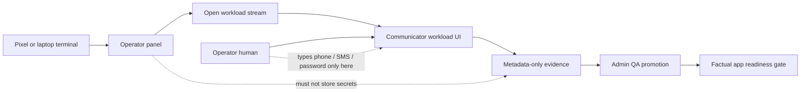

# Step 3.88 - Private Input Handoff For Communicator Tests

## Freeze

This step turns communicator account testing into a strict human handoff workflow.
Codex may navigate, open streams and record metadata-only evidence, but the
operator enters account data, phone numbers, SMS/2FA codes and passwords only
inside the workload UI on Pixel or laptop.

## Implemented

- Operator portal shows a `Private input handoff` card in `Account Bootstrap`.
- Account bootstrap sessions expose a `humanHandoff` plan with ordered steps.
- API rejects secret-like values in bootstrap evidence, not only secret-like field names.
- PASS still requires all required checks and admin QA promotion.
- PHANTOM remains separate and cannot promote communicator execution.

## Mermaid

## Acceptance Criteria

| Area | PASS condition |
| --- | --- |
| Private input | Phone, OTP/SMS, passwords and seeds are never typed into SYLION panel fields or chat. |
| Operator UI | Account Bootstrap displays the handoff steps before evidence recording. |
| API guard | Field names and free text values containing phone numbers or codes are rejected. |
| Communicator PASS | UI visible, account bootstrap and send/receive checks all pass. |
| Review | Admin QA must promote the metadata-only evidence before factual readiness. |

## Next Human Test Order

1. Signal.
2. Telegram.
3. WhatsApp.
4. Threema.
5. Zangi after Android-native provenance is approved.

