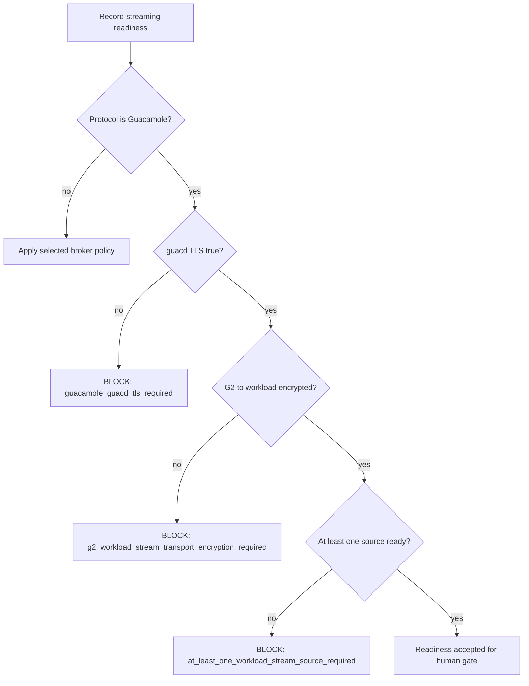

# Step 3.90 - Guacamole Encrypted Production Broker

Date: 2026-05-24
Status: implemented contract, live G2/AX102 transport verified, human app/account gates pending

## Decision

Production thin-client streaming must use a G2 session broker. Direct KasmVNC/noVNC endpoints remain lab/fallback paths until a separate ADR approves them for production.

Guacamole is the selected production broker for the current sprint because it centralizes session policy, per-user limits, connection inventory and audit metadata. KasmVNC remains useful for Pixel UX validation, but its web endpoint is not the production broker boundary.

## Required Encryption

- Pixel/laptop to G2: TLS over the SYLION VPN path.
- Guacamole web application to guacd: TLS required through `GUACD_SSL=true`.
- G2 to WORKLOAD host: encrypted private transport required, currently implemented as a private stunnel adapter for Guacamole VNC egress.
- WORKLOAD host to Firecracker microVM: host-local private tap or vsock only; no public exposure.

## Mermaid Flow

```mermaid
flowchart LR
  Pixel["Pixel / laptop terminal"] -->|"TLS over IPsec path"| G1["G1 network gateway"]
  G1 -->|"IPsec policy path"| G2["G2 access broker"]
  G2 -->|"HTTPS /guacamole"| Guac["Guacamole web app"]
  Guac -->|"GUACD_SSL TLS"| Guacd["guacd"]
  Guacd -->|"host-local VNC to stunnel client"| G2Stunnel["G2 stunnel client"]
  G2Stunnel -->|"TLS private bind"| WorkloadStunnel["WORKLOAD stunnel server"]
  WorkloadStunnel -->|"host-local tap/vsock only"| MicroVM["Firecracker app microVM"]
  MicroVM --> App["Signal / WhatsApp / Telegram / Threema / DuckDuckGo / LibreOffice / Exodus"]
```

## Gates

## Implementation Notes

- `scripts/install-g2-guacamole-broker.mjs` now deploys Guacamole with `GUACD_SSL=true` and starts `guacd` with certificate/key flags.
- `scripts/install-workload-guacamole-vnc-forwards.mjs` now installs private stunnel listeners on AX102 and records encrypted egress evidence.
- `scripts/seed-g2-guacamole-workload-connections.mjs` now seeds Guacamole connections through G2 local stunnel client ports instead of raw RFB across the server link.
- The operator portal readiness and runtime manifest reject Guacamole unless both `guacdTls` and `g2ToWorkloadEncrypted` are true.

## Live Verification

- G2 Guacamole broker responds through the private broker endpoint with Guacamole headers and `GUACD_SSL=true`.
- Guacamole has eight seeded SYLION workload connections and the per-user connection ceiling remains ten.
- AX102 exposes Guacamole-compatible workload streams through encrypted private stunnel adapters, not raw public VNC.
- DuckDuckGo, LibreOffice, WhatsApp, Telegram, Threema, Signal, Zangi and Exodus have RFB reachability evidence through the encrypted G2 to workload path.

## Residual Risks

- The current stunnel adapter uses private-link encryption and records that fingerprint pinning is still required before final human approval.
- KasmVNC remains the best current Pixel UX fallback, but it is not marked as production-approved.
- Communicator account creation and send/receive tests are still pending operator-provided test accounts or SMS codes.
- Zangi remains blocked for production use until the Android-native image/APK provenance gate is satisfied.
- Exodus requires Pixel-fit and wallet-risk human verification without storing wallet secrets.
- HSM/FIDO2 and Puli AX physical validation remain deferred by project decision.
