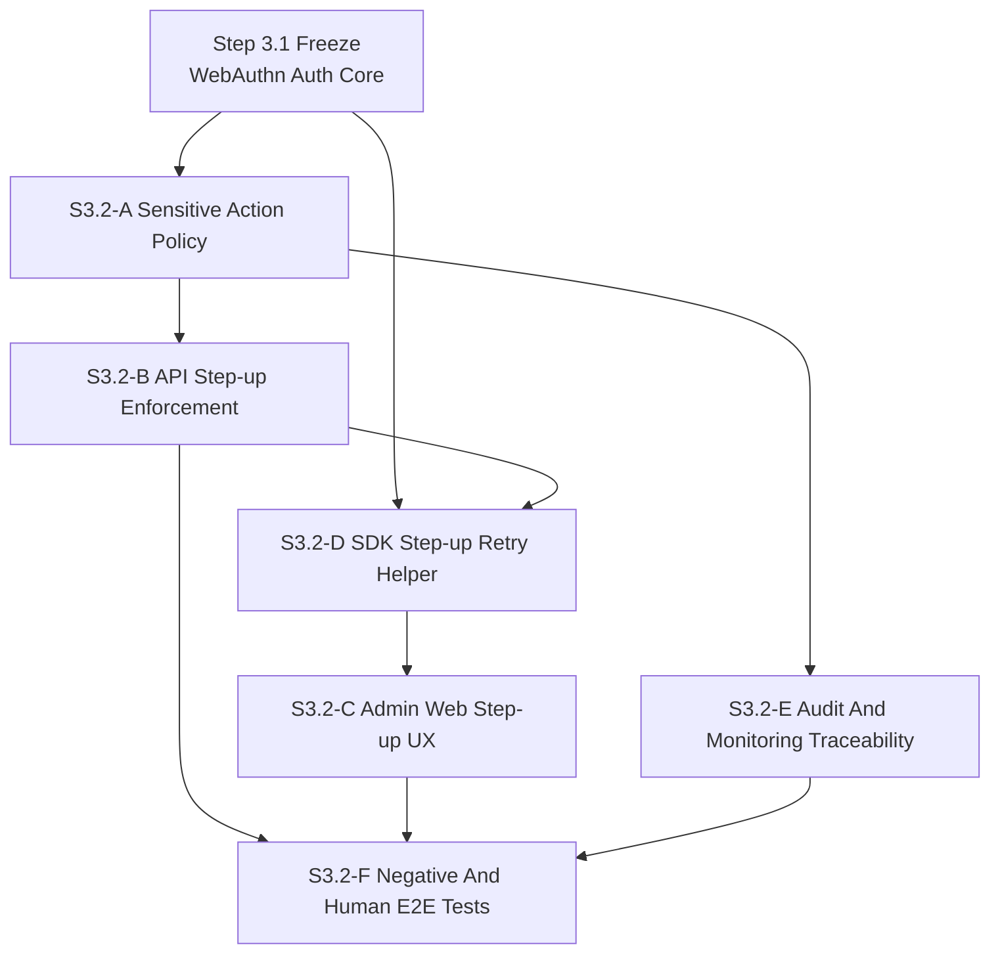
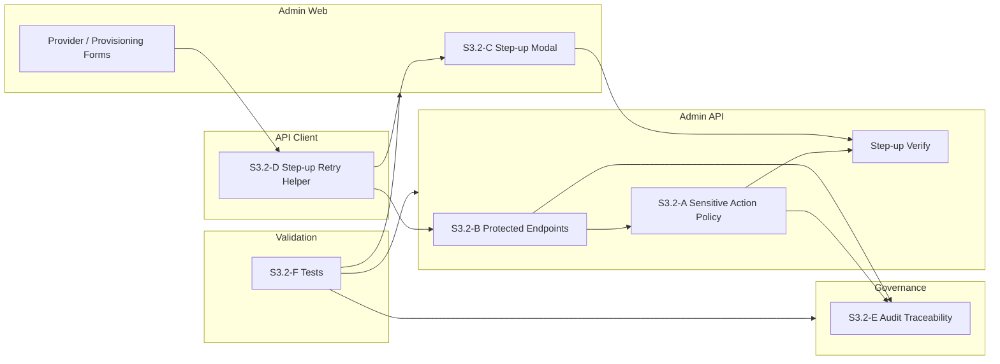
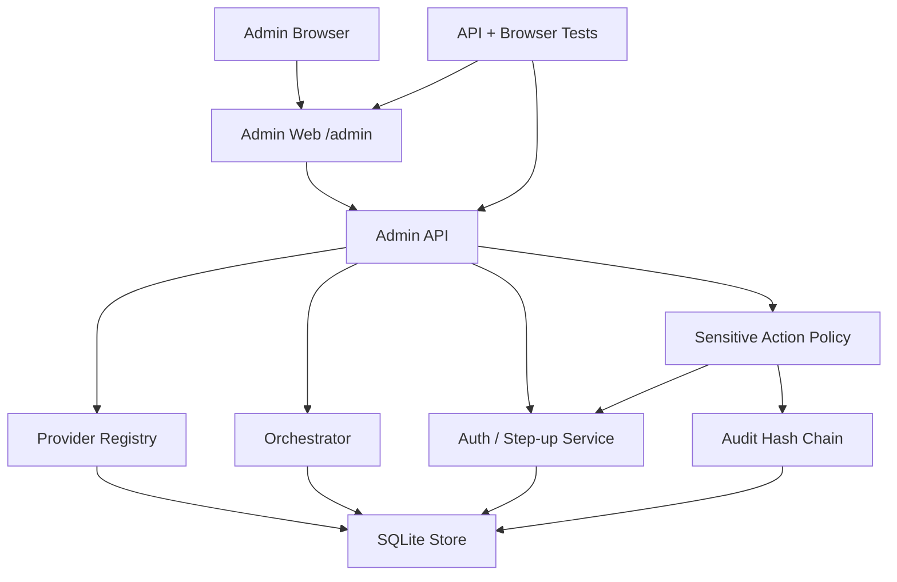
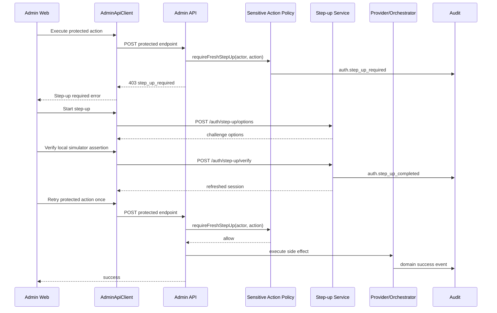
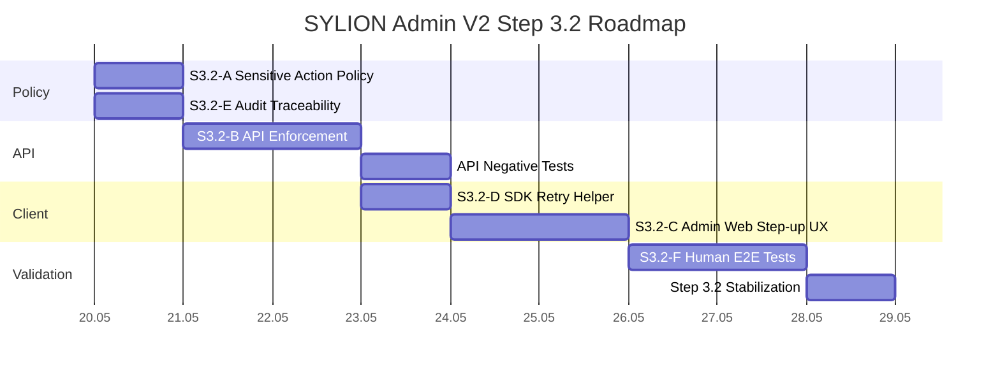

# SYLION Admin Panel V2 - Step 3.2 Graphs And Roadmap

## Module Dependency Graph



## Module Map



## Deployment Graph



## Runtime Flow



## Implementation Roadmap



## Integration Order

```text
1. Add sensitive action policy helper.
2. Add AppError shape step_up_required.
3. Enforce policy in provider/orchestrator endpoints before side effects.
4. Add API negative tests and leakage assertions.
5. Add SDK step-up helper.
6. Add Admin Web modal and one-shot retry.
7. Verify browser flow for execute job.
8. Update implementation log and status docs.
```

## Release Gates

```text
Gate 1: protected endpoints return step_up_required before side effects.
Gate 2: no provider secret appears in error/audit/log output.
Gate 3: step-up verify refreshes session freshness.
Gate 4: UI modal performs step-up and retries action once.
Gate 5: browser flow for execute job passes.
Gate 6: npm.cmd test passes.
```

