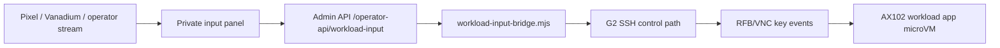

# Step 3.100 - Pixel Guacamole Input Bridge

Data: 2026-05-24

## Cel

Naprawić krytyczny problem z wejściem z Pixela: obraz i tap/focus działały w Guacamole, ale `adb input text` nie przechodził do aplikacji w workloadzie. Wdrożony fix dodaje kontrolowany most:

## Zasady bezpieczeństwa

- Terminal nadal dostaje tylko piksele i wysyła eventy wejścia.
- Treść wpisywana przez operatora nie jest zwracana w API.
- Treść wpisywana przez operatora nie jest zapisywana w audycie.
- Audyt zapisuje tylko metadane: aplikacja, długość tekstu, `submit`, liczba wysłanych klawiszy, status.
- Clipboard i transfer plików pozostają wyłączone bez CDR.
- Exodus i Zangi nadal mają swoje produkcyjne blokady: akceptacja ryzyka wallet oraz Android-native provenance.

## Co wdrożono

- `scripts/workload-input-bridge.mjs`: serwerowy RFB client wysyłający key events do portów VNC na G2.
- `POST /operator-api/workload-input`: endpoint z blokadami Guacamole, live access, stream source, Exodus/Zangi.
- `apps/operator-web/stream.html`: mobilny panel `Private input to workload`.
- `apps/operator-web/stream.js`: obsługa `Type`, `Type + Enter`, `Enter`, bez storage treści inputu.
- `apps/operator-web/styles.css`: panel pozycjonowany nad klawiaturą Pixela przez `visualViewport`.

## Testy lokalne

- `node --test services/admin-api/test/operator-portal-skeleton.test.js` - PASS.
- `node --test services/admin-api/test/step3-79-g2-session-broker-policy.test.js` - PASS.

## Testy live na Hetzner

- Admin VPS: usługa `sylion-admin-api` aktywna po deployu.
- Bridge live: `duckduckgo_browser` RFB accepted key events, framebuffer `960x1678`, `terminalDataStored=false`.
- Pixel: panel inputu wyświetla się nad klawiaturą.
- Pixel: tekst wpisany przez lokalną klawiaturę został wysłany przez backend i wykonał realne wyszukiwanie w DuckDuckGo workload.

Artefakty:

- `docs/admin-panel-v2/test-artifacts/step3-100-pixel-input-bridge/pixel-input-panel-v2.png`
- `docs/admin-panel-v2/test-artifacts/step3-100-pixel-input-bridge/pixel-after-type-enter.png`
- `docs/admin-panel-v2/test-artifacts/step3-100-pixel-input-bridge/live-workload-status.json`

## Stan aplikacji na Pixelu

| Aplikacja | Stan ekranowy | Bloker produkcyjny |
|---|---|---|
| DuckDuckGo | PASS, search działa przez input bridge | brak w tym teście |
| LibreOffice | PASS, Writer widoczny | brak w tym teście |
| Signal | PASS, ekran QR linked device widoczny | konto/send-receive do wykonania z operatorem |
| WhatsApp | PASS, ekran QR/login widoczny | konto/send-receive do wykonania z operatorem |
| Telegram | PASS, ekran QR/login widoczny | konto/send-receive do wykonania z operatorem |
| Threema | PASS, ekran QR/login widoczny | konto/send-receive do wykonania z operatorem |
| Exodus | BLOCKED w panelu | `operator_wallet_risk_acceptance_required` |
| Zangi | BLOCKED w panelu | `zangi_android_native_provenance_required` |

Artefakty ekranowe aplikacji:

- `docs/admin-panel-v2/test-artifacts/step3-100-pixel-input-bridge/apps/libreoffice.png`
- `docs/admin-panel-v2/test-artifacts/step3-100-pixel-input-bridge/apps/signal.png`
- `docs/admin-panel-v2/test-artifacts/step3-100-pixel-input-bridge/apps/whatsapp.png`
- `docs/admin-panel-v2/test-artifacts/step3-100-pixel-input-bridge/apps/telegram.png`
- `docs/admin-panel-v2/test-artifacts/step3-100-pixel-input-bridge/apps/threema.png`
- `docs/admin-panel-v2/test-artifacts/step3-100-pixel-input-bridge/apps/exodus.png`
- `docs/admin-panel-v2/test-artifacts/step3-100-pixel-input-bridge/apps/zangi.png`

## Następne kroki

1. Dodać w panelu operatora jawny przycisk akceptacji ryzyka Exodus dla testowego operatora, z metadanymi i bez danych walleta.
2. Dla Zangi zakończyć Android-native provenance: zatwierdzony obraz Android workload oraz zatwierdzony APK ref.
3. Dla komunikatorów wykonać testy kont: QR/link, logowanie z operatorem, send/receive, wyłącznie metadane.
4. Rozszerzyć input bridge o znaki spoza ASCII dopiero po teście RFB keysym/IME i decyzji bezpieczeństwa.
