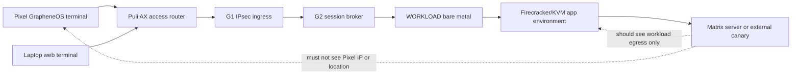
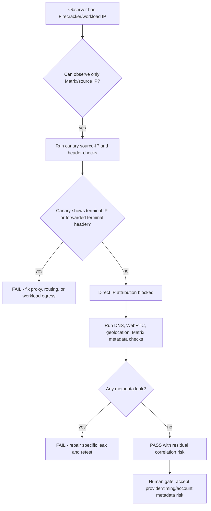

# Step 3.102 - Terminal attribution risk from workload or Matrix IP

Date: 2026-05-25

## Scope

Pytanie: czy osoba, która zna tylko publiczny adres IP Firecrackera/workloadu albo widzi połączenie z aplikacji Matrix przez serwer, może ustalić lokalizację Pixela lub operatora?

Krótka odpowiedź: nie powinna móc zrobić tego z samego IP workloadu, jeżeli wszystkie kontrole ścieżki SYLION przechodzą. Nie wolno jednak robić roszczenia "anonimowość gwarantowana", bo zostają ryzyka korelacji czasu, metadanych konta, logów providera i kompromitacji terminala.

## Implemented Control

Dodany został operator-scoped endpoint:

`GET /operator-api/terminal-attribution-risk`

Endpoint zwraca wyłącznie metadane kontrolne:

- co serwer Matrix może zobaczyć,
- czego serwer Matrix nie może zobaczyć,
- które dowody są wymagane,
- jakie blokery nadal istnieją,
- jakie ryzyka resztkowe wymagają human gate.

Endpoint nie zapisuje i nie zwraca treści wiadomości, danych portfela, plików, sekretów, numerów telefonów ani zawartości pakietów.

## Architecture Path



## What Matrix Should See

| Observer | Allowed observation | Forbidden observation |
| --- | --- | --- |
| External Matrix server | Workload egress IP or configured routing exit | Pixel public IP, Pixel private IP, Pixel location |
| Dedicated SYLION Matrix | Workload or internal service source class | Terminal device ID, terminal IP, operator identity |
| Admin monitoring | Metadata-only health and route state | Message content, packet capture, file contents |

Forbidden forwarding headers:

- `X-Forwarded-For`
- `X-Real-IP`
- `Forwarded`
- proxy protocol values containing terminal or private-hop identity

## Threat Matrix

| Attack path | Expected SYLION behavior | Required test | Residual risk |
| --- | --- | --- | --- |
| Matrix server reads source IP | Source is workload egress or configured route exit, not Pixel | Matrix/HTTP canary source-IP probe from each microVM | Provider and timing logs |
| Proxy leaks `X-Forwarded-For` | Header stripped before Matrix/external service | Canary header dump with no terminal or private-hop IP | Misconfigured future proxy |
| DNS leak | Pixel and workload use tunnel/policy DNS | Pixel DNS-through-tunnel plus workload DNS leak probe | Provider resolver metadata if policy changes |
| Browser WebRTC leak | Browser workload exposes no local/terminal ICE candidates | WebRTC ICE candidate leak test in workload browser | Browser update regression |
| Browser geolocation | Geolocation denied in workload session | Permission policy and manual UI check | User consent mistake |
| Matrix client metadata | Device/user-agent strings do not identify Pixel/operator | Metadata review for device name, profile, contact discovery | Account bootstrap metadata |
| Traffic correlation | No direct identity from IP, but timing can correlate | Blue-team timing/volume review | Cannot be eliminated in baseline |
| Terminal compromise | Thin client limits stored data, not active compromise | Pixel/laptop posture check | High if terminal is live-compromised |

## Control Flow



## Acceptance Criteria

The assessment may report `direct_terminal_attribution_blocked_residual_correlation_risk_remains` only when:

1. G1 to G2 policy path is healthy.
2. G2 to workload private path is healthy.
3. Matrix canary proves observed source is workload egress or configured route exit.
4. Forwarding headers do not carry terminal/private-hop IP data.
5. Pixel/laptop DNS is through tunnel.
6. Workload DNS leak probe passes.
7. Browser/WebRTC leak test passes.
8. Browser geolocation is denied.
9. Matrix client metadata is reviewed and scrubbed.

Even then, the output must keep:

- `anonymityClaimAllowed=false`,
- `humanGate.required=true`,
- residual risks for provider logs, timing correlation, terminal compromise and account bootstrap metadata.

## Test Command

```bash
node --test services/admin-api/test/step3-102-terminal-attribution-risk.test.js
```

## Next Live Tests

1. Deploy a content-safe Matrix/HTTP canary and call it from each workload microVM.
2. Record only source-IP class and header presence, never message content.
3. Run the same probe from DuckDuckGo, Signal, Telegram, WhatsApp, Threema and Zangi workloads.
4. Run Pixel ADB DNS/path evidence and workload DNS leak evidence.
5. Run browser WebRTC/geolocation checks from the workload browser.
6. Update production readiness only after the factual canary evidence exists.
