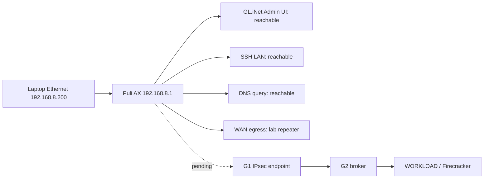

# Step 3.103 - Puli AX physical smoke

Date: 2026-05-26

## Scope

Physical GL.iNet GL-XE3000 Puli AX is now connected to the laptop over Ethernet. This step records the first non-mutating physical smoke check before installing any SYLION router package, IPsec profile, kill switch, DNS policy, or firmware changes.

Secrets are not stored, printed, committed, or passed in command arguments. Router password entry must happen only in an interactive terminal or the GL.iNet UI.

## Current Finding

Status: `lan_smoke_passed`

The router is reachable on the expected GL.iNet LAN address, exposes the admin UI, and now has lab WAN/DNS through `Repeater` mode. This is a lab uplink pass, not production router readiness.

Observed non-secret facts:

| Check | Result |
| --- | --- |
| Laptop Ethernet address | `192.168.8.200/24` |
| Router LAN address | `192.168.8.1` |
| GL.iNet admin UI | reachable, title `Admin Panel` |
| SSH on LAN | reachable |
| HTTP/HTTPS on LAN | reachable |
| DNS through router | reachable |
| WAN through router | reachable through lab repeater |
| IPsec UDP ports on LAN | not open, no tunnel expected yet |

## Mermaid - Physical Smoke State



## Script

Repeat the non-mutating physical smoke:

```bash
node scripts/puli-ax-physical-smoke.mjs
```

The script writes a local ignored artifact:

`docs/admin-panel-v2/test-artifacts/puli-ax-physical-smoke/latest.json`

The artifact is metadata-only and redacts public egress IP. It does not contain the router password, Wi-Fi password, SSH private key, SIM data, message content, wallet data, or terminal operational data.

## Required Next Actions

1. Confirm in GL.iNet UI whether WAN/cellular is connected and has Internet.
2. Confirm LAN DNS behavior. Before SYLION tunnel is installed, DNS may be intentionally limited, but the state must be explicit.
3. Install a dedicated SSH key for automation. Do not paste the router password into chat or repo files.
4. Capture authenticated inventory:
   - model,
   - GL OS/OpenWrt base version,
   - kernel,
   - strongSwan availability,
   - nftables availability,
   - dnsmasq configuration,
   - WAN/cellular state.
5. Generate or bind the operator router package in Admin API.
6. Apply SYLION package only after review:
   - default-drop kill switch before tunnel,
   - DNS tunnel-only,
   - no LAN-to-WAN bypass,
   - WAN admin disabled,
   - SSH key auth only,
   - IPsec IKEv2 mutual certificate profile to G1.
7. Run T01-T10:
   - boot order,
   - tunnel down behavior,
   - DNS leak prevention,
   - IKEv2 proposals,
   - rekey/DPD,
   - config drift,
   - power loss recovery.

## Production Decision

Do not mark the router as production-ready yet.

Current decision: `LAB LAN/WAN SMOKE PASSED - NEEDS AUTHENTICATED ROUTER INVENTORY`.

Human gate remains required because authenticated firmware inventory, firmware provenance, kill-switch behavior, DNS leak prevention, IPsec profile, and production cellular/WAN behavior have not passed physical tests yet.

## 2026-05-26 Repeater Update

After configuring the router as a repeater to the lab Wi-Fi uplink, the non-mutating smoke test returned:

- `status=lan_smoke_passed`
- GL.iNet admin UI reachable
- SSH LAN port reachable
- DNS through router reachable
- WAN through router reachable
- no secrets stored or printed

Remaining blocker:

- dedicated SSH key auth is not validated yet, so authenticated inventory and package installation are still blocked.
