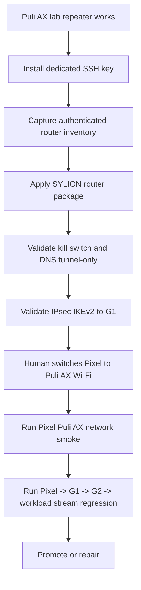

# Step 3.104 - Pixel to Puli AX network switch gate

Date: 2026-05-26

## Scope

This step defines the controlled gate for moving the physical Pixel terminal onto the Puli AX network after the router is configured. It does not store Wi-Fi passwords, router passwords, ADB secrets, operator messages, wallet data, or file contents.

The Pixel must stay in thin-client mode. The terminal may display pixels and send input events, but it must not store workload data or bypass G1/G2.

## Current Decision

Status: `LAB PATH OBSERVED - ROUTER PRODUCTION GATES STILL OPEN`

The Puli AX has passed lab repeater LAN/WAN smoke. The Pixel ADB smoke now observes a Puli AX LAN address, router reachability, Internet reachability, and SYLION private VPN route metadata from the Pixel. This is a lab path observation, not production router readiness.

The Pixel should be promoted only after these gates pass:

| Gate | Required state |
| --- | --- |
| Puli AX SSH key access | dedicated key auth validated |
| Router inventory | firmware, kernel, packages and WAN state captured |
| Kill switch | default-drop before VPN startup |
| DNS policy | tunnel-only DNS, no leak path |
| Admin exposure | no WAN admin panel |
| IPsec | IKEv2 certificate profile to G1 |
| Pixel switch smoke | Pixel confirms Puli AX LAN route through ADB |
| SYLION path smoke | Pixel sees SYLION VPN route after profile install |

## Mermaid - Switch Gate



## Mermaid - Data Path After Switch


## Script

Run after the Pixel is connected and USB debugging is authorized:

```bash
npm run test:pixel-puli-ax-network-smoke
```

The script writes a local ignored artifact:

`docs/admin-panel-v2/test-artifacts/pixel-puli-ax-network-smoke/latest.json`

The artifact contains only metadata:

- ADB available / authorized state,
- hashed Pixel serial,
- model and OS patch metadata,
- whether Wi-Fi is connected,
- whether a private Puli AX LAN route is visible,
- whether SYLION private routes / VPN interface are visible,
- router and Internet ping pass/fail.

It does not write the Wi-Fi password, router password, router admin session, BSSID, message content, wallet data, files, or communication history.

## Status Values

| Status | Meaning |
| --- | --- |
| `blocked_adb_unavailable` | ADB cannot be found or executed |
| `blocked_no_authorized_pixel` | no authorized Pixel is visible |
| `blocked_pixel_unauthorized` | Pixel is attached but USB debugging is not approved |
| `not_on_puli_ax_network_yet` | Pixel is not confirmed behind Puli AX |
| `puli_ax_lan_seen` | Pixel is behind Puli AX and can reach the router |
| `puli_ax_with_sylion_vpn_path_seen` | Pixel is behind Puli AX and SYLION private VPN routes are visible |

## Human Test Procedure

1. Finish router security package and authenticated router inventory.
2. Confirm kill switch and DNS leak tests on Puli AX.
3. On the Pixel, manually select the Puli AX Wi-Fi network. Do not paste the Wi-Fi password into chat, repository files, scripts, or command history.
4. Keep USB connected and authorize ADB if prompted.
5. Run `npm run test:pixel-puli-ax-network-smoke`.
6. Continue only if the result is at least `puli_ax_lan_seen`.
7. After IPsec profile is active, rerun and require `puli_ax_with_sylion_vpn_path_seen`.
8. Run full human regression: operator panel, Guacamole stream, DuckDuckGo, LibreOffice, Exodus, and each communicator workload.

## Production Decision

Do not promote Pixel over Puli AX to production until:

- router authenticated inventory is captured,
- SSH key auth is validated,
- WAN admin is disabled,
- kill switch and DNS tunnel-only tests pass,
- IPsec to G1 is established,
- Pixel network smoke passes,
- end-to-end stream regression passes through G1/G2/workload.

Current decision: `LAB PIXEL PATH OBSERVED - NOT PRODUCTION`.

## 2026-05-26 Pixel ADB Smoke

Latest metadata-only smoke result:

- `status=puli_ax_with_sylion_vpn_path_seen`
- Pixel model observed through ADB: `Pixel 9 Pro`
- Android release: `16`
- security patch: `2026-05-01`
- Wi-Fi connected: yes
- Puli AX LAN address evidence: yes
- router ping: pass
- Internet ping: pass
- SYLION private VPN route evidence: yes
- cellular default route: no
- secrets stored or printed: no

Remaining production blockers:

- dedicated router SSH key auth is not validated yet,
- authenticated firmware/package inventory is not captured yet,
- router kill-switch and DNS tunnel-only policy are not installed/tested yet,
- IPsec router-to-G1 profile has not passed physical failure tests yet.
