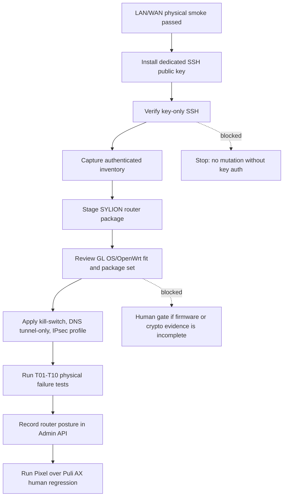

# Step 3.105 - Puli AX authenticated hardening gate

Date: 2026-05-26

## Scope

This step turns the physical Puli AX work from unauthenticated LAN smoke into authenticated router hardening. It deliberately separates:

1. SSH key installation,
2. metadata-only router inventory,
3. package staging,
4. kill-switch / DNS / IPsec apply,
5. T01-T10 physical failure testing.

No router password, Wi-Fi password, SIM metadata, IMEI, public egress IP, message content, wallet data, or terminal operational data may be printed, stored, or committed.

## Current State

Status: `LAB TUNNEL ACTIVE - PRODUCTION KILL SWITCH/FIRMWARE GATES REMAIN`

Already passed:

- Puli AX LAN/WAN repeater smoke: `lan_smoke_passed`.
- Pixel ADB network smoke: `puli_ax_with_sylion_vpn_path_seen`.
- Router admin UI reachable on LAN.
- Router SSH port reachable on LAN.
- Dedicated SSH key auth validated.
- strongSwan route to G1 established.
- Pixel resolves `operator.sylion.internal` through router DNS.
- Pixel reaches G2 private broker on `10.42.0.12:443`.
- Router LAN-to-tunnel SNAT installed for Pixel/client traffic.
- TCP MSS clamp installed to avoid TLS/WebSocket stalls over repeater + ESP.

Blocked:

- production kill switch is not permanently loaded outside the explicit failure-test window.
- GL.iNet firmware reports OpenWrt `21.02-SNAPSHOT`; lab acceptance is recorded, but production target remains hardened OpenWrt 23.05+ or explicitly reviewed equivalent.

## Tools Added

```bash
scripts/puli-ax-install-ssh-key-interactive.ps1
npm run test:puli-ax-authenticated-inventory
npm run live:puli-ax-hardening-deps
npm run live:puli-ax-router-ipsec-lab
npm run live:puli-ax-killswitch-window
```

The PowerShell installer opens a normal SSH password prompt. The router password is typed by the human directly into the terminal and is never known, printed, stored, or passed as a command-line argument by Codex.

The inventory smoke uses key-only SSH. If key auth is not working, it exits with `blocked_ssh_key_auth_required` and records only metadata.

## Mermaid - Hardening Gate



## Why Production Apply Is Still Gated

The production posture is intentionally not marked ready until the kill-switch failure window and firmware gate pass because full router enforcement can:

- change the LAN subnet from the current GL.iNet default,
- disable SSH password auth,
- modify firewall defaults,
- load an nftables kill switch before a router-to-G1 IPsec profile is fully validated.

Applying those controls in the wrong order can cut off router access or break the current lab uplink. The lab profile therefore applies IPsec, DNS, SNAT, and MSS controls, while keeping the destructive failure-window checks explicit.

## Pass Criteria

The router can proceed to package staging only when:

| Check | Required |
| --- | --- |
| key-only SSH | pass |
| OpenWrt/GL OS inventory | captured |
| `uci` | present |
| `nft` | present or installable |
| strongSwan / `ipsec` / `swanctl` | present or installable |
| dnsmasq | present |
| SSH password auth | disabled after key verification |
| SYLION kill switch | installed and tested |
| SYLION IPsec config | installed and tested |
| DNS tunnel-only | tested |
| WAN admin | disabled |

## Commands

Open the interactive key installer:

```powershell
powershell -NoProfile -ExecutionPolicy Bypass -File scripts\puli-ax-install-ssh-key-interactive.ps1
```

Then run:

```bash
npm run test:puli-ax-authenticated-inventory
npm run test:puli-ax-physical-smoke
npm run test:pixel-puli-ax-network-smoke
```

## Current Evidence

Latest authenticated inventory result:

- `status=inventory_captured_with_blockers`
- `sshKeyAuth=true`
- `sylionRouterTunnelEstablished=true`
- `sylionRouterChildInstalled=true`
- `sylionLanSnat=true`
- `sylionTcpMssClamp=true`
- `sylionInternalDnsStatic=true`
- `sylionInternalDnsResolves=true`
- blockers: `sylion_killswitch_not_loaded`, `openwrt_23_05_or_explicit_glos_lab_acceptance_required`
- secrets stored: no
- password printed: no
- production execution allowed: no
- side effect allowed: only explicit `--apply` router lab provisioning scripts

## Production Decision

Decision: `CONTINUE LAB PATH / HOLD PRODUCTION ROUTER READY UNTIL KILL-SWITCH AND FIRMWARE GATES PASS`

Human gate remains required before applying kill-switch, DNS tunnel-only, or IPsec profile because router key recovery and authenticated firmware/package inventory are not proven yet.
