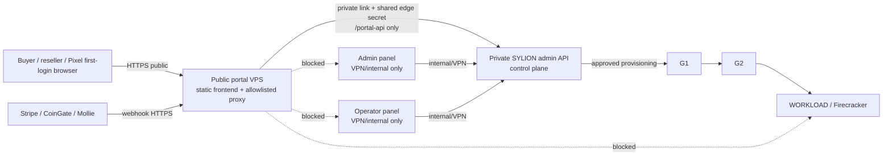
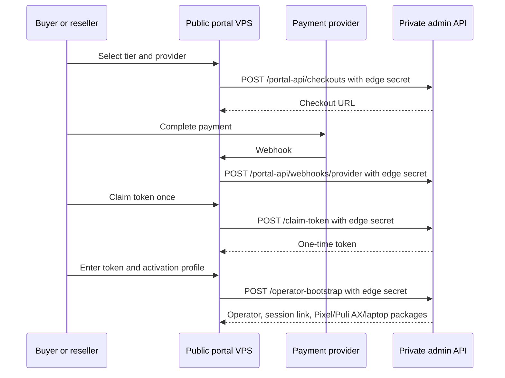

# Step 3.107 - Public Customer Portal VPS Split

Status: implemented contract, deployment script ready.
Scope: public purchase portal, token activation, package handoff.
Out of scope: public admin panel, public operator panel, public workload streams.

## Decision

The customer purchase portal is allowed to be public, but it must run on a separate public-edge VPS and must not expose the SYLION control plane.

The admin API remains private. The public portal VPS serves:

- static `apps/customer-portal` frontend,
- allowlisted `/portal-api/*` proxy routes only,
- no `/admin`, `/operator`, `/operator-api`, `/auth`, provider, workload or audit routes.

The private admin API accepts public-portal mutations only when `SYLION_PUBLIC_PORTAL_SHARED_SECRET` matches the edge-proxy header. Browser clients never receive that secret.

## Allowed Public Routes

| Route | Public edge | Control-plane effect |
| --- | --- | --- |
| `GET /` | serves portal | none |
| `GET /portal` | serves portal | none |
| `GET /portal-api/pricing` | proxied | public pricing catalog |
| `GET /portal-api/payment-providers` | proxied | redacted provider readiness |
| `POST /portal-api/checkouts` | proxied with edge secret | creates checkout intent |
| `POST /portal-api/webhooks/:provider` | proxied with edge secret | verifies provider webhook |
| `POST /portal-api/checkouts/:id/claim-token` | proxied with edge secret | returns token once |
| `POST /portal-api/operator-bootstrap` | proxied with edge secret | creates tenant/operator/packages |

## Forbidden Public Routes

- `/admin`
- `/operator`
- `/operator-api/*`
- `/auth/*`
- `/providers/*`
- `/live-execution/*`
- `/audit*`
- workload stream hosts and Guacamole/Kasm/noVNC endpoints

## Architecture



## Token Activation Flow



## Deployment

Required environment on the machine running the deploy:

```powershell
$env:HCLOUD_TOKEN="..." # only when creating a new Hetzner Cloud VPS
$env:SYLION_PUBLIC_PORTAL_SHARED_SECRET="..." # generated strong secret, not printed
```

Create and deploy a new Hetzner Cloud public portal VPS:

```powershell
node scripts/deploy-public-portal-vps.mjs `
  --create-hetzner `
  --name=sylion-public-portal-01 `
  --server-type=cx23 `
  --location=fsn1 `
  --network=12247599 `
  --ssh-public-key=.deploy/sylion_hetzner_admin_ed25519.pub `
  --key=.deploy/sylion_hetzner_admin_ed25519 `
  --control-plane=http://10.42.0.10:8080 `
  --admin-host=188.245.227.27
```

Deploy to an already-created VPS:

```powershell
node scripts/deploy-public-portal-vps.mjs `
  --host=<public-portal-vps-ip> `
  --key=.deploy/sylion_hetzner_admin_ed25519 `
  --control-plane=http://10.42.0.10:8080 `
  --admin-host=188.245.227.27
```

`--admin-host` installs the same shared edge secret into the private admin API systemd drop-in and restarts `sylion-admin-api`.
When `--network` attaches the portal VPS to the private SYLION network, the script also allows only the portal private IP to reach the private admin API listener on TCP `8080`.

## Current Live Lab Deployment

| Field | Value |
| --- | --- |
| Public portal VPS | `sylion-public-portal-01` |
| Hetzner server type | `cx23` |
| Public IP | `46.224.34.121` |
| Private IP | `10.42.0.2` |
| Private network | `sylion-prod-op-01-private` / `10.42.0.0/16` |
| Control-plane URL from portal edge | `http://10.42.0.10:8080` |
| Public service | `sylion-public-portal` |
| Exposed public ports | `22`, `80`, `443` |
| Admin/operator exposure | blocked by public edge route allowlist |

## Public Portal Feature Contract

The public portal must show the customer exactly what can be bought before checkout:

- five selectable annual tiers: Pilot, Standard, Pro, Phantom and Sovereign;
- monthly price, annual commitment, minimum term, workload app-environment count and tenancy model for every tier;
- included controls and limits for the selected tier;
- payment-provider status for Stripe, CoinGate and Mollie without exposing provider secrets;
- token catalog for operator bootstrap, subscription extension, tier upgrade, jurisdiction credit, workload capacity, Matrix server, PHANTOM review and PHANTOM access;
- B2B-only, annual-commitment and no-refund-after-provisioning wording, with the mandatory-law exception;
- explicit wording that the portal sells scoped provisioning tokens and package handoff, not anonymity or impossible security.

Tier cards are active controls. Selecting a tier updates the checkout select and the selected-tier summary, so a user can choose the subscription visually before creating a provider checkout.

## Network Gate

The public VPS must reach the private control plane through one of:

- Hetzner private network/vSwitch path,
- IPsec tunnel,
- another approved private service mesh/mTLS path.

It must not expose `/admin`, `/operator`, workload streams or provider-control routes on the public internet.

## Acceptance Tests

1. `GET /` on public VPS returns the portal.
2. `GET /admin` on public VPS returns 404.
3. `GET /operator` on public VPS returns 404.
4. `GET /operator-api/about` on public VPS returns 404.
5. `GET /portal-api/pricing` returns public pricing.
6. Direct `POST /portal-api/checkouts` to private admin API without edge secret returns 403 when `SYLION_PUBLIC_PORTAL_SHARED_SECRET` is set.
7. `POST /portal-api/checkouts` through public VPS succeeds when payment provider keys are configured.
8. Audit does not contain raw payment secrets, token material, cookies, Authorization headers, wallet data or message contents.

## Human Gate

Human gate is required before:

- changing public DNS,
- enabling live Stripe/CoinGate/Mollie credentials,
- claiming production payment compliance,
- connecting public portal to live operator provisioning that mutates cloud resources without admin approval.
