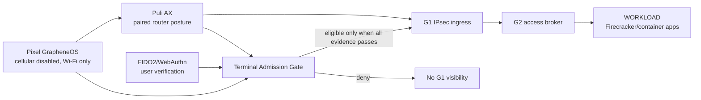
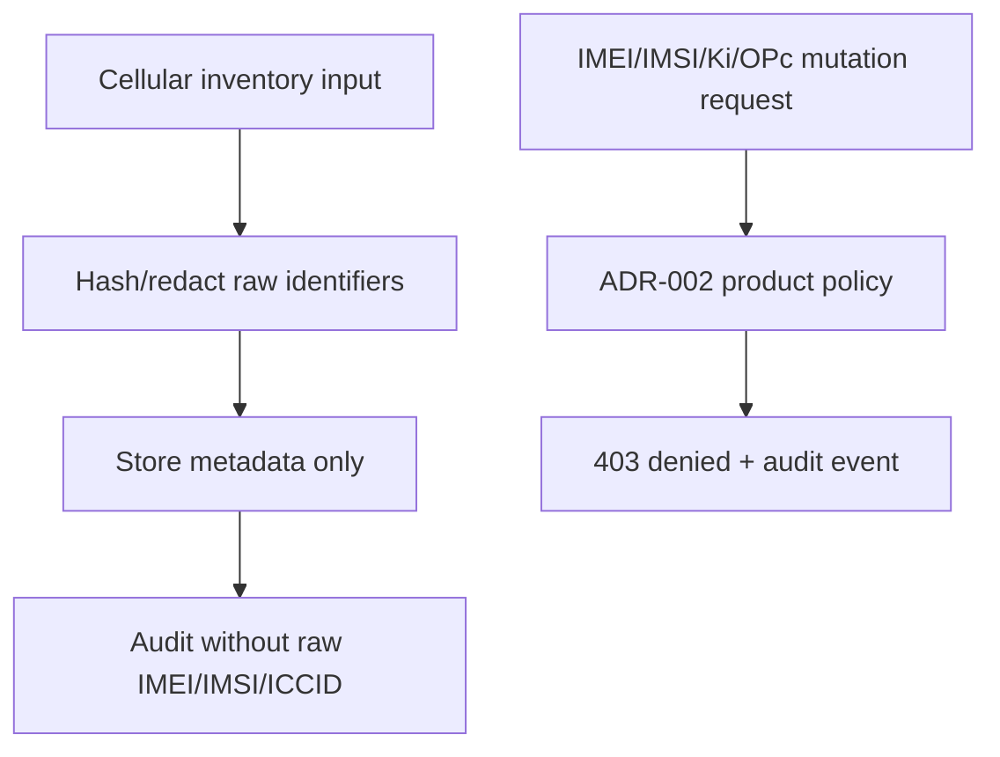

# Step 3.106 - Terminal Admission And Cellular Policy

Scope: Pixel GrapheneOS + Puli AX + FIDO2 correlation before G1 access, and safe cellular inventory without IMEI/IMSI mutation.

## Freeze

ADR-002 is now a product rejection for cellular identity mutation. SYLION does not implement public-network IMEI override, IMSI programming, Ki/OPc writing, TAC spoofing, modem unlock routines for identity mutation, or boot-time cellular identity rotation.

Supported controls:

- metadata-only modem/SIM inventory,
- hashed ICCID/IMEI/IMSI when readable,
- legal SIM/profile/provider lifecycle,
- Puli AX router posture evidence,
- Pixel Wi-Fi-only evidence,
- FIDO2/WebAuthn user verification evidence,
- IPsec IKEv2 certificate-auth route evidence to G1,
- no terminal operational data.

## Admin API

Implemented routes:

- `POST /operators/:operatorId/cellular-inventory`
- `GET /cellular/inventory?operatorId=...`
- `POST /cellular/policy/evaluate-action`
- `POST /operators/:operatorId/terminal-admission/evaluate`
- `GET /terminal-admissions?operatorId=...`

## Terminal Admission Rules

Production eligibility is granted only when all are true:

1. Pixel terminal is assigned to the operator.
2. Puli AX router is assigned to the same operator.
3. FIDO2 device is assigned and the session has user verification evidence.
4. Router package and posture are validated.
5. Pixel cellular is disabled.
6. Pixel is Wi-Fi-only.
7. Router pairing evidence exists.
8. IPsec to G1 is established.
9. Certificate chain is trusted.
10. Terminal stores no operational data.

Missing evidence results in `decision=blocked`.

## Mermaid





## Tests

Run:

```bash
npm run test:terminal-admission-cellular-policy
```

Test coverage:

- every prohibited cellular identity action is denied,
- cellular inventory response and audit contain no raw IMEI/IMSI/ICCID,
- terminal admission blocks missing FIDO2/IPsec evidence,
- terminal admission grants G1 eligibility only after Pixel + Puli AX + FIDO2 + route evidence passes.

## Residual Work

- Wire admission state into the admin and operator UI.
- Record live Pixel/Puli AX evidence through ADB/router smoke once router DHCP/SSH are stable.
- Keep HSM/FIDO2 physical enrollment deferred until hardware is available.
