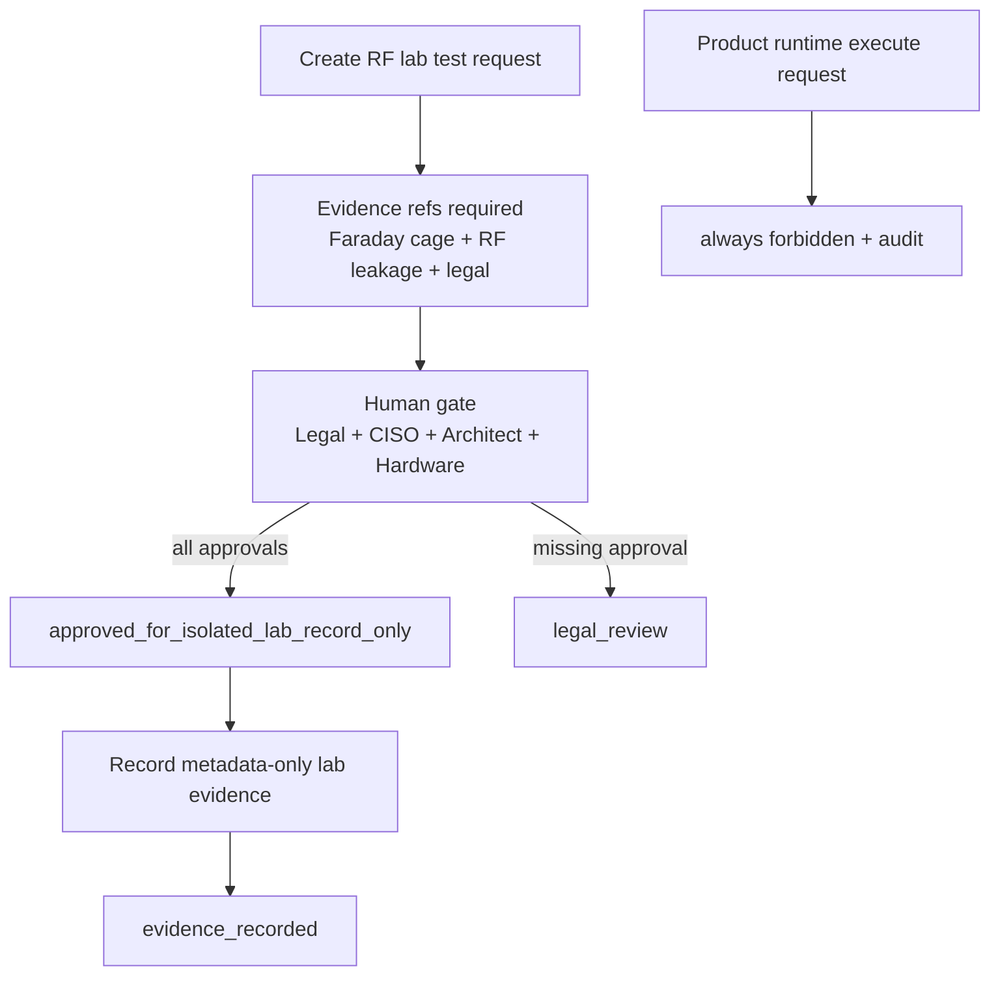

# Step 3.107 - RF Lab IMEI Governance

Scope: allow SYLION to manage evidence for a closed Faraday-cage IMEI characterization test without adding a product runtime executor for IMEI mutation.

## Decision

SYLION product code remains forbidden from changing public-network cellular identifiers. A closed RF lab may still need to test modem behavior. That is handled as a governance and evidence workflow:

- request lab test,
- attach legal review,
- attach Faraday cage calibration evidence,
- attach RF leakage evidence,
- require Legal + CISO + Architect + Hardware approvals,
- record non-sensitive final evidence,
- deny any attempt to execute an IMEI change through the product runtime.

## API

- `POST /rf-lab/imei-change-tests`
- `GET /rf-lab/imei-change-tests`
- `GET /rf-lab/imei-change-tests/:testId`
- `POST /rf-lab/imei-change-tests/:testId/approve`
- `POST /rf-lab/imei-change-tests/:testId/evidence`
- `POST /rf-lab/imei-change-tests/:testId/execute-product-runtime`

The last route exists as a negative control: it always returns forbidden and records an audit event.

## Hard Conditions

1. Faraday cage evidence reference required.
2. RF leakage test reference required.
3. Legal opinion reference required.
4. Responsible engineer required.
5. Four approvals required: Legal, CISO, Architect, Hardware.
6. Evidence can be recorded only when isolation is still active and no public mobile network is observed.
7. Raw IMEI/IMSI/ICCID/Ki/OPc/TAC values are rejected.
8. Operational modem commands or unlock details are rejected.
9. Product runtime execution is always denied.

## Mermaid



## Test Command

```bash
npm run test:rf-lab-imei-governance
```

## Boundary

This module does not include instructions, scripts, AT commands, modem unlock paths, public-network procedures, raw identifiers, SIM secrets, or device mutation logic. It is an audit/control-plane record so the lab process is visible and governable without embedding the sensitive operation into SYLION product code.
