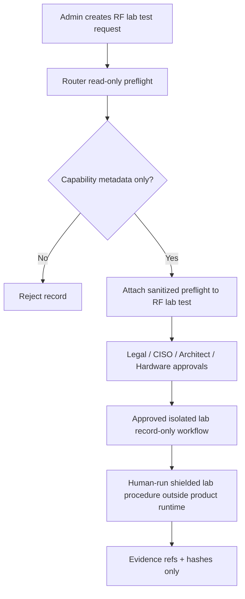

# Step 3.108 - RF Lab Router Software Preflight

## Scope

This step adds a read-only router software preflight for PHANTOM RF lab preparation.
It answers one narrow question: is the Puli AX router ready to be inspected in an
approved shielded lab workflow with Python, PC/SC, OpenSC/CCID and pySim shell
tooling visible?

It does not provide a product runtime executor for cellular identity mutation. It
does not read card identifiers, card secrets, modem identifiers or network
registration state.

## Controls

- Product runtime execution remains denied.
- Preflight runs read-only SSH checks only.
- Stored output is capability metadata, blockers and evidence references.
- Router IP is redacted when attached to the admin API RF lab record.
- Raw cellular identifiers and SIM secret material are rejected by API validation.
- Evidence still requires the RF lab governance path from Step 3.107.

## New Script

```bash
npm run test:puli-ax-rf-lab-preflight
```

The script writes:

```text
docs/admin-panel-v2/test-artifacts/puli-ax-rf-lab-preflight/latest.json
```

The script checks only:

- command/package presence for Python, PC/SC, OpenSC/CCID and pySim shell tooling
- USB bus visibility
- smart-card-reader hint from sanitized USB metadata
- explicit negative controls proving no read/write/mutation action was attempted

## New API

```text
POST /rf-lab/imei-change-tests/:testId/router-preflight
```

Request body:

```json
{
  "preflight": {
    "component": "puli_ax_rf_lab_router_preflight",
    "status": "preflight_ready_for_human_gate",
    "facts": {
      "capabilities": {
        "python3Present": true,
        "pcscdPresent": true,
        "pysimShellPresent": true,
        "smartcardReaderHint": true
      }
    },
    "controls": {
      "readOnly": true,
      "rawCellularIdentifiersRead": false,
      "simSecretMaterialRead": false,
      "mutationCommandsExecuted": false,
      "productRuntimeExecutorAvailable": false
    }
  },
  "evidenceRefs": ["evidence://rf-lab/router-preflight-puli-ax"]
}
```

Response attaches `routerSoftwarePreflights[]` to the RF lab test.

## Mermaid Flow



## Acceptance

- `test:rf-lab-router-preflight` passes.
- `test:rf-lab-imei-governance` still passes.
- Product runtime endpoint still denies execution.
- API rejects unsafe preflight evidence.
- No operational radio identity procedure is introduced into product code.

## Verification

```bash
npm run test:rf-lab-router-preflight
npm run test:rf-lab-imei-governance
```
