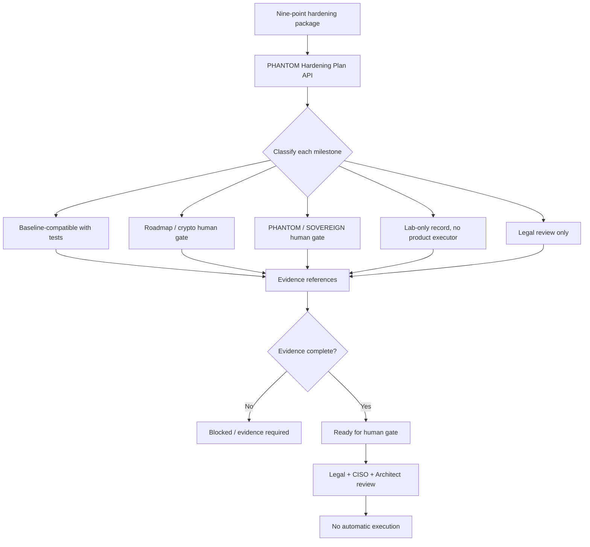

# Step 3.109 - SYLION 3.0 / PHANTOM v3.0 Hardening Plan

## Purpose

This step converts the nine-point SYLION/PHANTOM hardening package into
policy-as-code. The system can now show which controls are baseline-compatible,
which require PHANTOM/SOVEREIGN human gates, which are lab-only, and which need
legal review before any product wording or implementation claim.

The implementation deliberately does not enable PHANTOM execution. All outputs
carry:

- `humanGateRequired=true`
- `sideEffectAllowed=false`
- `executionAllowed=false`
- `productionExecutionAllowed=false`

## API

```text
GET /phantom/hardening-plan
POST /phantom/hardening-plan/evaluate
```

`GET` returns the fixed hardening plan:

1. G2 streaming broker E2EE replacement track
2. Hybrid PQC transport migration roadmap
3. SOVEREIGN autonomous perimeter qualification
4. Pixel and Puli AX terminal admission hardening
5. eSIM exclusion and RF lab telecom identity governance
6. Transport camouflage and traffic-shaping review
7. eBPF runtime monitoring and incident automation
8. Safe rotation orchestration policy
9. OPSEC training and emergency workflow drills

`POST` accepts evidence references per milestone and returns whether each item is
still missing evidence or ready for human gate. It never unlocks execution.

## Classification

| Milestone | Classification | Runtime posture |
| --- | --- | --- |
| Streaming broker E2EE | roadmap human gate | no execution |
| PQC transport | roadmap human gate | no execution |
| Autonomous perimeter | PHANTOM human gate | no execution |
| Terminal radio isolation | baseline with tests | no execution from plan |
| eSIM/RF lab governance | lab-only record | no product executor |
| Transport camouflage | legal review only | no baseline claim |
| eBPF monitoring | baseline with tests | metadata-only alerts |
| Safe rotation | PHANTOM human gate | no telecom identity executor |
| OPSEC training | baseline with tests | evidence-only |

## Mermaid



## Enforcement

- Unknown milestone IDs are rejected.
- Evidence references are validated through PHANTOM governance text filters.
- Prohibited operational RF details are rejected.
- Audit records are created for plan reads and evaluations.
- The plan cannot mark production execution as allowed.

## Verification

```bash
npm run test:phantom-hardening-plan
```

Recommended regression bundle:

```bash
npm run test:phantom-hardening-plan
npm run test:rf-lab-router-preflight
npm run test:rf-lab-imei-governance
npm run test:terminal-admission-cellular-policy
```
