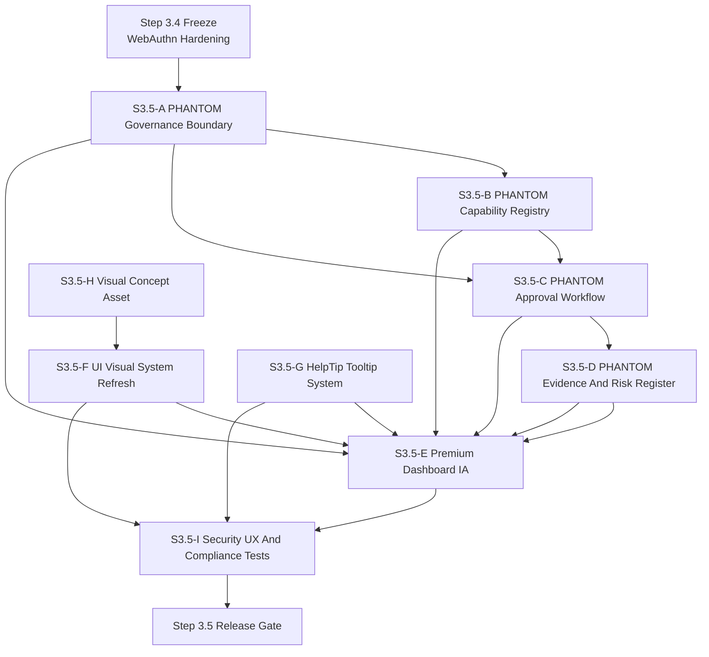
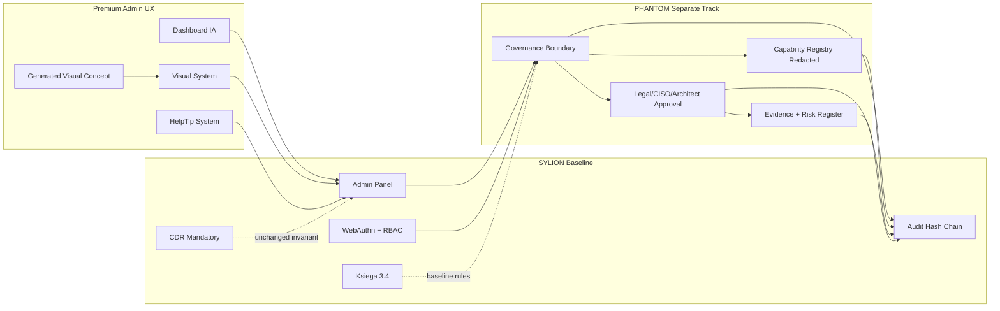
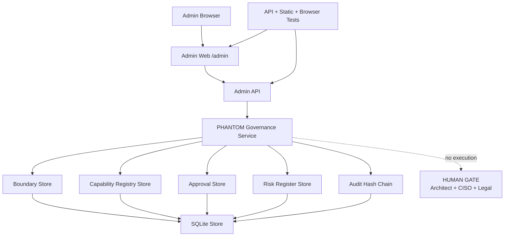
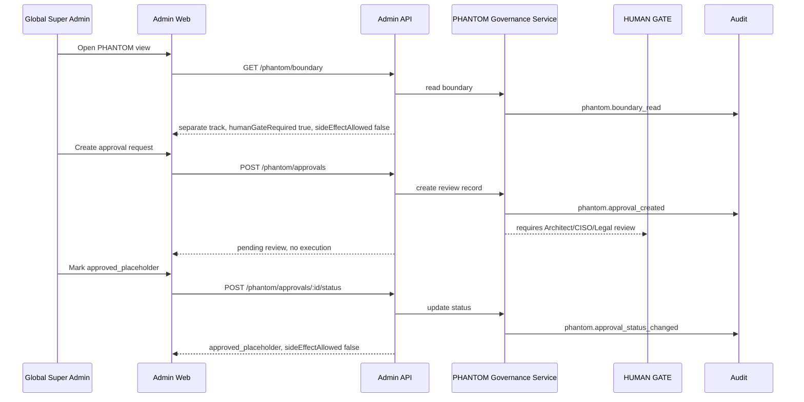
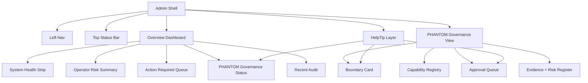
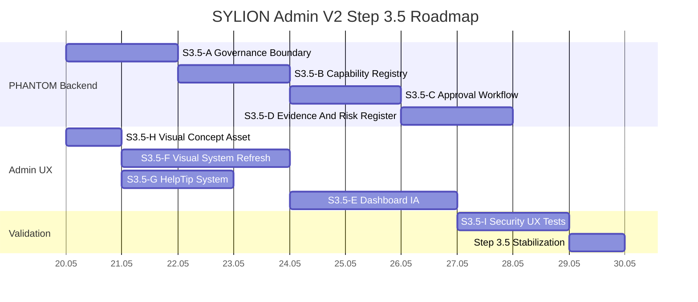

# SYLION Admin Panel V2 - Step 3.5 Graphs And Roadmap

## Module Dependency Graph



## Module Map



## Deployment Graph



## Runtime Flow



## UI Layout Graph



## Implementation Roadmap



## Release Gates

```text
Gate 1: PHANTOM boundary exists and is disabled_by_default or review_only.
Gate 2: no PHANTOM endpoint executes operational behavior.
Gate 3: Legal/CISO/Architect gates are explicit.
Gate 4: all PHANTOM status changes are audited.
Gate 5: PHANTOM UI has helptips for boundary and HUMAN GATE.
Gate 6: dashboard visual refresh is responsive and readable.
Gate 7: no prohibited operational details appear in UI/API/audit/logs.
Gate 8: PHANTOM remains outside baseline certification claims.
Gate 9: npm.cmd test passes.
Gate 10: browser verification passes.
```
