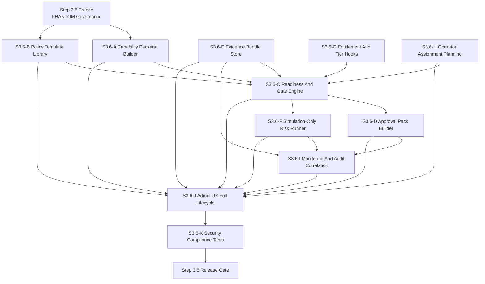
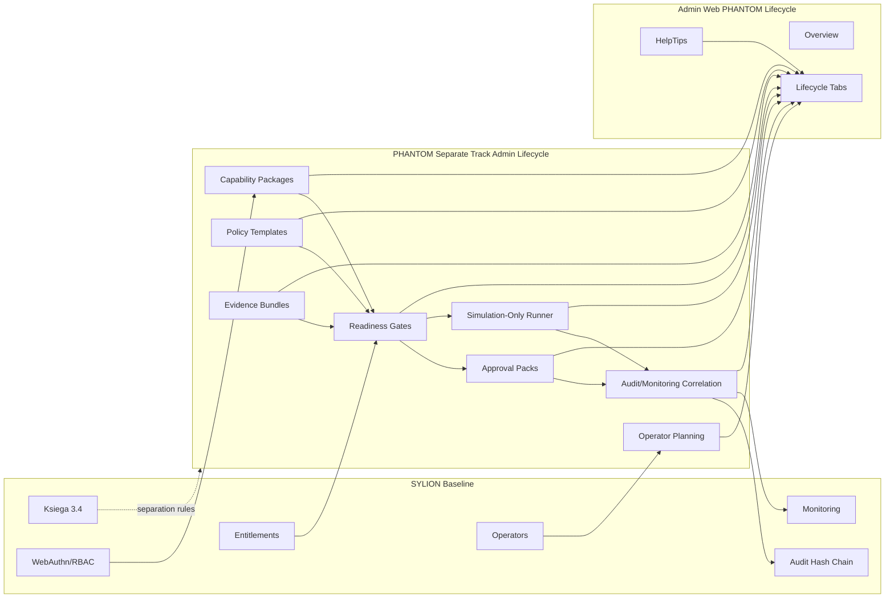
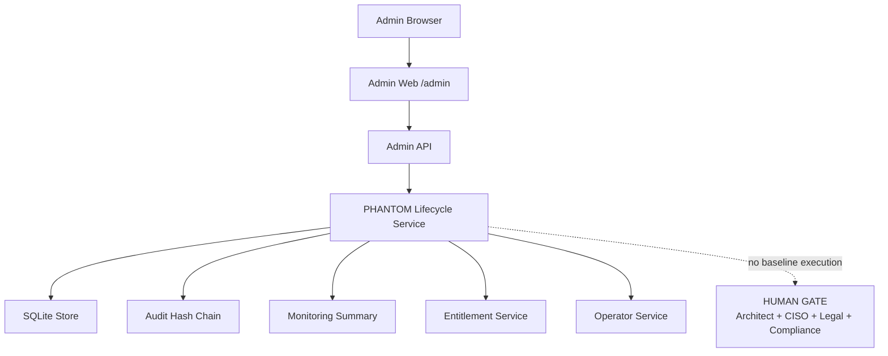
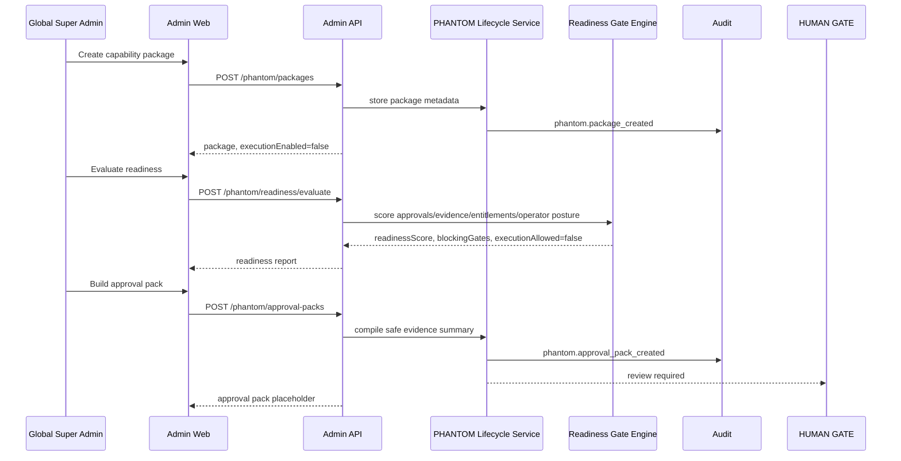
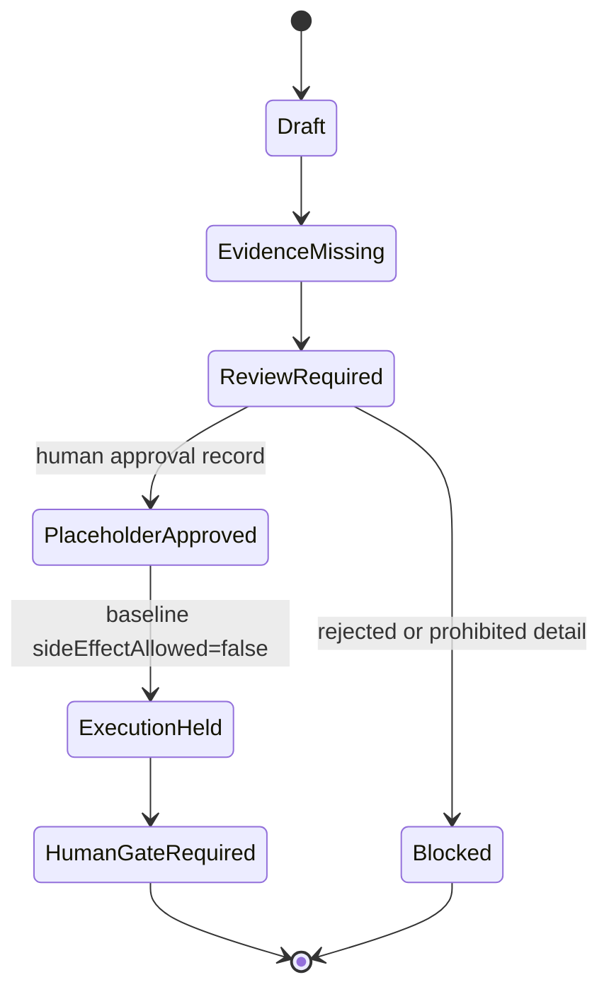
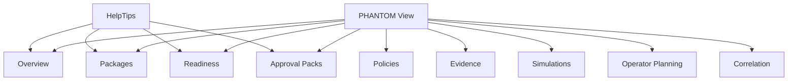
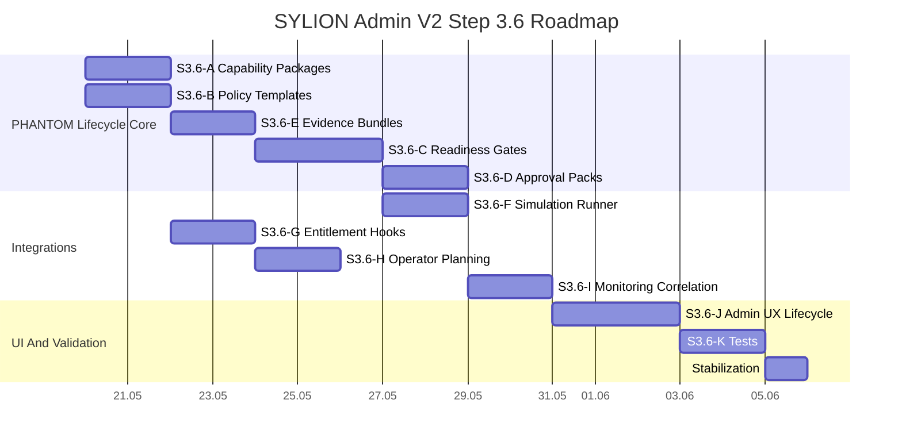

# SYLION Admin Panel V2 - Step 3.6 Graphs And Roadmap

## Module Dependency Graph



## Module Map



## Deployment Graph



## Runtime Flow



## Gate State Machine



## UI Lifecycle Graph



## Roadmap



## Release Gates

```text
Gate 1: all lifecycle records keep humanGateRequired=true.
Gate 2: executionAllowed=false and sideEffectAllowed=false in baseline.
Gate 3: readiness engine returns blockers, not bypasses.
Gate 4: simulation runner has no live side effects.
Gate 5: policy templates contain no operational instructions.
Gate 6: evidence bundles store references only.
Gate 7: UI contains HelpTips for sensitive terms.
Gate 8: no prohibited PHANTOM details appear in UI/API/audit/logs.
Gate 9: npm.cmd test passes.
Gate 10: browser verification passes.
```
