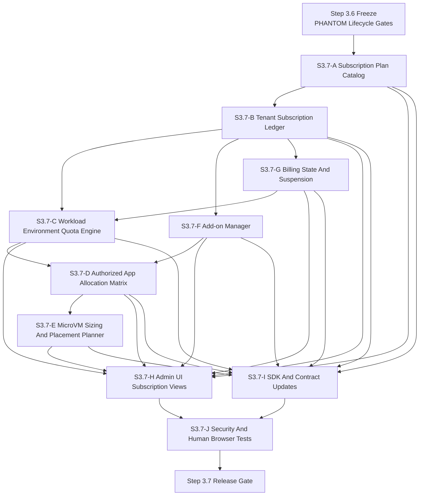
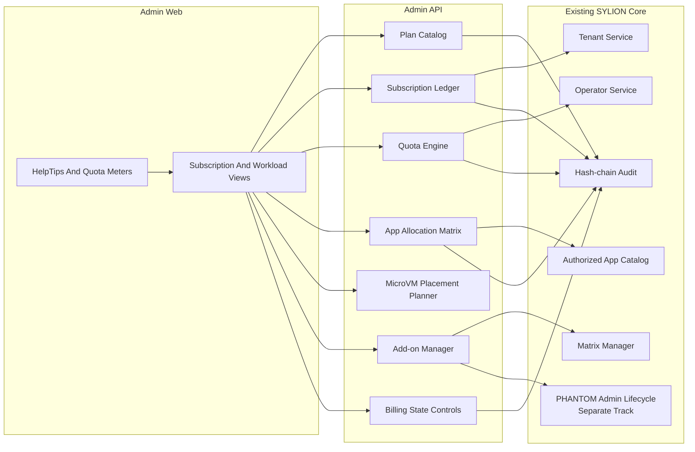
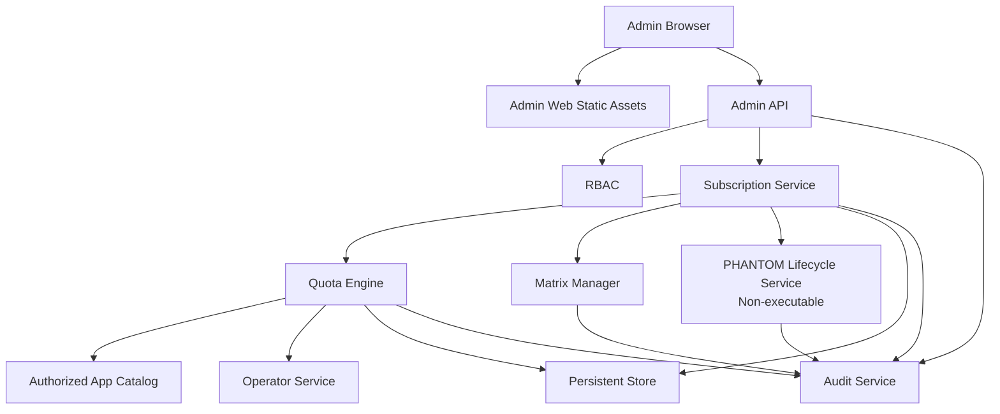
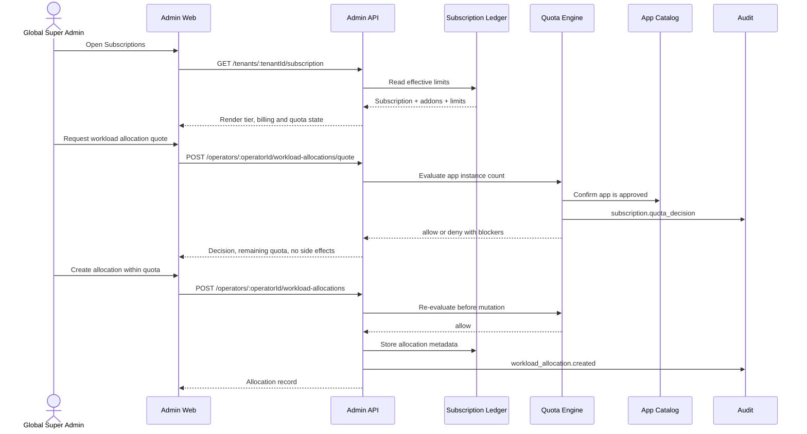
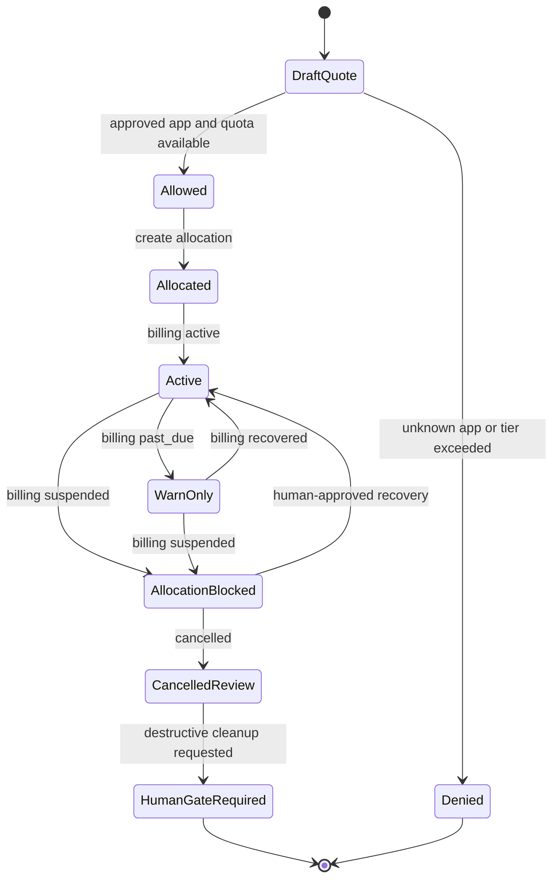
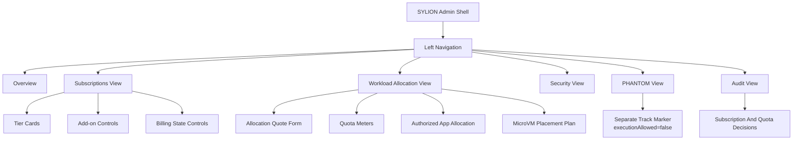
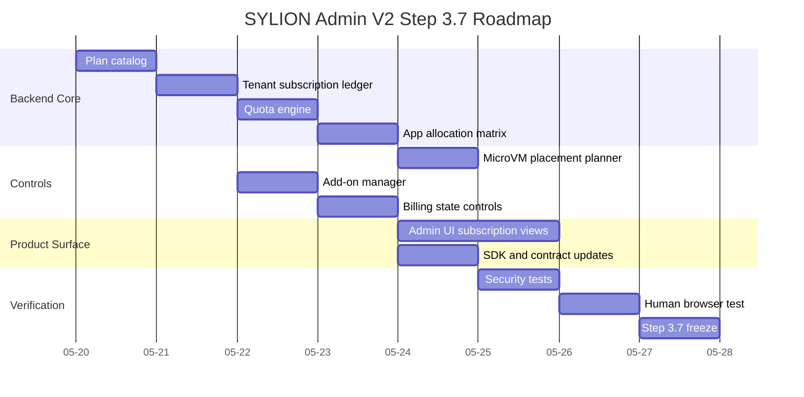

# SYLION Admin Panel V2 - Step 3.7 Graphs And Roadmap

## Diagram Files

```text
diagrams/39-step3-7-module-dependencies.mmd
diagrams/40-step3-7-module-map.mmd
diagrams/41-step3-7-deployment-graph.mmd
diagrams/42-step3-7-runtime-flow.mmd
diagrams/43-step3-7-quota-state-machine.mmd
diagrams/44-step3-7-ui-layout.mmd
diagrams/45-step3-7-roadmap-gantt.mmd
```

## Module Dependency Graph



## Module Map



## Deployment Graph



## Runtime Flow



## Quota State Machine



## UI Layout Graph



## Roadmap



