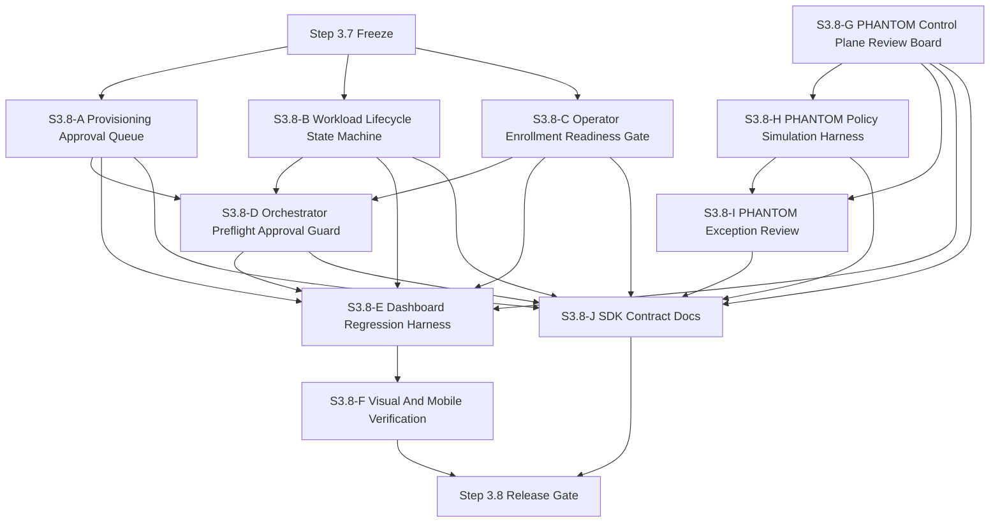
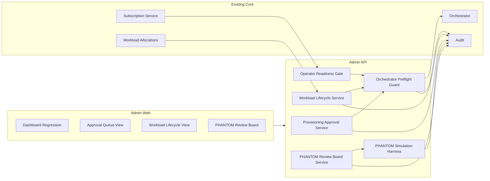
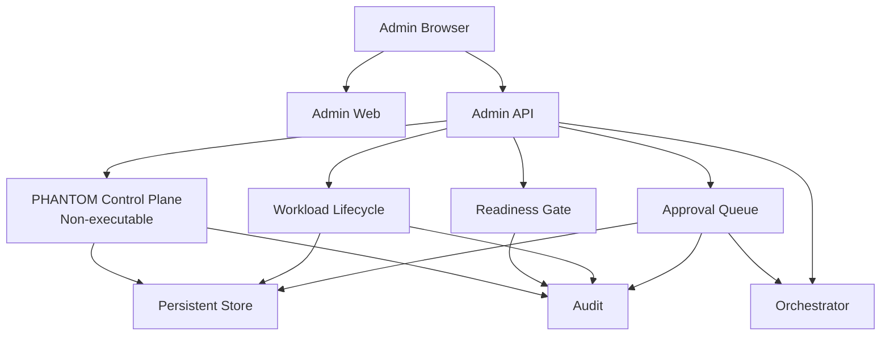
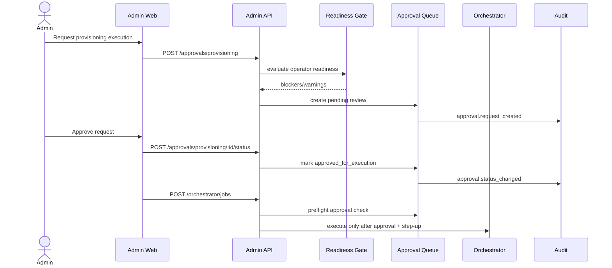
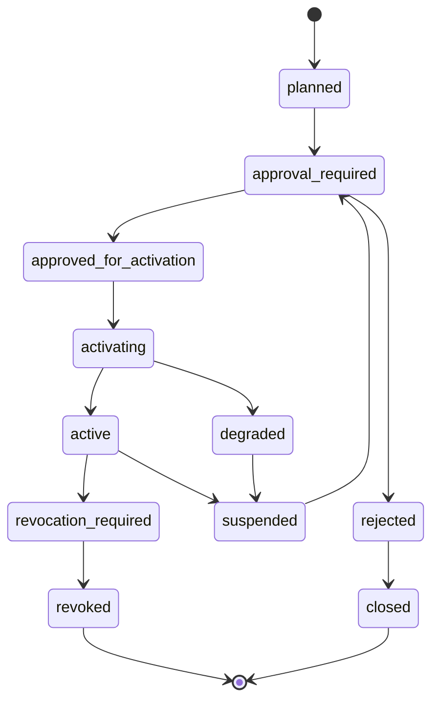
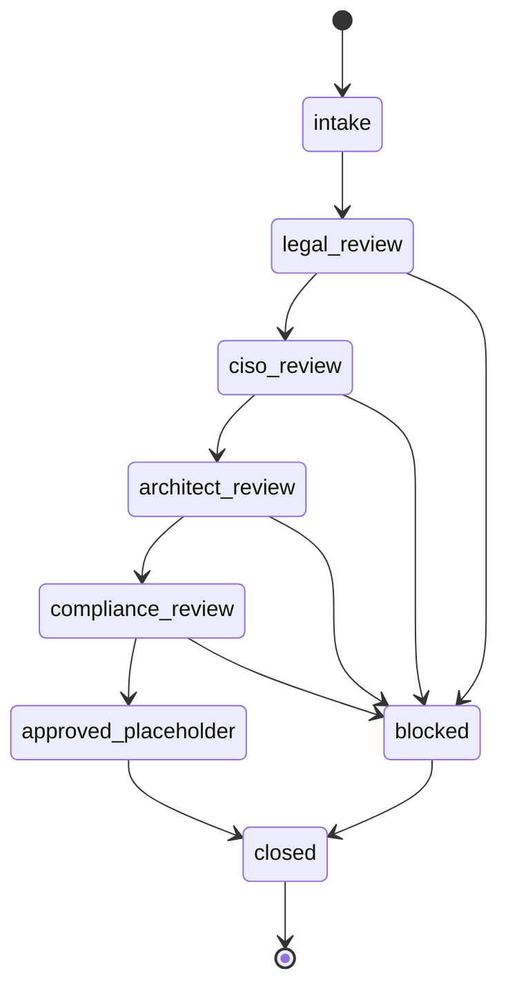
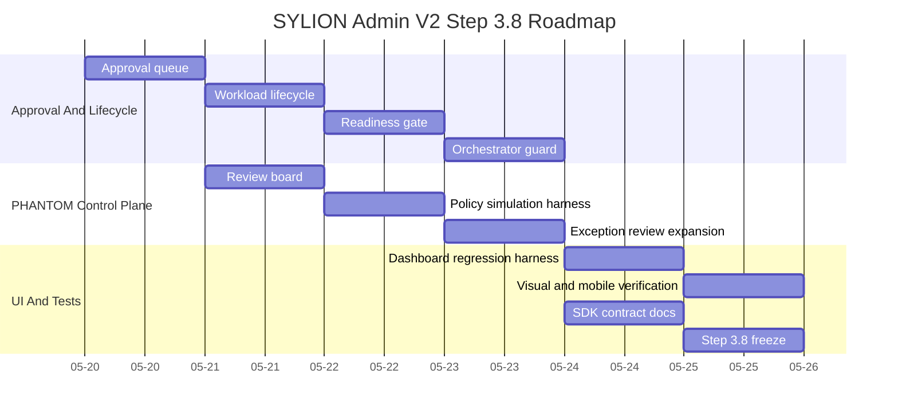

# SYLION Admin Panel V2 - Step 3.8 Graphs And Roadmap

## Diagram Files

```text
diagrams/46-step3-8-module-dependencies.mmd
diagrams/47-step3-8-module-map.mmd
diagrams/48-step3-8-deployment-graph.mmd
diagrams/49-step3-8-runtime-flow.mmd
diagrams/50-step3-8-workload-lifecycle.mmd
diagrams/51-step3-8-phantom-review-flow.mmd
diagrams/52-step3-8-roadmap-gantt.mmd
```

## Module Dependencies



## Module Map



## Deployment Graph



## Runtime Flow



## Workload Lifecycle



## PHANTOM Review Flow



## Roadmap



