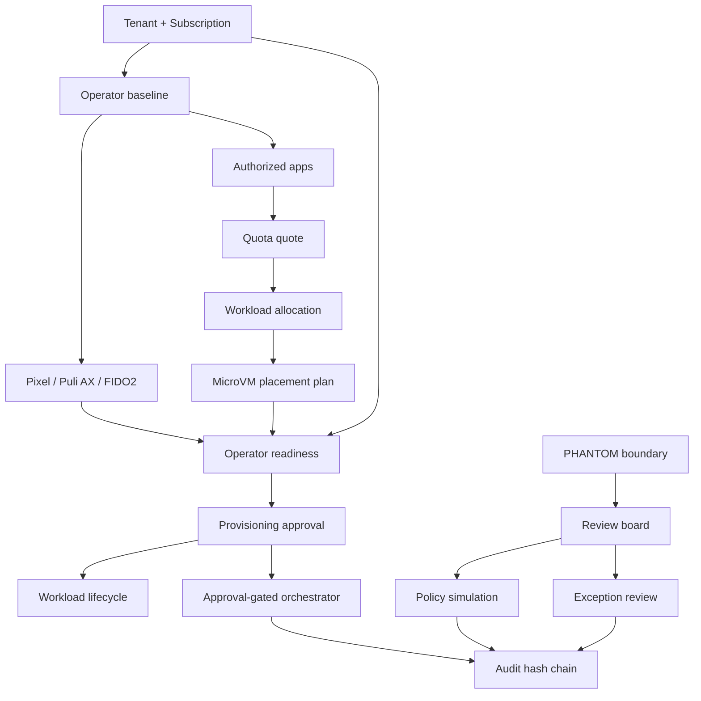

# Step 3.8 System Status vs Księga 3.4 and PHANTOM v3.0

Date: 2026-05-20

## Build Status

Step 3.8 extends the admin panel and API with approval gates, operator readiness, workload lifecycle, PHANTOM review board, PHANTOM policy simulations, PHANTOM exceptions, and deeper dashboard tests.

Current test status:

- Automated API/static tests: 55/55 passing.
- Dashboard click-through test: 9/9 scenarios passing.
- Screenshot artifact: `docs/admin-panel-v2/assets/step3-8-dashboard-playwright.png`.

## Księga 3.4 Coverage

| Area | Status | Evidence |
| --- | --- | --- |
| Thin Client no terminal operational data | Partial | Admin panel stores only admin metadata; production thin-client stream is not implemented yet. |
| 3 VPS per operator baseline | Implemented in admin model | Operator baseline records `vpsPerOperator=3`; readiness validates it. |
| G1/G2/WORKLOAD separation | Partial | Inventory/provisioning metadata models layers; real network enforcement is not implemented yet. |
| Puli AX router gate | Implemented in admin readiness | Device inventory and readiness require `puli_ax_router`. |
| Pixel GrapheneOS gate | Implemented in admin readiness | Readiness requires `pixel_grapheneos`. |
| FIDO2 / step-up | Implemented for admin sensitive actions | Provider secret actions and orchestrator execution require fresh step-up. |
| Provider secrets | Implemented as references | Provider module stores secret references and clears UI secret field. |
| CDR mandatory | Implemented in catalog/allocation policy | Plans and workload allocation preserve `cdrRequired=true`. |
| Subscription workload limits | Implemented | Quota quote/allocation enforce per-tier and per-app limits. |
| Approval before execution | Implemented for strict path | Orchestrator supports approval-gated execution through `approvalRequired=true` and approved approval ID. |
| Monitoring without content | Implemented in current tests | Monitoring tests reject communication content. |
| Audit | Implemented | Hash-chain audit stream records RBAC, readiness, approvals, lifecycle, PHANTOM actions. |
| HSM/PKI production integration | Partial | Certificate references exist; real HSM/KMS integration remains future work. |
| Real provider provisioning | Partial | Provider connection is mocked/test-mode; no real Hetzner/OVH mutation yet. |
| Real Firecracker execution | Not implemented | Current workload lifecycle and placement are metadata/control-plane only. |
| Real Graphene/Puli image build | Partial | Image artifact references exist; production image build pipeline remains future work. |

## PHANTOM v3.0 Status

PHANTOM remains a separate `[A]` track outside certifiable baseline. This sprint adds admin control-plane visibility only:

- Review board items with Legal, CISO, Architect, and Compliance/Product owners.
- Policy simulations marked `policy_simulation_only`.
- Exceptions that explicitly reject execution requests.
- Existing packages, evidence bundles, approval packs, readiness, simulations, and assignment plans remain `sideEffectAllowed=false`.

PHANTOM invariants preserved:

- `humanGateRequired=true`
- `sideEffectAllowed=false`
- `executionAllowed=false`
- `executionEnabled=false`
- no operational PHANTOM details accepted in governance text
- no PHANTOM resource can unlock provisioning execution approvals

## Known Problems and Gaps

1. Legacy orchestrator calls can still run without approval unless the caller opts into strict approval gating with `approvalRequired=true`.
   - Reason: compatibility with existing tests and Step 3.2/3.7 flows.
   - Required next step: migrate all UI and API clients to strict approval mode, then make approval mandatory globally.

2. Browser automation cannot use `locator.fill()` in the current in-app browser environment.
   - Product impact: none observed.
   - Test impact: dashboard tests must type fields or seed values through supported browser interactions.

3. Provider card render needs explicit wait in browser tests.
   - Product impact: low; async refresh works.
   - Test impact: wait for card visibility after submit.

4. Real cloud, router firmware, Firecracker, HSM/KMS, WORM external immutability, and image pipelines are not production implementations yet.
   - Current system is admin/control-plane and policy simulation layer.

5. Mobile/responsive visual QA for the expanded Step 3.8 dashboard is not complete.
   - Desktop/in-app viewport was tested.

## Dependency Graph

## Next Implementation Step

The next sprint should harden Step 3.8 into mandatory production behavior:

1. Make approval mandatory for every orchestrator execution path.
2. Persist readiness snapshots instead of keeping dashboard-only last results.
3. Add responsive/mobile browser tests.
4. Add CI workflow for API tests and browser smoke tests.
5. Start real provider adapter boundary in dry-run mode with no cloud mutation.

