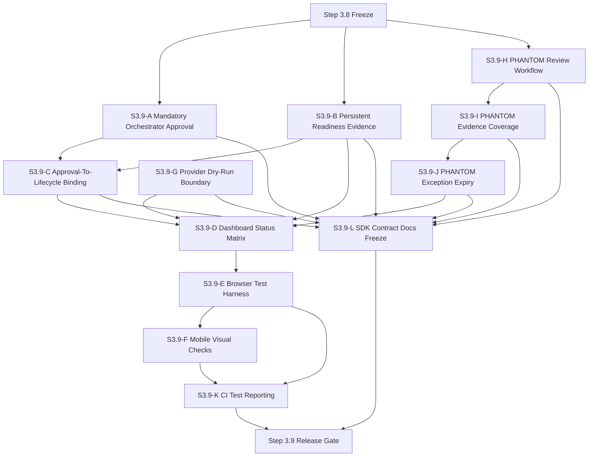
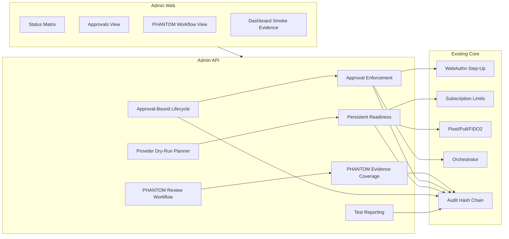
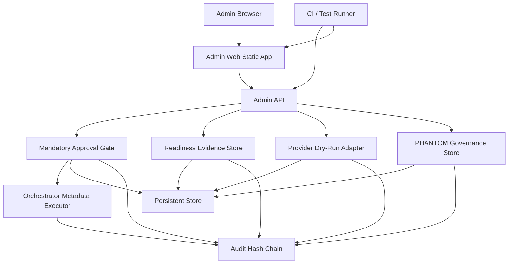
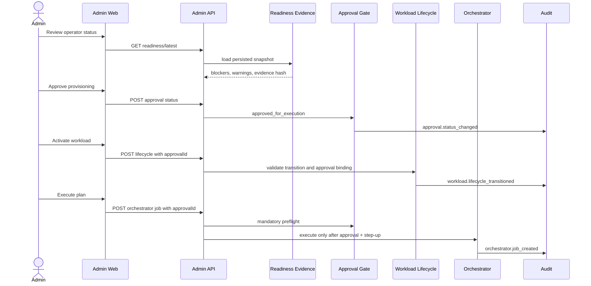
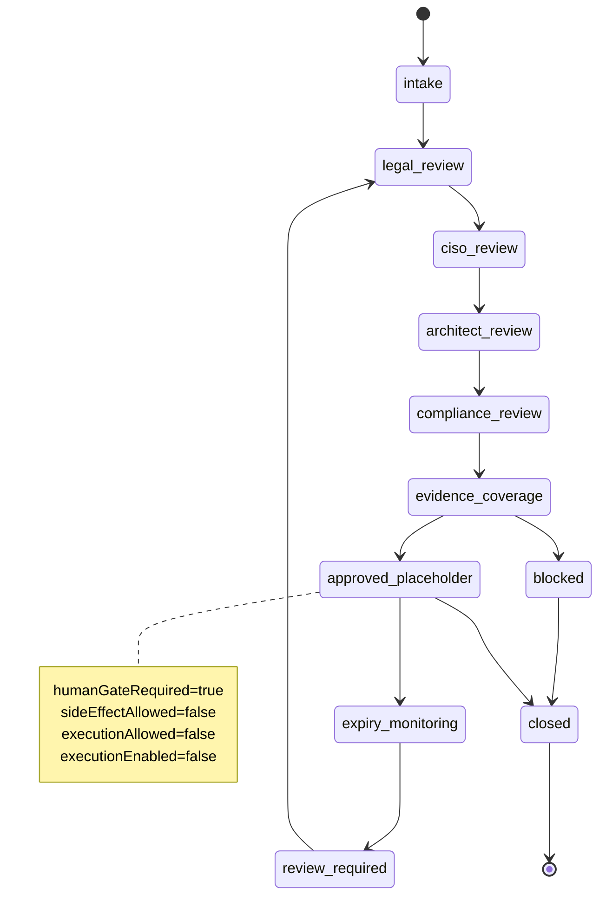
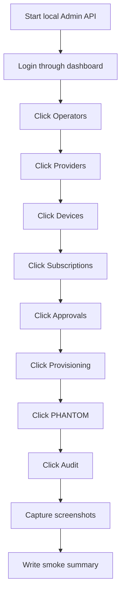
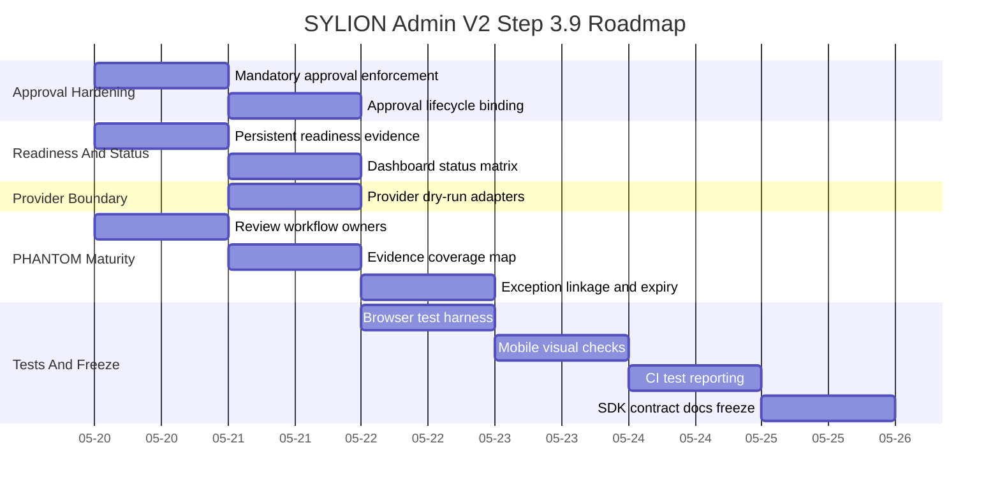

# SYLION Admin Panel V2 - Step 3.9 Graphs And Roadmap

## Diagram Files

```text
diagrams/53-step3-9-module-dependencies.mmd
diagrams/54-step3-9-module-map.mmd
diagrams/55-step3-9-deployment-graph.mmd
diagrams/56-step3-9-runtime-flow.mmd
diagrams/57-step3-9-phantom-workflow.mmd
diagrams/58-step3-9-test-harness.mmd
diagrams/59-step3-9-roadmap-gantt.mmd
```

## Module Dependencies



## Module Map



## Deployment Graph



## Runtime Flow



## PHANTOM Workflow



## Test Harness Flow



## Roadmap



