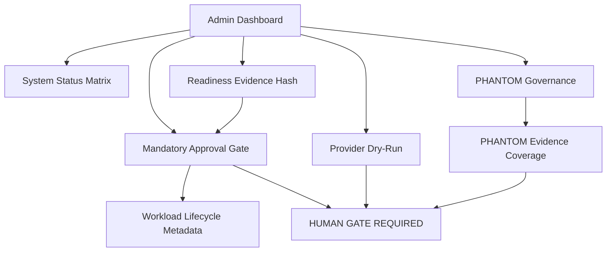

# SYLION Admin Panel V2 - Step 3.9 Status Vs Księga 3.4 And PHANTOM

Status: implemented and tested
Date: 2026-05-20

## Summary

Step 3.9 hardens the admin panel from a working control-plane slice into a stricter evidence and approval layer.

```text
API tests: 58/58 passing
Dashboard Playwright click-through: passing
Desktop/mobile screenshots: captured
Known UI issues found during Playwright: fixed
```

## Księga 3.4 Baseline Status

| Control | State | Evidence |
| --- | --- | --- |
| 3 isolated VPS per operator | Implemented as metadata baseline | provisioning plan, provider dry-run and orchestrator tests |
| G1/G2/WORKLOAD split | Implemented in planned actions and inventory | provider dry-run returns exactly G1/G2/WORKLOAD |
| Puli AX router gate | Implemented as readiness/device baseline | readiness and demo flow |
| Pixel GrapheneOS gate | Implemented as readiness/device baseline | readiness and device tests |
| FIDO2 / WebAuthn gate | Implemented for login and step-up | auth and step-up tests |
| Provider secrets by reference only | Implemented | provider tests and dry-run checks |
| Mandatory CDR | Implemented in app/workload policy checks | app catalog/CDR tests |
| Mandatory approval before orchestrator | Implemented in Step 3.9 | missing approval is denied, approved approval required |
| Persistent readiness evidence | Implemented | readiness history and evidenceHash |
| Real provider mutation | Blocked | dry-run only, HUMAN GATE before mutation |
| Real Firecracker execution | Blocked | metadata-only until HUMAN GATE |
| Production HSM/KMS | Not implemented | future gated work |

## PHANTOM v3.0 Status

| Area | State | Boundary |
| --- | --- | --- |
| Separate [A] track | Implemented | not part of certifiable baseline |
| Review board owners | Implemented | Legal/CISO/Architect/Compliance ack required |
| Evidence coverage | Implemented | governance metric only |
| Exception expiry | Implemented | expired exception blocks coverage |
| Dashboard controls | Implemented | PHANTOM view includes ack and coverage |
| Execution | Blocked | `executionAllowed=false`, `executionEnabled=false` |
| Certification claim | Blocked | `certificationClaim=false` |

## Mermaid Status Graph



## Residual Risks

```text
Real provider adapters are still blocked behind HUMAN GATE.
Real Firecracker orchestration is still blocked behind HUMAN GATE.
Production router firmware qualification is still evidence-only.
PHANTOM remains governance-only and cannot be described as production capability.
Customer-facing certification/security claims require Legal/CISO/Compliance review.
```

