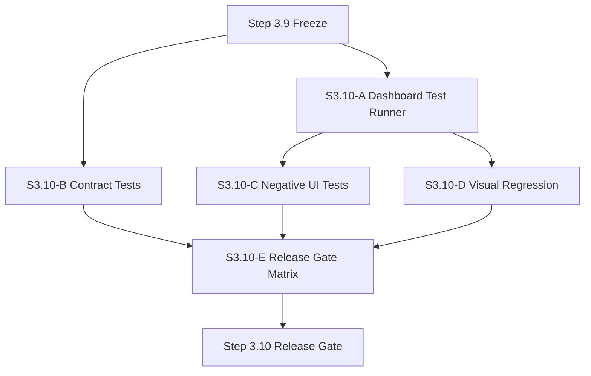

# SYLION Admin Panel V2 - Step 3.10 Masterplan

## Objective

Make testing and release assessment as first-class as implementation.

```text
Every sprint must answer:
what works
what is blocked
what failed in dashboard clicking
what changed vs Księga 3.4
what changed vs PHANTOM v3.0
what cannot be claimed yet
```

## Modules

### S3.10-A Dashboard Test Runner

Build a repeatable Playwright script for `/admin`.

Acceptance:

```text
logs in
runs demo flow
clicks all primary views
exercises provider dry-run, approvals and PHANTOM controls
writes JSON result and screenshots
```

### S3.10-B Contract Test Expansion

Add tests that compare SDK methods with openapi-lite documented routes.

Acceptance:

```text
new Step 3.9 SDK methods are exercised
mandatory approval contract is tested
PHANTOM coverage and ack endpoints are tested
provider dry-run endpoint is tested
```

### S3.10-C Negative UI Tests

Test failure paths through the dashboard, not just API.

Acceptance:

```text
missing approval cannot execute job
provider mutation mode cannot be run
PHANTOM execution request is rejected
expired exception appears as blocker
no route-not-found from empty forms
```

### S3.10-D Visual Regression Evidence

Capture desktop and mobile screenshots for critical views.

Acceptance:

```text
overview desktop/mobile
providers desktop/mobile
approvals desktop/mobile
phantom desktop/mobile
audit desktop/mobile
no horizontal overflow
no clipped critical text
```

### S3.10-E Release Gate Matrix

Generate a release gate document per sprint.

Acceptance:

```text
Księga 3.4 status table
PHANTOM status table
known issues
test commands and results
human gates
next sprint scope
```

## Mermaid Module Graph



