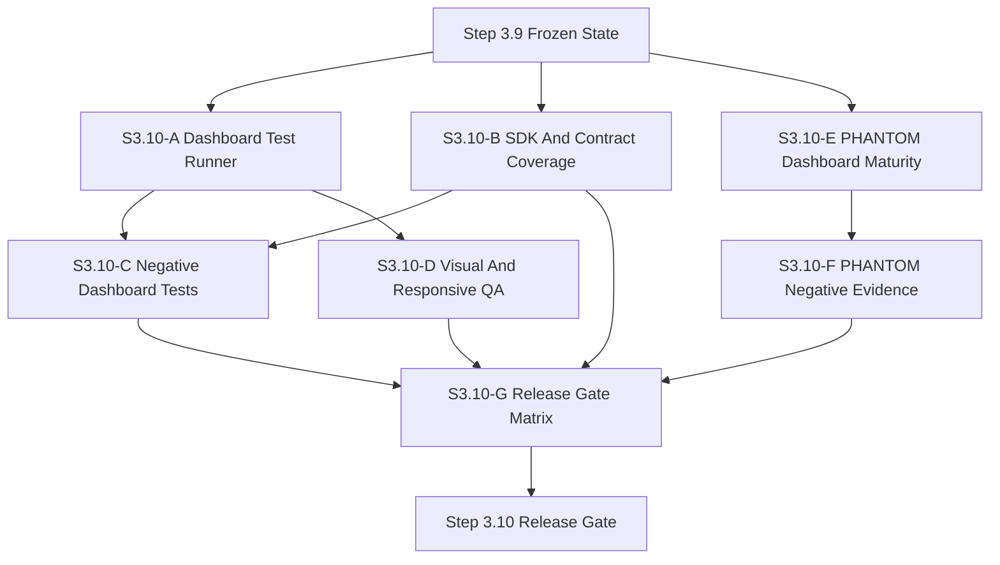

# SYLION Admin Panel V2 - Step 3.10 Masterplan

Status: planned
Date: 2026-05-21

## Sprint Name

```text
V2 Step 3.10 - Repeatable Test Harness, Contract Coverage, PHANTOM Sprint And Release Gate
```

## Objective

Step 3.10 turns the current admin panel into a repeatably testable release candidate workflow. It also develops PHANTOM v3.0 as a larger dashboard/admin module, but only inside the approved governance boundary.

```text
Every sprint must answer:
what works
what failed during dashboard clicking
what changed vs Ksiega 3.4
what changed vs PHANTOM v3.0
what remains blocked behind HUMAN GATE
what cannot be claimed to customers yet
```

## Architecture Decision

Decision: ACCEPT AS STEP 3.10 PLANNING BASELINE

Human gate:

```text
NOT REQUIRED for planning, tests, docs, dashboard control-plane UX and non-mutating API checks.
REQUIRED before real provider mutation, real Firecracker execution, router firmware signing, production HSM/KMS, customer-facing security claims, or PHANTOM production activation.
```

Baseline impact:

```text
No change to Ksiega 3.4 baseline.
No change to 3 VPS per operator.
No change to G1/G2/WORKLOAD separation.
No change to Puli AX router baseline.
No change to mandatory CDR.
No PHANTOM promotion into baseline product behavior.
```

Compliance verdict:

```text
Compliance-positive if Step 3.10 increases evidence, repeatability and negative testing.
PHANTOM must remain separate [A], governance-only and non-executable.
No certification, anonymity, invisibility, lawful-access resistance or jurisdictional guarantee claims.
```

## Module Breakdown

### S3.10-A Dashboard Test Runner

Responsibility:

```text
Create a repeatable dashboard runner for /admin.
Automate login, demo flow, navigation, provider dry-run, approvals, lifecycle, PHANTOM and audit checks.
Write JSON results and screenshots.
```

Acceptance:

```text
runner logs in using dev/test WebAuthn simulator
runner clicks all primary views
runner records failures with view/action names
runner captures desktop and mobile screenshots
runner fails on route-not-found, JS errors or missing critical cards
```

### S3.10-B SDK And Contract Coverage

Responsibility:

```text
Exercise new SDK methods and keep openapi-lite aligned.
Add contract checks for Step 3.9 and Step 3.10 routes.
```

Acceptance:

```text
readiness history endpoint covered
system status endpoint covered
provider dry-run endpoint covered
PHANTOM ack endpoint covered
PHANTOM coverage endpoint covered
orchestrator mandatory approval covered
```

### S3.10-C Negative Dashboard Tests

Responsibility:

```text
Test user-visible failure paths through the dashboard.
The UI must explain blocked states instead of leaking raw API failure.
```

Acceptance:

```text
missing approval cannot execute job
empty lifecycle allocation does not call invalid route
provider mutation mode is unavailable from UI
PHANTOM execution request is rejected
expired PHANTOM exception is visible as blocker
step-up failure stays explicit and auditable
```

### S3.10-D Visual And Responsive QA

Responsibility:

```text
Capture desktop and mobile evidence for critical views.
Check overflow, clipping, nav reachability, tooltip behavior and critical card readability.
```

Acceptance:

```text
desktop and mobile screenshots for Overview, Providers, Approvals, PHANTOM and Audit
no horizontal overflow on mobile
critical buttons reachable
help tips visible and not covering controls incoherently
```

### S3.10-E PHANTOM Dashboard Maturity

Responsibility:

```text
Make PHANTOM v3.0 dashboard workflows easier to review.
Expose package evidence state, owner acknowledgements, exception expiry and coverage blockers more clearly.
```

Acceptance:

```text
PHANTOM package page shows coverage, blockers, exceptions and owner ack status
expired exceptions are visually obvious
approved_placeholder remains non-executable
coverage cannot be displayed as certification
dashboard copy avoids unsafe claims
```

### S3.10-F PHANTOM Negative API And UI Evidence

Responsibility:

```text
Add negative tests proving PHANTOM cannot cross into baseline execution.
```

Acceptance:

```text
PHANTOM approval cannot unlock orchestrator
executionRequested=true is rejected
prohibited operational metadata is rejected
expired exception blocks coverage/readiness
all returned PHANTOM records preserve executionAllowed=false
```

### S3.10-G Release Gate Matrix

Responsibility:

```text
Generate a release gate document per sprint.
Compare implementation state to Ksiega 3.4 and PHANTOM v3.0.
List test results, problems found, fixes, residual risks and human gates.
```

Acceptance:

```text
release gate includes module status table
release gate includes security/compliance residual risk table
release gate includes dashboard test results
release gate includes PHANTOM non-execution proof
release gate names next sprint scope
```

## Parallel Work Plan

```text
Developer A: S3.10-A Dashboard Test Runner
Developer B: S3.10-B SDK And Contract Coverage
Developer C: S3.10-C Negative Dashboard Tests
Developer D: S3.10-D Visual And Responsive QA
Developer E: S3.10-E PHANTOM Dashboard Maturity
Developer F: S3.10-F PHANTOM Negative API And UI Evidence
Integrator: S3.10-G Release Gate Matrix
```

## Mermaid Module Graph



## Human Gate Stop Conditions

```text
real cloud mutation
real Firecracker start/stop
router firmware signing or production flashing
production HSM/KMS connection
PHANTOM production activation
customer-facing compliance/security claims
legal interpretation or risk acceptance
```

