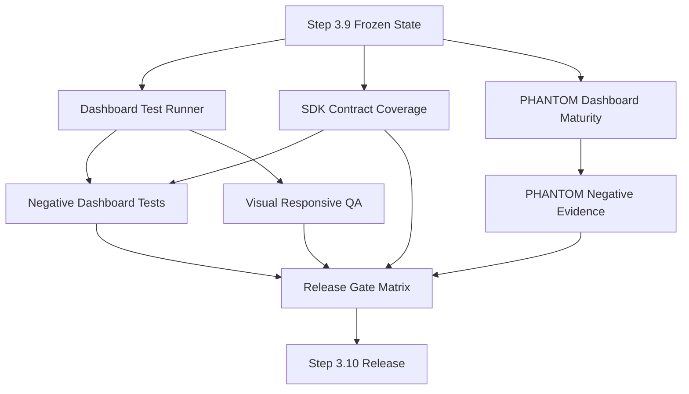
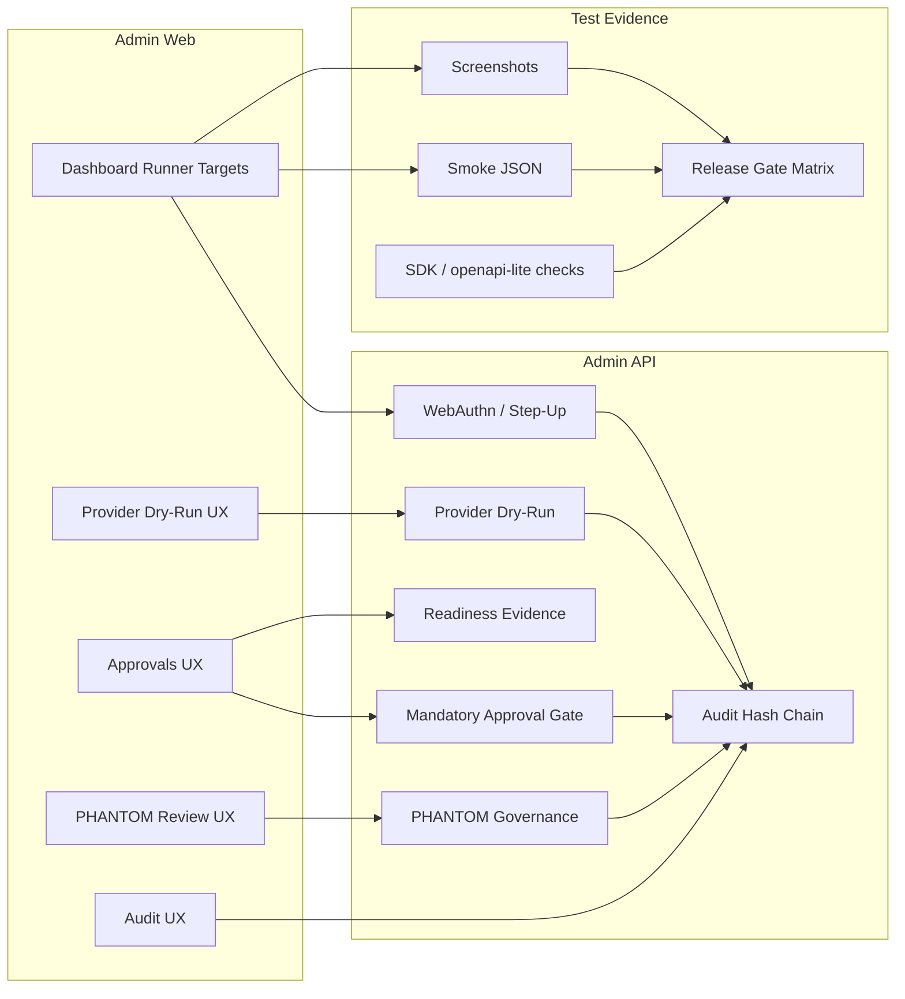
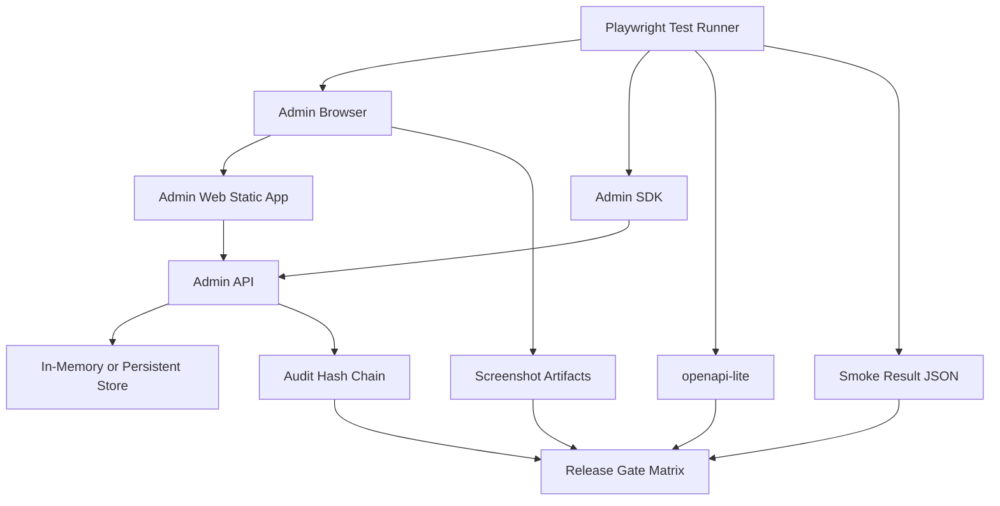
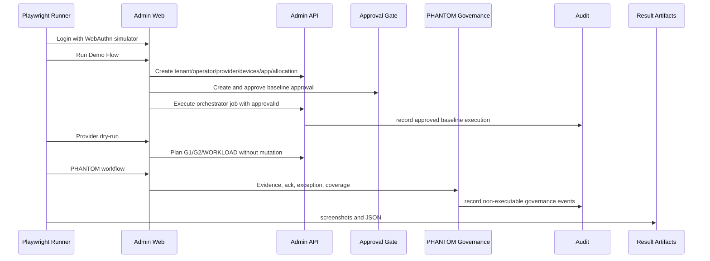
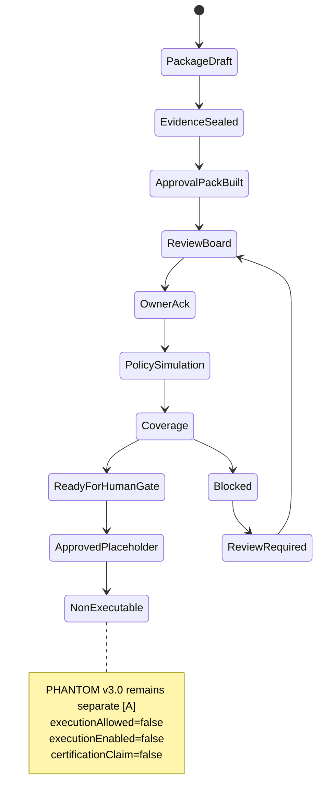
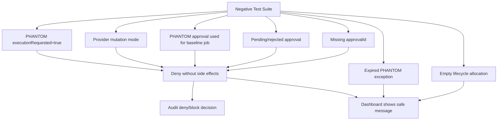
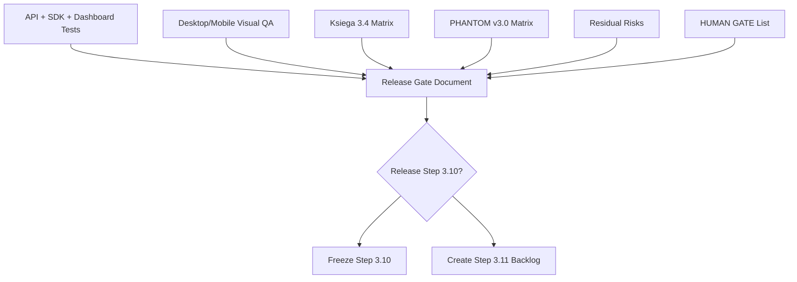
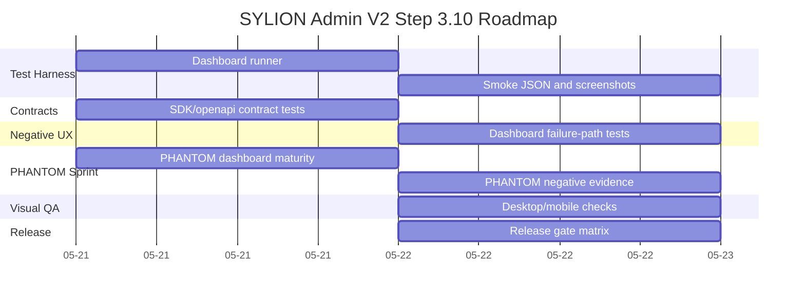

# SYLION Admin Panel V2 - Step 3.10 Graphs And Roadmap

Status: planned
Date: 2026-05-21

## Diagram Files

```text
diagrams/60-step3-10-test-deployment.mmd
diagrams/61-step3-10-runtime-test-flow.mmd
diagrams/62-step3-10-roadmap-gantt.mmd
diagrams/63-step3-10-module-dependencies.mmd
diagrams/64-step3-10-module-map.mmd
diagrams/65-step3-10-phantom-sprint-flow.mmd
diagrams/66-step3-10-negative-test-matrix.mmd
diagrams/67-step3-10-release-gate-flow.mmd
```

## Module Dependencies



## Module Map



## Deployment/Test Graph



## Runtime Test Flow



## PHANTOM Sprint Flow



## Negative Test Matrix



## Release Gate Flow



## Roadmap



