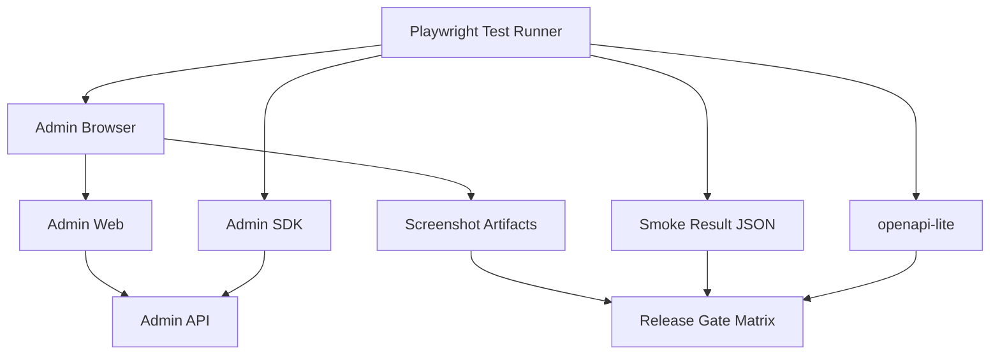
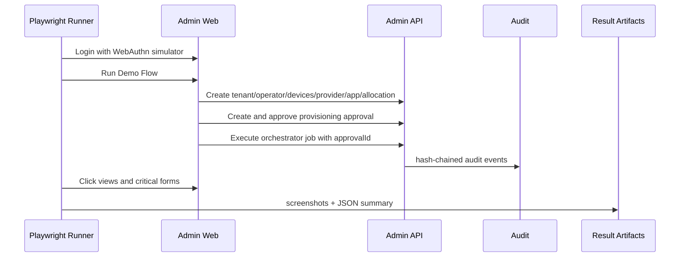
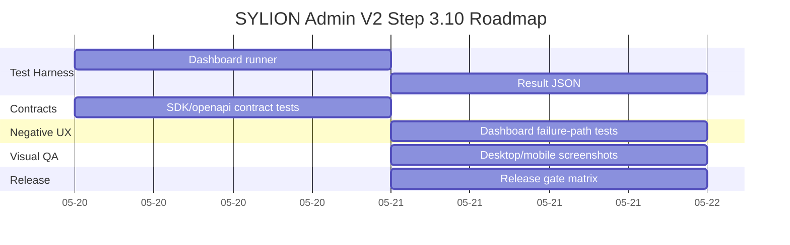

# SYLION Admin Panel V2 - Step 3.10 Graphs And Roadmap

## Deployment/Test Graph

```mermaid
flowchart TD
    Runner["Playwright Test Runner"]
    Browser["Admin Browser"]
    Web["Admin Web"]
    API["Admin API"]
    SDK["Admin SDK"]
    Contract["openapi-lite"]
    Screens["Screenshot Artifacts"]
    JSON["Smoke Result JSON"]
    Gate["Release Gate Matrix"]

    Runner --> Browser
    Browser --> Web
    Web --> API
    Runner --> SDK
    SDK --> API
    Runner --> Contract
    Browser --> Screens
    Runner --> JSON
    Screens --> Gate
    JSON --> Gate
    Contract --> Gate
```

## Runtime Test Flow

```mermaid
sequenceDiagram
    participant Test as Playwright Runner
    participant UI as Admin Web
    participant API as Admin API
    participant Audit as Audit
    participant Report as Result Artifacts

    Test->>UI: Login with WebAuthn simulator
    Test->>UI: Run Demo Flow
    UI->>API: Create tenant/operator/devices/provider/app/allocation
    UI->>API: Create and approve provisioning approval
    UI->>API: Execute orchestrator job with approvalId
    API->>Audit: hash-chained audit events
    Test->>UI: Click views and critical forms
    Test->>Report: screenshots + JSON summary
```

## Roadmap

```mermaid
gantt
    title SYLION Admin V2 Step 3.10 Roadmap
    dateFormat  YYYY-MM-DD
    axisFormat  %m-%d
    section Test Harness
    Dashboard runner                  :a1, 2026-05-20, 1d
    Result JSON                       :a2, after a1, 1d
    section Contracts
    SDK/openapi contract tests        :b1, 2026-05-20, 1d
    section Negative UX
    Dashboard failure-path tests      :c1, after a1, 1d
    section Visual QA
    Desktop/mobile screenshots        :d1, after a1, 1d
    section Release
    Release gate matrix               :e1, after b1, 1d
```

