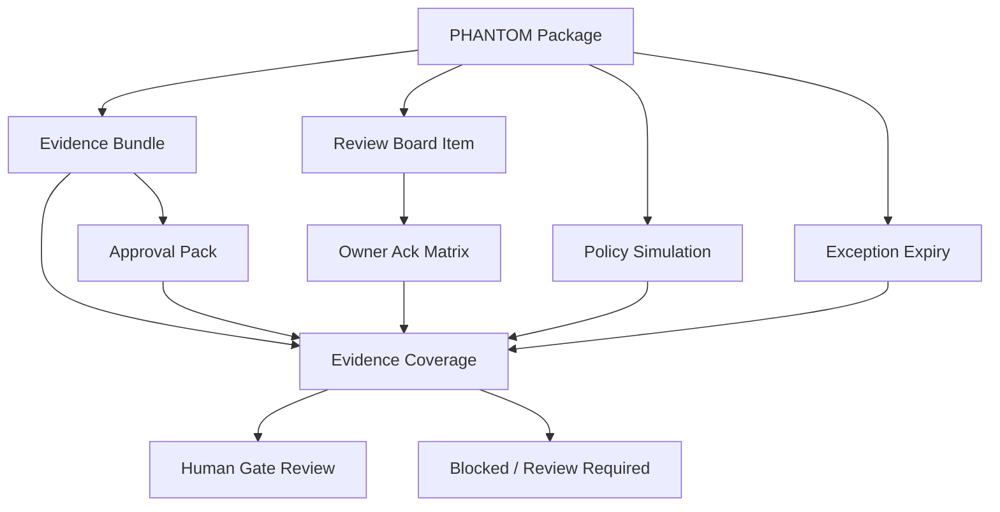

# SYLION Admin Panel V2 - Step 3.10 PHANTOM Sprint Plan

Status: planned
Date: 2026-05-21

## Purpose

Develop PHANTOM v3.0 inside the admin panel as a review, evidence and governance module.

This sprint does not implement production PHANTOM behavior.

```text
Allowed:
dashboard review workflows
owner acknowledgement status
evidence coverage
exception expiry and revalidation
negative tests
release evidence

Blocked:
execution
autonomous activation
baseline unlock
stealth/evasion/bypass details
customer-facing certification claims
```

## Functional Modules

### PH-1 Package Evidence Dashboard

```text
Show package, policy template, evidence bundle count, approval pack count, simulation count and blockers.
```

### PH-2 Owner Matrix

```text
Show Legal, CISO, Architect and Compliance acknowledgements.
Block approved_placeholder until all required owners are acknowledged.
```

### PH-3 Exception Expiry

```text
Show exception expiry, expired=true state and revalidation requirement.
Expired exceptions must block ready_for_human_gate coverage.
```

### PH-4 Negative Boundary Proof

```text
Prove PHANTOM cannot unlock orchestrator, cannot request execution and cannot become certification claim.
```

### PH-5 Release Evidence

```text
Export PHANTOM state into release gate matrix:
coverage
blockers
owner status
exceptions
non-execution proof
human gate status
```

## Mermaid PHANTOM Dependency Graph



## Acceptance Tests

```text
PHANTOM owner ack matrix visible in dashboard.
Missing owner ack blocks approved_placeholder.
Expired exception appears as blocker.
Coverage reports certificationClaim=false.
Every PHANTOM public record returns executionAllowed=false.
PHANTOM approval cannot unlock baseline orchestrator job.
```

