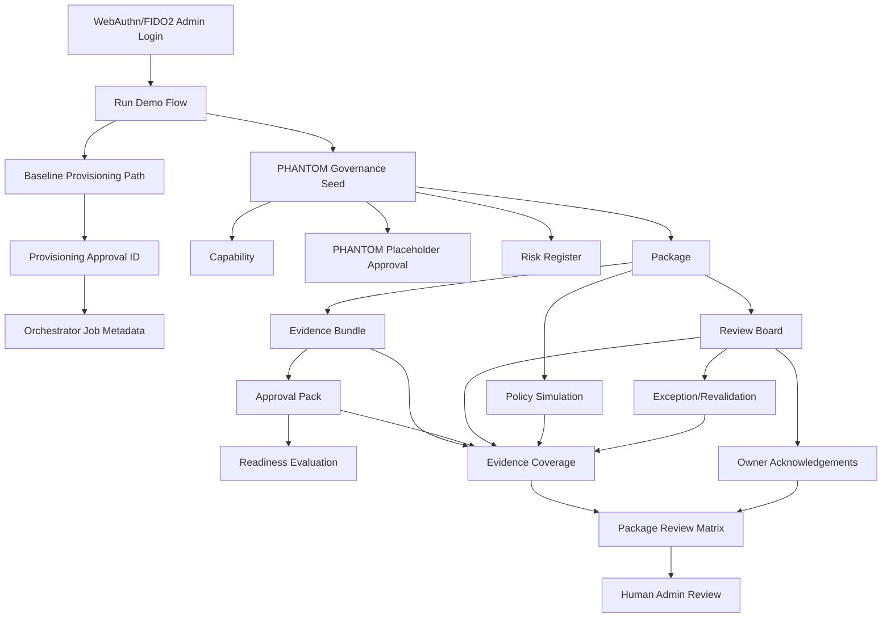
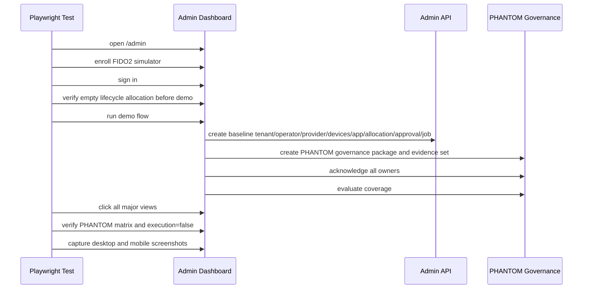

# SYLION Secure Admin Panel - Step 3.10 Implementation Freeze

Date: 2026-05-21
Status: implemented and tested

## Scope frozen in this step

Step 3.10 extends the admin panel test discipline and PHANTOM visibility layer:

- PHANTOM Package Review Matrix in the admin dashboard.
- PHANTOM demo flow seeded by `Run Demo Flow`, including capability, placeholder approval, risk, package, evidence bundle, approval pack, readiness, simulation, assignment plan, review board, owner acknowledgements, exception, coverage and audit correlation.
- Automatic PHANTOM evidence coverage refresh for every package.
- Negative API tests proving PHANTOM cannot cross into baseline execution.
- Playwright dashboard smoke test that logs in, runs the demo, clicks all major admin views and records desktop/mobile screenshots.

## Problems found and fixed during human-style testing

1. `Run Demo Flow` only created baseline provisioning data. PHANTOM panels stayed empty, so the dashboard did not show package review status after a human demo path.
   - Fixed by extending demo flow to create safe governance-only PHANTOM records.

2. PHANTOM evidence coverage was computed by endpoint but not fetched during `refreshAll()`.
   - Fixed by fetching coverage for each PHANTOM package on refresh.

3. The initial Playwright script targeted old navigation text (`Dashboard`) instead of current UI text (`Overview`).
   - Fixed in `scripts/admin-dashboard-smoke.mjs`.

4. The initial lifecycle negative UI check expected a toast before any allocation existed.
   - Fixed by checking that the allocation selector is empty before demo flow.

## Current Księga 3.4 status

- Implemented:
  - mandatory approval ID for orchestrator execution,
  - persisted readiness evidence and evidence hashes,
  - 3 VPS baseline metadata,
  - Puli AX as router model in device flow,
  - CDR mandatory controls in app catalog/allocation flow,
  - provider dry-run planning without cloud mutation,
  - audit hash chain and monitoring/anomaly metadata.

- Still blocked by design before production:
  - real Firecracker execution,
  - real provider cloud mutation,
  - production HSM/PKI material handling,
  - production router firmware signing/provisioning,
  - real GrapheneOS image build pipeline.

## Current PHANTOM v3.0 status

- Implemented as separate governance track.
- PHANTOM remains `executionAllowed=false` and `executionEnabled=false`.
- PHANTOM placeholder approvals cannot unlock `/orchestrator/jobs`.
- PHANTOM policy simulations reject prohibited operational language.
- PHANTOM exceptions cannot request execution and require revalidation dates.
- Owner acknowledgements are visible in Review Board and Package Review Matrix.
- Coverage is evidence-only and carries `certificationClaim=false`.

## Verification

- `npm test`: 60/60 passing.
- `npm run test:dashboard`: passing against `http://127.0.0.1:8099/admin`.
- Playwright artifacts:
  - `docs/admin-panel-v2/test-artifacts/step3-10-dashboard-smoke/phantom-desktop.png`
  - `docs/admin-panel-v2/test-artifacts/step3-10-dashboard-smoke/phantom-mobile.png`
  - desktop screenshots for Overview, Operators, Provisioning, Approvals, Subscriptions, Devices, Providers, Security, PHANTOM and Audit.

## Dependency graph

## Test flow graph

