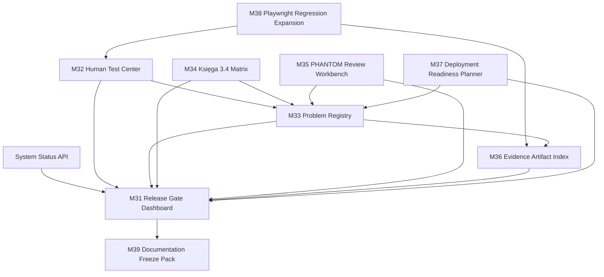
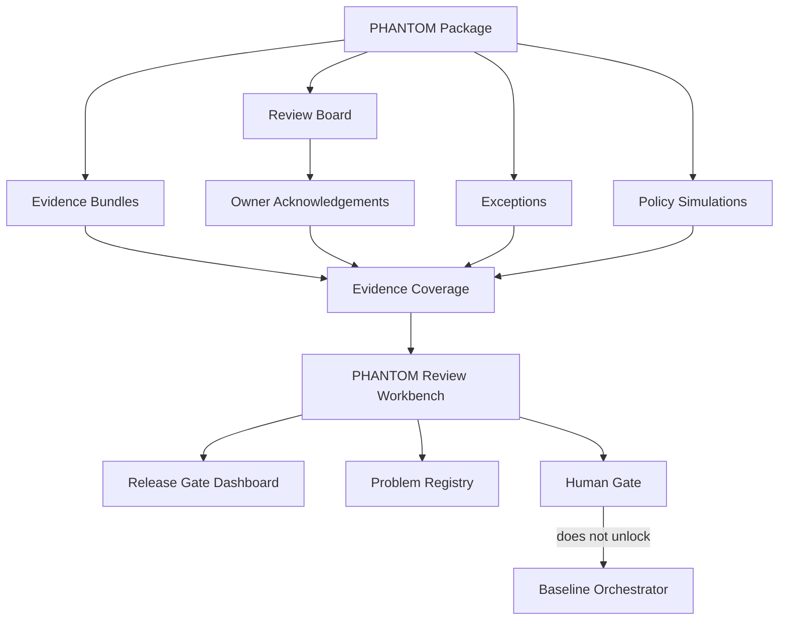
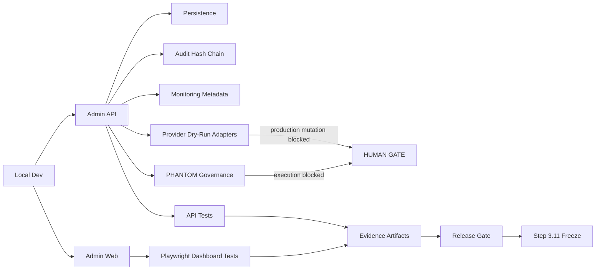
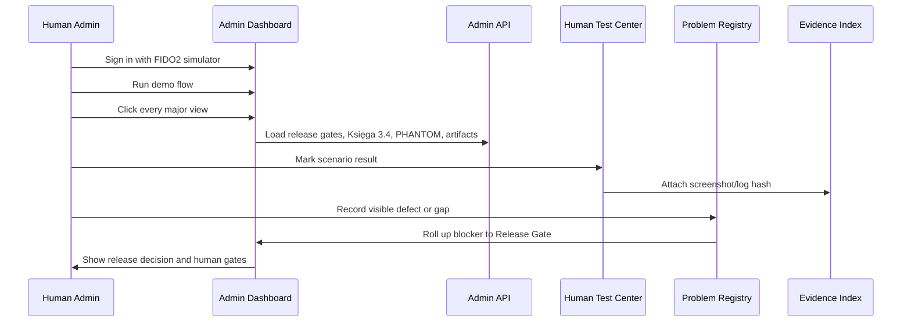
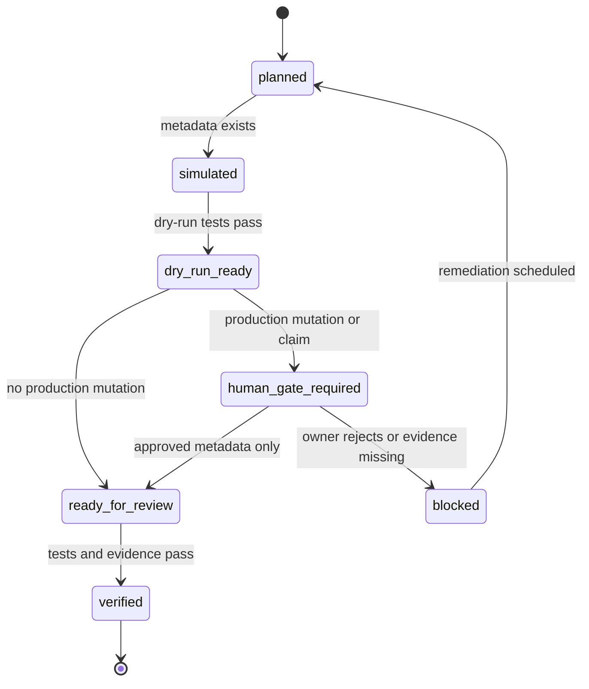
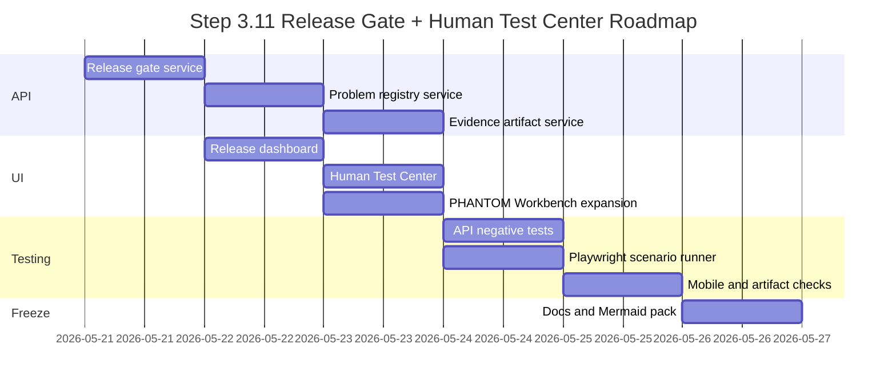
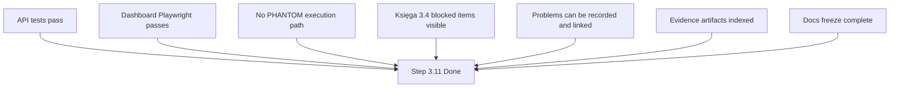

# SYLION Admin Panel V2 - Step 3.11 Graphs and Roadmap

Status: planned
Date: 2026-05-21

## Module Dependency Graph

## PHANTOM Governance Graph

## Deployment Readiness Graph

## Human Test Flow

## Release Gate State Machine

## Roadmap

### Sprint 3.11-A: Data Model and API

- release gate service,
- problem registry service,
- evidence artifact service,
- human test scenario service,
- API tests and negative tests.

### Sprint 3.11-B: Admin UI

- Release Gate view,
- Human Test Center view,
- Problem Registry view,
- PHANTOM Review Workbench expansion,
- Księga 3.4 matrix cards.

### Sprint 3.11-C: Playwright Expansion

- scenario runner,
- JSON summary,
- screenshot index,
- mobile viewport,
- negative path checks.

### Sprint 3.11-D: Freeze and Release Review

- status report,
- known problems list,
- residual risk list,
- Mermaid graphs,
- final acceptance checklist.

## Roadmap Gantt

## Acceptance Graph

